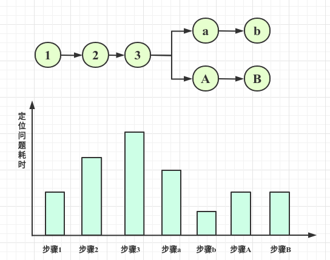

> 程序员的编程时间分布也符合二八原则,20%时间Conding, 80%时间调Debugging. 相比编码水平, TroubleShooting的能力可能更影响效率.

本文旨在把工作中的定位错误的思路整理为文字, 便于后期不断的优化和规范. 
#### 0. 写在前面
一般而言，当我们发现程序的运行不符合我们的预期时，我们就会认为有不好的事情在发生。“不符合预期”可严谨的描述为**我的程序及其依赖的第三方程序在运行中产生了不是我所预期的结果**。此处有三个主体：1）我本人；2）我写的程序；3）依赖的第三方程序。

由此得出三种产生非预期结果的原因：

1）程序运行正确，但是我本人对其运行机制不清楚导致对其结果误判；

2）我自己写的程序逻辑有问题；

3）我依赖的第三方程序有问题；

#### 1. 思维定势
1. 问题提问者的说辞不一定是对错误的正确描述, 需要自己去判断
2. 问题发生的时间和发现的时间可能差距很大。当前发现的错误有可能新引入的，也有可能是触发了之前粗心留下的彩蛋。
3. 在解决问题时，要大胆想象问题空间和小心的求证。
4. 任何错误的认定，都会使后面的探索徒劳。如同走迷宫，错误的路径只会让你困在死胡同，最终回到原点。
5. 之前类似问题的原因，不一定是本次问题的原因。
#### 2. 通用策略
```
1. 重现问题
    1.1  写测试用例，快速复现问题。这也为以后定位减少工作量。

2. 定位问题
    2.1 看
    2.1.1 观察错误堆栈
    2.1.2 输出更详细的日志信息
    2.1.3 内存Dump & CPU Jstack
    2.1.4 JMX等监测工具

    2.2 DEBUG
    2.2.1 本地调试(Debug Tool & Print & Log)
    2.2.2 远程调试

    2.3 找变化 
    2.3.1 找出与上一次正确版本的差异和变化

    2.4 梳理调用链
    2.4.1 梳理流程，通过二分法定位错误点
    2.4.2 梳理流程，优先排查容易定位的点(和2.4.1酌情选择)

    2.5 搜和问
    2.5.1 查看出问题组件的文档，优先看常见问题QA
    2.5.2 Google & Stackoverflow
    2.5.3 询问软件的开发和支持人员
3. 解决问题
4. 沉淀为文档
```
#### 3. 场景策略
1. 日常开发场景
```
定义: 开发场景为研发人员在着手解决自己书写或他人遗留的代码的情景.
优势: 该场景下可优先借助IDE进行Debug.
手段: IDE Debug工具(断点, 条件断点, 打印过程变量)
```
2. 线上运维场景
```
定义: 开发场景为研发人员要定位正在线上环境运行的代码的情景.
劣势: 
1) 线上日志级别高, 日志不精细, 不容易定位问题和知晓问题代码上下文;
2) 线上Bug不容易复现, bug可能是执行频度较低的代码路径, 只有特殊的请求才会触发;
3) 安全起见, 线上服务器一般不允许执行远程调试
手段: 
1) 若是重大Bug, 则先回滚版本减少损失
2) 增加或通过log4j抽取详细的线上日志
3) 本地运行线上版本包进行调试
4) Dump内存和CPU信息
```
3. 测试运维场景
```
定义: 开发场景为研发人员要定位正在测试环境运行的代码的情景.
优势: bug不会影响生产, 且测试服务器允许远程调试 
手段: 
1) 远程调试
2) 增加日志
3) 本地运行测试版本包进行调试
4) Dump内存和CPU信息
```
#### 4. 优先定位路径中耗时较短的片段


在日常的定位问题时，二分法有时候不是首选，有时候通过粗略的评估整个调用路径中各个片段定位的耗时，优先挑拣容易定位的片段可能会起到事半功倍的作用。

例如：有些片段只需要通过一个简单的命令，例如ping，telnet就可以定位问题出现在上游还是下游。

#### 5. 如何提升
1. 规范自己
1. 帮助他人