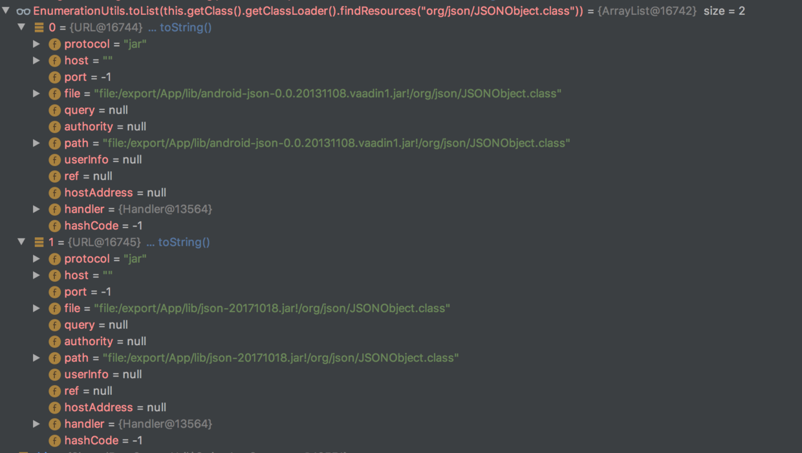

今天在写Rest端新功能时，发现一个错误如下，明显是由于jar包冲突导致的。原因有两种：
1）jar包版本错误
2）两个不同artifact的jar包，包含了相同的类，导致随机加载
```
Caused by: java.lang.NoSuchMethodError: org.json.JSONObject.stringToValue(Ljava/lang/String;)Ljava/lang/Object;
	at org.json.XML.stringToValue(XML.java:409)
	at org.json.XML.parse(XML.java:343)
	at org.json.XML.toJSONObject(XML.java:458)
	at org.json.XML.toJSONObject(XML.java:429)
```

#### 解决路径
1. 确认了是第二种情况，即两个不同的jar包内有相同限定名的类；
2. 找到包含该类的包，两种方法：
  - 通过Grep命令：`grep -r "JSONObject" .`
  - Debug调试：在合适的位置打断点，输入检测表达式`EnumerationUtils.toList(this.getClass().getClassLoader().findResources("org/json/JSONObject.class")) `,结果如下：
    
3. 排除android-json-0.0.20131108.vaadin1.jar即可