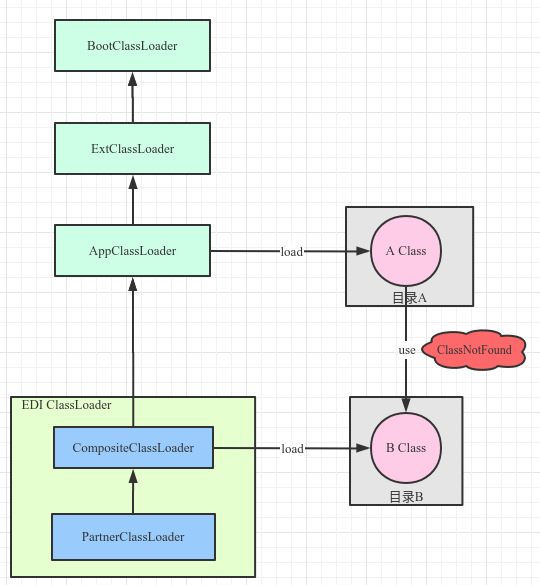

#### 一、问题描述
EDI测试环境运行时，在JSF调用时报ClassNotFound，而在商家目录B下有该依赖，通过远程断点定位到并没有走EDI自定义的类加载器。
#### 二、原因
JSF调用的参数类A是EDI平台类，由应用类加载器加载。而A中某个属性是B类，其未在应用类加载器的扫描目录A而在商家目录B下，已由EDI自定义类加载器CompositeClassLoader加载。
由于类加载的全盘委托机制，导致在A中使用到B时，由加载A类的类加载器去加载B，导致加载不到，引发ClassNotFoundException。
#### 三、解决方案
把B所在的jar包放到目录A下。

