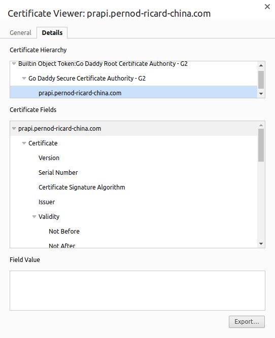
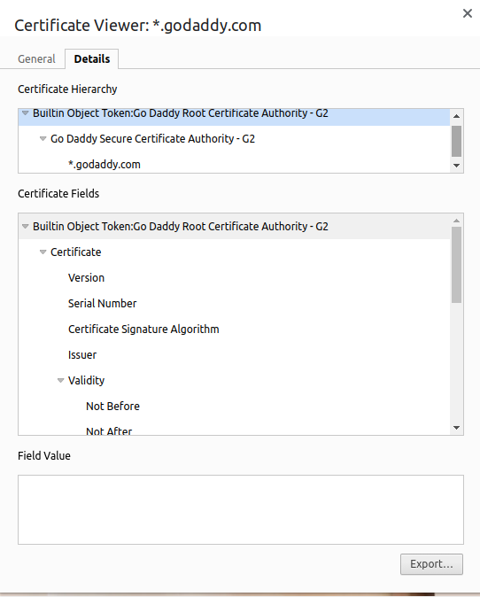
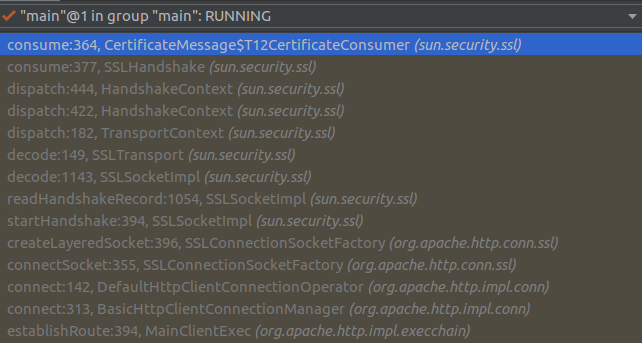
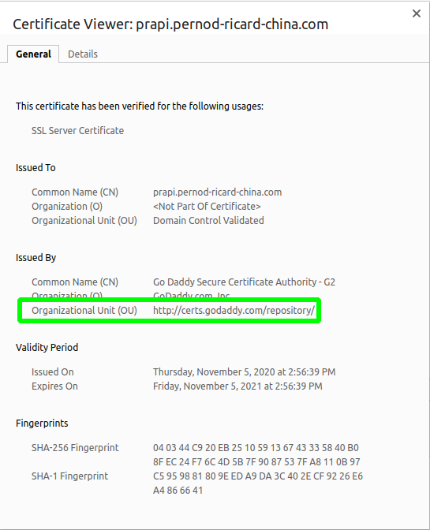
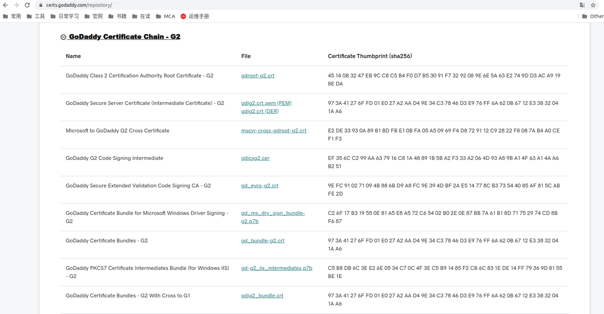

#### 1. 背景
昨天有商家运维提示商家证书更新，需要我方手动导入更新。可通过访问该URL发现该地址的https证书是经过CA认证的，非自签名的，如下图。


讲道理而言，经过CA认证的证书，会在SSL握手时获取证书链来验证证书有效性，但是我方调用商家URL时却出现如下错误：
```java
com.jd.edi.utils.exception.runtime.ProcessorRunningException: sun.security.validator.ValidatorException: PKIX path building failed: sun.security.provider.certpath.SunCertPathBuilderException: unable to find valid certification path to requested target
  at com.jd.lsb.edi.flow.camel.processor.exception.ExceptionProcessor.process(ExceptionProcessor.java:66)
  at org.apache.camel.processor.DelegateSyncProcessor.process(DelegateSyncProcessor.java:63)
  at org.apache.camel.processor.CamelInternalProcessor.process(CamelInternalProcessor.java:201)
  at org.apache.camel.processor.Pipeline.process(Pipeline.java:138)
  at org.apache.camel.processor.Pipeline.process(Pipeline.java:101)
  at org.apache.camel.processor.FatalFallbackErrorHandler.process(FatalFallbackErrorHandler.java:82)
  at org.apache.camel.processor.RedeliveryErrorHandler.deliverToFailureProcessor(RedeliveryErrorHandler.java:1063)
  at org.apache.camel.processor.RedeliveryErrorHandler.process(RedeliveryErrorHandler.java:474)
  at org.apache.camel.processor.CamelInternalProcessor.process(CamelInternalProcessor.java:201)
  at org.apache.camel.processor.Pipeline.process(Pipeline.java:138)
  at org.apache.camel.processor.Pipeline.process(Pipeline.java:101)
  at org.apache.camel.processor.CamelInternalProcessor.process(CamelInternalProcessor.java:201)
  at org.apache.camel.processor.DelegateAsyncProcessor.process(DelegateAsyncProcessor.java:97)
  at com.jd.lsb.edi.component.jsf.utils.RouteHandler.invoke(RouteHandler.java:46)
  at com.sun.proxy.$Proxy111.handle(Unknown Source)
  at sun.reflect.GeneratedMethodAccessor1025.invoke(Unknown Source)
  at sun.reflect.DelegatingMethodAccessorImpl.invoke(DelegatingMethodAccessorImpl.java:43)
  at java.lang.reflect.Method.invoke(Method.java:497)
  at com.jd.jsf.gd.filter.ProviderInvokeFilter.reflectInvoke(ProviderInvokeFilter.java:140)
  at com.jd.jsf.gd.filter.ProviderInvokeFilter.invoke(ProviderInvokeFilter.java:100)
  at com.jd.jsf.gd.filter.ProviderSecurityFilter.invoke(ProviderSecurityFilter.java:42)
  at com.jd.jsf.gd.filter.ProviderConcurrentsFilter.invoke(ProviderConcurrentsFilter.java:62)
  at com.jd.jsf.gd.filter.ProviderTimeoutFilter.invoke(ProviderTimeoutFilter.java:39)
  at com.jd.jsf.gd.filter.ProviderMethodCheckFilter.invoke(ProviderMethodCheckFilter.java:78)
  at com.jd.jsf.gd.filter.ProviderInvokeLimitFilter.invoke(ProviderInvokeLimitFilter.java:56)
  at com.jd.jsf.gd.filter.ProviderHttpGWFilter.invoke(ProviderHttpGWFilter.java:47)
  at com.jd.jsf.gd.filter.ProviderGenericFilter.invoke(ProviderGenericFilter.java:118)
  at com.jd.jsf.gd.filter.ProviderContextFilter.invoke(ProviderContextFilter.java:81)
  at com.jd.jsf.gd.filter.ExceptionFilter.invoke(ExceptionFilter.java:44)
  at com.jd.jsf.gd.filter.SystemTimeCheckFilter.invoke(SystemTimeCheckFilter.java:79)
  at com.jd.jsf.gd.filter.FilterChain.invoke(FilterChain.java:281)
  at com.jd.jsf.gd.server.ProviderProxyInvoker.invoke(ProviderProxyInvoker.java:66)
  at com.jd.jsf.gd.server.JSFTask.doRun(JSFTask.java:129)
  at com.jd.jsf.gd.server.BaseTask.run(BaseTask.java:29)
  at java.util.concurrent.Executors$RunnableAdapter.call(Executors.java:511)
  at java.util.concurrent.FutureTask.run(FutureTask.java:266)
  at java.util.concurrent.ThreadPoolExecutor.runWorker(ThreadPoolExecutor.java:1142)
  at java.util.concurrent.ThreadPoolExecutor$Worker.run(ThreadPoolExecutor.java:617)
  at java.lang.Thread.run(Thread.java:745)
Caused by: javax.net.ssl.SSLHandshakeException: sun.security.validator.ValidatorException: PKIX path building failed: sun.security.provider.certpath.SunCertPathBuilderException: unable to find valid certification path to requested target
  at sun.security.ssl.Alerts.getSSLException(Alerts.java:192)
  at sun.security.ssl.SSLSocketImpl.fatal(SSLSocketImpl.java:1949)
  at sun.security.ssl.Handshaker.fatalSE(Handshaker.java:302)
  at sun.security.ssl.Handshaker.fatalSE(Handshaker.java:296)
  at sun.security.ssl.ClientHandshaker.serverCertificate(ClientHandshaker.java:1497)
  at sun.security.ssl.ClientHandshaker.processMessage(ClientHandshaker.java:212)
  at sun.security.ssl.Handshaker.processLoop(Handshaker.java:979)
  at sun.security.ssl.Handshaker.process_record(Handshaker.java:914)
  at sun.security.ssl.SSLSocketImpl.readRecord(SSLSocketImpl.java:1062)
  at sun.security.ssl.SSLSocketImpl.performInitialHandshake(SSLSocketImpl.java:1375)
  at sun.security.ssl.SSLSocketImpl.startHandshake(SSLSocketImpl.java:1403)
  at sun.security.ssl.SSLSocketImpl.startHandshake(SSLSocketImpl.java:1387)
  at org.apache.http.conn.ssl.SSLConnectionSocketFactory.createLayeredSocket(SSLConnectionSocketFactory.java:396)
  at org.apache.http.conn.ssl.SSLConnectionSocketFactory.connectSocket(SSLConnectionSocketFactory.java:355)
  at org.apache.http.impl.conn.DefaultHttpClientConnectionOperator.connect(DefaultHttpClientConnectionOperator.java:142)
  at org.apache.http.impl.conn.PoolingHttpClientConnectionManager.connect(PoolingHttpClientConnectionManager.java:359)
  at org.apache.http.impl.execchain.MainClientExec.establishRoute(MainClientExec.java:381)
  at org.apache.http.impl.execchain.MainClientExec.execute(MainClientExec.java:237)
  at org.apache.http.impl.execchain.ProtocolExec.execute(ProtocolExec.java:185)
  at org.apache.http.impl.execchain.RetryExec.execute(RetryExec.java:89)
  at org.apache.http.impl.execchain.RedirectExec.execute(RedirectExec.java:111)
  at org.apache.http.impl.client.InternalHttpClient.doExecute(InternalHttpClient.java:185)
  at org.apache.http.impl.client.CloseableHttpClient.execute(CloseableHttpClient.java:83)
  at org.apache.http.impl.client.CloseableHttpClient.execute(CloseableHttpClient.java:56)
  at org.apache.camel.component.http4.HttpProducer.executeMethod(HttpProducer.java:334)
  at org.apache.camel.component.http4.HttpProducer.process(HttpProducer.java:193)
  at org.apache.camel.util.AsyncProcessorConverterHelper$ProcessorToAsyncProcessorBridge.process(AsyncProcessorConverterHelper.java:61)
  at org.apache.camel.processor.SendProcessor.process(SendProcessor.java:148)
  at org.apache.camel.processor.RedeliveryErrorHandler.process(RedeliveryErrorHandler.java:548)
  ... 31 more
Caused by: sun.security.validator.ValidatorException: PKIX path building failed: sun.security.provider.certpath.SunCertPathBuilderException: unable to find valid certification path to requested target
  at sun.security.validator.PKIXValidator.doBuild(PKIXValidator.java:387)
  at sun.security.validator.PKIXValidator.engineValidate(PKIXValidator.java:292)
  at sun.security.validator.Validator.validate(Validator.java:260)
  at sun.security.ssl.X509TrustManagerImpl.validate(X509TrustManagerImpl.java:324)
  at sun.security.ssl.X509TrustManagerImpl.checkTrusted(X509TrustManagerImpl.java:229)
  at sun.security.ssl.X509TrustManagerImpl.checkServerTrusted(X509TrustManagerImpl.java:105)
  at com.jd.lsb.edi.service.http.common.ssl.SSLTrustManager.checkServerTrusted(SSLTrustManager.java:54)
  at sun.security.ssl.AbstractTrustManagerWrapper.checkServerTrusted(SSLContextImpl.java:922)
  at sun.security.ssl.ClientHandshaker.serverCertificate(ClientHandshaker.java:1479)
  ... 55 more
Caused by: sun.security.provider.certpath.SunCertPathBuilderException: unable to find valid certification path to requested target
  at sun.security.provider.certpath.SunCertPathBuilder.build(SunCertPathBuilder.java:145)
  at sun.security.provider.certpath.SunCertPathBuilder.engineBuild(SunCertPathBuilder.java:131)
  at java.security.cert.CertPathBuilder.build(CertPathBuilder.java:280)
  at sun.security.validator.PKIXValidator.doBuild(PKIXValidator.java:382)
  ... 63 more
```

最终，导入商家证书后解决。
#### 2. 定位问题
##### 1）对比地址：https://sg.godaddy.com/（两者都使用 了相同的CA证书链）



##### 2）对比结果
* HttpClient可正常访问：https://sg.godaddy.com/
* 通过Debug发现：正常访问时，SSL握手时HttpClient会收到一个证书链；而访问失败时，只收到了server的证书。
* 测试把中间的证书导入cert中后可正常访问。


```java
class T12CertificateConsumer {
        @Override
        public void consume(ConnectionContext context, ByteBuffer message) throws IOException {
            。。。
            // 此处访问正常时会接受到证书链，相反失败的情况是只收到了server一个证书
            T12CertificateMessage cm = new T12CertificateMessage(hc, message);
            
        }
}
```

#### 3.结论
即便是经过CA认证的证书，如果Server端没有把证书关联起来在SSL握手时一并返回，也会导致https访问异常。
#### 4. 后续
跟商家技术反馈后，他们调整了证书，经测试不导入证书也可以正常访问。

#### 其他、浏览器可正常访问的猜测
浏览器会自动从OU里下载间接证书链，如下图。



#### 参考
1. https://stackoverflow.com/questions/12778012/java-sslsocket-how-to-send-full-server-cert-chain
1. https://stackoverflow.com/questions/9299133/why-doesnt-java-send-the-client-certificate-during-ssl-handshake/9300727#9300727