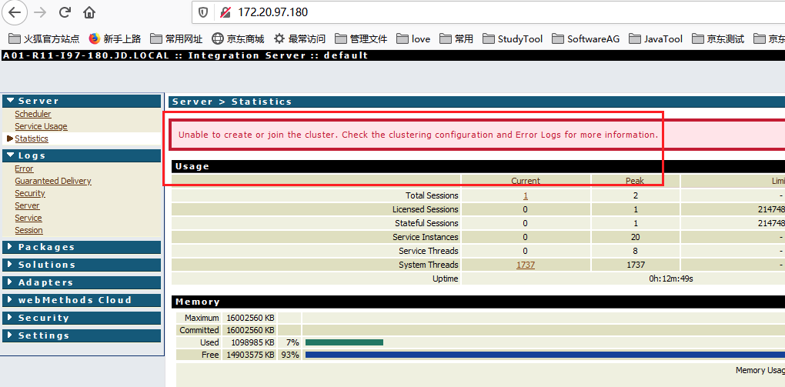

#### 一、问题描述

前天晚上建华重启Webmethod IS后发现IS无法正常加入Cluster。管理端报错如下，



#### 二、解决路径

1）通过堡垒机登陆该机器查看IS启动日志server.log，发现有如下异常信息：

```java
2021-03-02 00:07:55 CST [ISS.0017.0001E] An error was encountered parsing SoftwareAG-IS-Core.xml: net.sf.ehcache.CacheException: Unable to load class net.sf.ehcache.terracotta.ExpressEnterpriseTerracottaClusteredInstanceFactory. Initial cause was org.terracotta.toolkit.ToolkitInstantiationException: java.lang.RuntimeException: Unable to create toolkit.
        at net.sf.ehcache.util.ClassLoaderUtil.createNewInstance(ClassLoaderUtil.java:90)
        at net.sf.ehcache.terracotta.TerracottaClusteredInstanceHelper.newClusteredInstanceFactory(TerracottaClusteredInstanceHelper.java:157)
        at net.sf.ehcache.terracotta.TerracottaClient.createNewClusteredInstanceFactory(TerracottaClient.java:180)
        at net.sf.ehcache.terracotta.TerracottaClient.createClusteredInstanceFactory(TerracottaClient.java:129)
        at net.sf.ehcache.CacheManager.doInit(CacheManager.java:463)
        at net.sf.ehcache.CacheManager.init(CacheManager.java:395)
        at net.sf.ehcache.CacheManager.<init>(CacheManager.java:270)
        at net.sf.ehcache.CacheManager.newInstance(CacheManager.java:1116)
        at net.sf.ehcache.CacheManager.newInstance(CacheManager.java:1092)
        at com.wm.app.b2b.server.cache.config.CacheManagerConfig.readConfiguration(CacheManagerConfig.java:311)
        at com.wm.app.b2b.server.cache.config.CacheManagerConfig.readConfiguration(CacheManagerConfig.java:365)
        at com.wm.app.b2b.server.cache.config.CacheManagerReader.call(CacheManagerReader.java:33)
        at com.wm.app.b2b.server.cache.config.CacheManagerReader.call(CacheManagerReader.java:13)
        at java.util.concurrent.FutureTask.run(FutureTask.java:266)
        at java.util.concurrent.ThreadPoolExecutor.runWorker(ThreadPoolExecutor.java:1142)
        at java.util.concurrent.ThreadPoolExecutor$Worker.run(ThreadPoolExecutor.java:617)
        at java.lang.Thread.run(Thread.java:745)
Caused by: java.lang.RuntimeException: org.terracotta.toolkit.ToolkitInstantiationException: java.lang.RuntimeException: Unable to create toolkit.
        at org.terracotta.modules.ehcache.TerracottaToolkitBuilder.createToolkit(TerracottaToolkitBuilder.java:65)
        at org.terracotta.modules.ehcache.TerracottaToolkitBuilder.buildToolkit(TerracottaToolkitBuilder.java:58)
        at org.terracotta.modules.ehcache.ToolkitInstanceFactoryImpl.createTerracottaToolkit(ToolkitInstanceFactoryImpl.java:183)
        at org.terracotta.modules.ehcache.ToolkitInstanceFactoryImpl.<init>(ToolkitInstanceFactoryImpl.java:119)
        at org.terracotta.modules.ehcache.ToolkitInstanceFactoryImpl.<init>(ToolkitInstanceFactoryImpl.java:129)
        at org.terracotta.modules.ehcache.EnterpriseToolkitInstanceFactory.<init>(EnterpriseToolkitInstanceFactory.java:23)
        at org.terracotta.modules.ehcache.store.EnterpriseTerracottaClusteredInstanceFactory.createToolkitInstanceFactory(EnterpriseTerracottaClusteredInstanceFactory.java:21)
        at org.terracotta.modules.ehcache.store.TerracottaClusteredInstanceFactory.<init>(TerracottaClusteredInstanceFactory.java:65)
        at org.terracotta.modules.ehcache.store.EnterpriseTerracottaClusteredInstanceFactory.<init>(EnterpriseTerracottaClusteredInstanceFactory.java:15)
        at net.sf.ehcache.terracotta.ExpressEnterpriseTerracottaClusteredInstanceFactory.<init>(ExpressEnterpriseTerracottaClusteredInstanceFactory.java:11)
        at sun.reflect.NativeConstructorAccessorImpl.newInstance0(Native Method)
        at sun.reflect.NativeConstructorAccessorImpl.newInstance(NativeConstructorAccessorImpl.java:62)
        at sun.reflect.DelegatingConstructorAccessorImpl.newInstance(DelegatingConstructorAccessorImpl.java:45)
        at java.lang.reflect.Constructor.newInstance(Constructor.java:423)
        at net.sf.ehcache.util.ClassLoaderUtil.createNewInstance(ClassLoaderUtil.java:73)
        ... 16 more

Caused by: org.terracotta.toolkit.ToolkitInstantiationException: java.lang.RuntimeException: Unable to create toolkit.
        at com.terracotta.toolkit.api.TerracottaToolkitFactoryService.createToolkit(TerracottaToolkitFactoryService.java:63)
        at org.terracotta.toolkit.ToolkitFactory.create(ToolkitFactory.java:100)
        at org.terracotta.toolkit.ToolkitFactory.createToolkit(ToolkitFactory.java:84)
        at org.terracotta.modules.ehcache.TerracottaToolkitBuilder.createToolkit(TerracottaToolkitBuilder.java:63)
        ... 30 more
Caused by: java.lang.RuntimeException: Unable to create toolkit.
        at com.terracotta.toolkit.client.TerracottaToolkitCreator.createToolkit(TerracottaToolkitCreator.java:95)
        at com.terracotta.toolkit.api.EnterpriseTerracottaToolkitFactoryService.createToolkit(EnterpriseTerracottaToolkitFactoryService.java:17)
        at com.terracotta.toolkit.api.TerracottaToolkitFactoryService.createToolkit(TerracottaToolkitFactoryService.java:58)
        ... 33 more
Caused by: java.lang.RuntimeException: java.lang.RuntimeException: java.lang.IllegalStateException: Your product key only allows maximum 20 clients to connect.
        at com.terracotta.toolkit.express.TerracottaInternalClientImpl.init(TerracottaInternalClientImpl.java:101)
        at com.terracotta.toolkit.client.TerracottaToolkitCreator.createInternalToolkit(TerracottaToolkitCreator.java:154)
        at com.terracotta.toolkit.client.TerracottaToolkitCreator.createInternalToolkitSynchronously(TerracottaToolkitCreator.java:111)
        at com.terracotta.toolkit.client.TerracottaToolkitCreator.createToolkit(TerracottaToolkitCreator.java:78)
        ... 35 more
Caused by: java.lang.RuntimeException: java.lang.IllegalStateException: Your product key only allows maximum 20 clients to connect.
        at com.tc.lang.StartupHelper.startUp(StartupHelper.java:53)
        at com.tc.object.DistributedObjectClientFactory.create(DistributedObjectClientFactory.java:157)
        at com.terracotta.toolkit.express.CreateClient$ClientCreatorCallableImpl.call(CreateClient.java:123)
        at com.terracotta.toolkit.express.TerracottaInternalClientImpl.init(TerracottaInternalClientImpl.java:93)
        ... 38 more
Caused by: java.lang.IllegalStateException: Your product key only allows maximum 20 clients to connect.
        at com.tc.object.DistributedObjectClient.openChannel(DistributedObjectClient.java:838)
        at com.tc.object.DistributedObjectClient.start(DistributedObjectClient.java:798)
        at com.tc.object.DistributedObjectClientFactory$2.execute(DistributedObjectClientFactory.java:138)
        at com.tc.lang.StartupHelper.startUp(StartupHelper.java:50)
        ... 41 more
Caused by: com.tc.net.MaxConnectionsExceededException: Your product key only allows maximum 20 clients to connect.
        at com.tc.net.protocol.transport.ClientMessageTransport.handleHandshakeError(ClientMessageTransport.java:139)
        at com.tc.net.protocol.transport.ClientMessageTransport.handshakeConnection(ClientMessageTransport.java:361)
        at com.tc.net.protocol.transport.ClientMessageTransport.openConnection(ClientMessageTransport.java:326)
        at com.tc.net.protocol.transport.ClientConnectionEstablisher.connectTryAllOnce(ClientConnectionEstablisher.java:156)
        at com.tc.net.protocol.transport.ClientConnectionEstablisher.open(ClientConnectionEstablisher.java:143)
        at com.tc.net.protocol.transport.ClientMessageTransport.open(ClientMessageTransport.java:113)
        at com.tc.net.protocol.delivery.OnceAndOnlyOnceProtocolNetworkLayerImpl.open(OnceAndOnlyOnceProtocolNetworkLayerImpl.java:294)
        at com.tc.net.protocol.tcm.ClientMessageChannelImpl.open(ClientMessageChannelImpl.java:108)
        at com.tc.object.DSOClientMessageChannelImpl.open(DSOClientMessageChannelImpl.java:96)
        at com.tc.object.DistributedObjectClient.openChannel(DistributedObjectClient.java:825)
        ... 44 more
. See the Integration Server error log for the full stack trace.

```

2）根据Webmethod官网的帖子，验证license是否一致。由于没有账号看不到帖子上的日志信息，先验证license三是否一致。经验证发现一致，排除license过期可能。

3）考虑是由于连接数达到上限导致的，于是登陆TC集群的所有机器查看TC的连接数，执行命令：

```shell
ps -ef | grep terracotta  # 找到对应进程号
netstat -anp | grep terracotta_pid  # 查看连接数
```

通过该命令发现TC是主备模式，只有一台处于激活态（通过命令查看连接数，有连接的即是激活的TC），如下：

```shell
[wm99@A01-R14-I148-67 ~]$ netstat -anp | grep 45409
(Not all processes could be identified, non-owned process info
 will not be shown, you would have to be root to see it all.)
tcp6       0      0 :::9530                 :::*                    LISTEN      45409/java
tcp6       0      0 :::9540                 :::*                    LISTEN      45409/java
tcp6       0      0 :::9510                 :::*                    LISTEN      45409/java
tcp6       0      0 :::44527                :::*                    LISTEN      45409/java
tcp6       0      0 172.28.148.67:9510      172.28.178.99:44369     ESTABLISHED 45409/java
tcp6       0      0 172.28.148.67:9530      172.20.97.177:60588     ESTABLISHED 45409/java
tcp6       0      0 172.28.148.67:9510      172.20.97.177:43834     ESTABLISHED 45409/java
tcp6       0      0 172.28.148.67:9510      172.20.97.177:44208     ESTABLISHED 45409/java
tcp6       0      0 172.28.148.67:9510      172.28.178.85:44472     ESTABLISHED 45409/java
tcp6       0      0 172.28.148.67:9510      172.28.178.99:44490     ESTABLISHED 45409/java
tcp6       0      0 172.28.148.67:45409     10.176.86.248:21600     ESTABLISHED -
tcp6       0      0 172.28.148.67:9510      172.28.148.66:38103     ESTABLISHED 45409/java
tcp6       0      0 172.28.148.67:9510      172.28.178.99:44455     ESTABLISHED 45409/java
tcp6       0      0 172.28.148.67:9510      172.28.148.67:43806     ESTABLISHED 45409/java
tcp6       0      0 172.28.148.67:9510      172.28.178.99:44420     ESTABLISHED 45409/java
tcp6       0      0 172.28.148.67:9510      172.28.178.85:44129     ESTABLISHED 45409/java
tcp6       0      0 172.28.148.67:9510      172.28.148.67:43854     ESTABLISHED 45409/java
tcp6       0      0 172.28.148.67:9510      172.20.97.177:44138     ESTABLISHED 45409/java
tcp6       0      0 172.28.148.67:9510      172.20.97.177:44068     ESTABLISHED 45409/java
tcp6       0      0 172.28.148.67:9510      172.20.97.177:43904     ESTABLISHED 45409/java
tcp6       0      0 172.28.148.67:9510      172.28.178.85:44308     ESTABLISHED 45409/java
tcp6       0      0 172.28.148.67:9510      172.28.148.66:38157     ESTABLISHED 45409/java
tcp6       0      0 172.28.148.67:9510      172.28.148.67:43840     ESTABLISHED 45409/java
tcp6       0      0 172.28.148.67:9510      172.28.148.66:38695     ESTABLISHED 45409/java
tcp6       0      0 172.28.148.67:9510      172.28.148.66:38731     ESTABLISHED 45409/java
tcp6       0      0 172.28.148.67:9510      172.28.178.99:44010     ESTABLISHED 45409/java
tcp6       0      0 172.28.148.67:9510      172.20.97.177:44103     ESTABLISHED 45409/java
tcp6       0      0 172.28.148.67:9510      172.20.97.177:43869     ESTABLISHED 45409/java
tcp6       0      0 172.28.148.67:9510      172.20.97.177:43939     ESTABLISHED 45409/java
tcp6       0      0 172.28.148.67:9510      172.28.148.67:43862     ESTABLISHED 45409/java
tcp6       0      0 172.28.148.67:9510      172.28.148.67:43871     ESTABLISHED 45409/java
tcp6       0      0 172.28.148.67:9510      172.28.148.66:38651     ESTABLISHED 45409/java
tcp6       0      0 172.28.148.67:9530      172.28.148.66:41151     ESTABLISHED 45409/java
tcp6       0      0 172.28.148.67:9510      172.28.148.66:38068     ESTABLISHED 45409/java
tcp6       0      0 172.28.148.67:9510      172.28.178.85:44254     ESTABLISHED 45409/java
tcp6       0      0 172.28.148.67:9510      172.28.148.67:43842     ESTABLISHED 45409/java
tcp6       0      0 172.28.148.67:9510      172.20.97.177:43616     ESTABLISHED 45409/java
tcp6       0      0 172.28.148.67:9510      172.28.178.85:44393     ESTABLISHED 45409/java
tcp6       0      0 172.28.148.67:9510      172.28.148.66:38313     ESTABLISHED 45409/java
tcp6       0      0 172.28.148.67:9510      172.28.148.67:43867     ESTABLISHED 45409/java
tcp6       0      0 172.28.148.67:9510      172.28.178.85:44773     ESTABLISHED 45409/java
tcp6       0      0 172.28.148.67:9510      172.28.178.99:44197     ESTABLISHED 45409/java
tcp6       0      0 172.28.148.67:9510      172.28.178.85:44572     ESTABLISHED 45409/java
tcp6       0      0 172.28.148.67:9510      172.28.178.85:44810     ESTABLISHED 45409/java
tcp6       0      0 172.28.148.67:9510      172.28.178.99:44652     ESTABLISHED 45409/java
tcp6       0      0 172.28.148.67:9510      172.28.148.66:38266     ESTABLISHED 45409/java
tcp6       0      0 172.28.148.67:9510      172.28.178.99:44120     ESTABLISHED 45409/java
tcp6       0      0 172.28.148.67:9510      172.28.148.67:43853     ESTABLISHED 45409/java
tcp6       0      0 172.28.148.67:9510      172.28.178.85:44650     ESTABLISHED 45409/java
tcp6       0      0 172.28.148.67:9510      172.28.148.66:38495     ESTABLISHED 45409/java
tcp6       0      0 172.28.148.67:9510      172.28.178.99:44595     ESTABLISHED 45409/java
tcp6       0      0 172.28.148.67:9510      172.28.148.67:43857     ESTABLISHED 45409/java
unix  2      [ ]         STREAM     CONNECTED     483755797 45409/java
unix  2      [ ]         STREAM     CONNECTED     483975815 45409/java
```

然后重启该TC，IS成功加入cluster。

#### 三、总结

可通过命令`netstat -anp | grep pid`查看连接数，排查一些连接数量受限的问题。

#### # 参考

1. https://tech.forums.softwareag.com/t/clustering-of-is-9-10-with-terracotta-server-array/193340