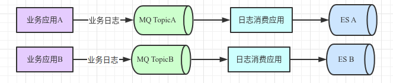

### 一、问题背景

5月17日，下午4点由于EDI集群上某商家请求剧增，MQ的生产流量也变成平时两倍，而日志消费应用消费能力不足，导致日志积压到MQ，24小时后积压到2亿。


### 二、解决步骤

1）登陆MQ监控页面，查看其他消费者是否有积压

发现有其他应用无积压，说明MQ没有达到消费瓶颈。

> 评估应该是日志消费应用处理逻辑较多或者写入ES有瓶颈。

2）登陆日志消费应用，执行jstack，分析调用栈

jstack里发现涉及到ES写入逻辑时，大部分线程处于等待ES响应态。

> 评估可能是ES有瓶颈。

3）登陆ES监控页面，查看ES的写入QPS和资源使用率

ES的写入QPS为4K左右，CPU使用率为10%-30%间。

> 评估ES写入远没有到瓶颈，可能是日志消费应用没有并发写入ES导致。

4）修改日志消费应用，改为并发写ES

旧逻辑是同步的非并发写：

```java
BulkRequestBuilder bulkRequest = transportClient.prepareBulk();
BulkResponse responses = bulkRequest.execute().actionGet(awaitTime);
```

新逻辑改为使用BulkProcessor并发写：

```java
BulkProcessor bulkProcessor = BulkProcessor.builder(transportClient, new BulkProcessor.Listener() {
        @Override
        public void beforeBulk(long l, BulkRequest bulkRequest) {
        }
        @Override
        public void afterBulk(long l, BulkRequest bulkRequest, BulkResponse 
        }
        @Override
        public void afterBulk(long l, BulkRequest bulkRequest, Throwable throwable) {
        }
    }).setBulkActions(10000)
      .setBulkSize(new ByteSizeValue(20, ByteSizeUnit.MB))
      .setFlushInterval(TimeValue.timeValueSeconds(5))
      .setConcurrentRequests(4)
      .setBackoffPolicy(BackoffPolicy.exponentialBackoff(TimeValue.timeValueMillis(100), 1))
      .build();
```

5）修改代码后，重新观察ES监控

写入QPS峰值达到1.8W，CPU使用率达到60%。此是MQ的积压数几乎稳定，不再增长也不减少。

> 经和ES技术沟通，当前ES负载较合适不适合再增加并发度。于是考虑申请新ES来分摊压力。

6）新建Topic，新申请ES，解决问题



ø MQ上新建Topic，大流量的商家的日志写到新Topic上；

ø 新申请几台日志消费应用，消费新Topic，写入新ES。

经观察新ES集群的写入QPS均值约1.7W。

> 执行以上操作后，积压问题解决。

### 三、问题结论

积压问题需要开源节流两方面考虑。后面考虑可以不保存查询类日志，减小流量压力。

