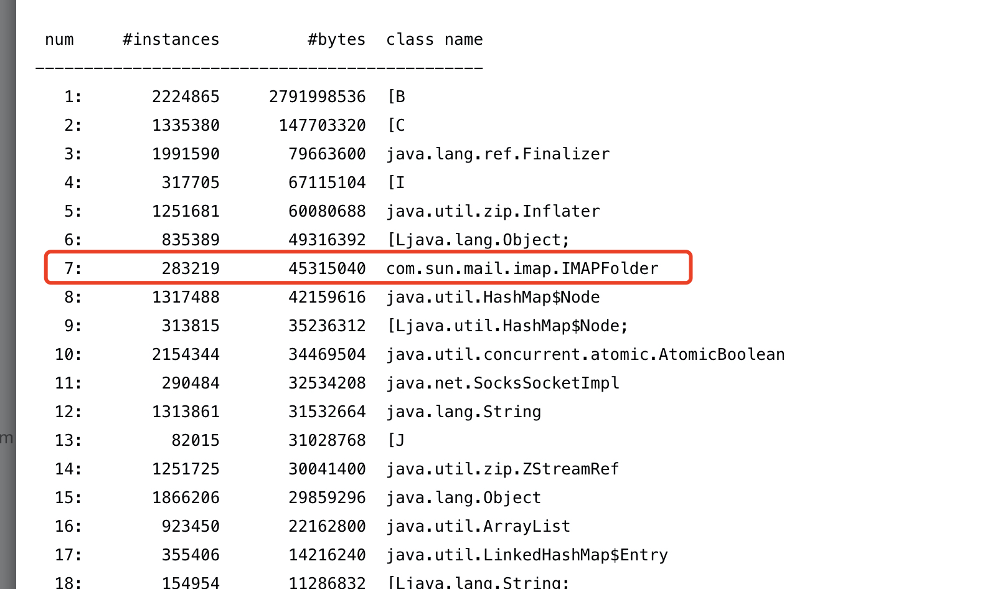

#### 一、背景描述

今日中午收到告警，EDI某应用集群的个别容器出现堆内存使用率97%告警，且持续数小时没停止。

#### 二、排查路径

##### 1）查看该集群请求量，与往日对比是否有剧增；

从ES集群进行日志统计，发现其与往日流量无差。排除流量异常引起的堆内存飙高；

##### 2）在内存飙高容器上执行jstack，观察是否有异常；

观察线程堆栈，发现无异常。排除流程死循环等引起的异常；

##### 3）在内存飙高容器上执行jmap -heap，jmap -histo，jmap -dump

> 执行jmap前先摘掉流量，避免影响系统可用性。

通过直方图可看出，有大量的IMapFolder对象产生。猜测应该是EDI流程里读取邮件的服务引起的。

恰巧此时有研发反馈其EDI的一个扫描邮箱的流程两天没日志了，印证了刚才的猜想。



##### 5）询问研发邮箱有当前有多少邮件需要扫描

研发反馈当前邮箱里有3000+邮件，其中未读邮件200+，且每个邮件都有附件。而其流程逻辑是只处理未读邮件，然后标为已读。

##### 6）查看EDI里处理邮件源码，确认扫描逻辑

源码里是扫描全部邮件到本机，然后再根据标识（如未读状态）进行过滤。根据邮件及其附件大小（附件约200KB），每次读取需要200KB * 3K = 600MB空间。这些在容器JVM配置为`Xms=4G Xmx=4G`上，这些对象必然会进入到老年代。而扫描又是15分钟频次的定时任务触发，必然会频繁触发FullGC。

以下为`jmap -heap`信息：

```
Heap Configuration:
   MinHeapFreeRatio         = 40
   MaxHeapFreeRatio         = 70
   MaxHeapSize              = 4294967296 (4096.0MB)
   NewSize                  = 348913664 (332.75MB)
   MaxNewSize               = 348913664 (332.75MB)
   OldSize                  = 3946053632 (3763.25MB)
   NewRatio                 = 2
   SurvivorRatio            = 8
   MetaspaceSize            = 536870912 (512.0MB)
   CompressedClassSpaceSize = 1073741824 (1024.0MB)
   MaxMetaspaceSize         = 536870912 (512.0MB)
   G1HeapRegionSize         = 0 (0.0MB)
```

#### 三、解决方案

##### 1）让研发把已读的邮件备份到其他文件夹

##### 2）降低定时任务频次

经过以上方案修改后，内存使用恢复正常。之后研发发现其邮件仍然没有处理，而后我把后台邮件相关的日志通过log4j的Logger和Appender，修改其日志级别，并抽取到单独的日志文件进行观察。发现研发的正则表达式也错了，告诉其正确写法后解决。

