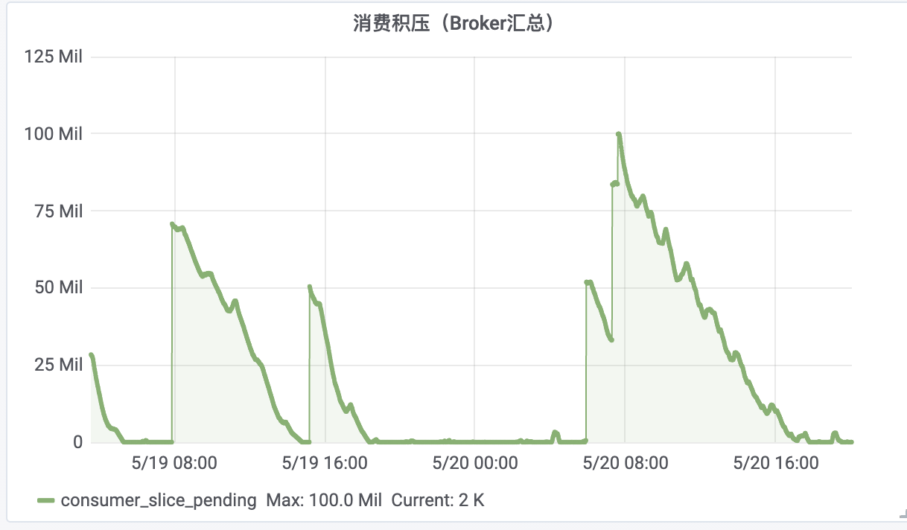
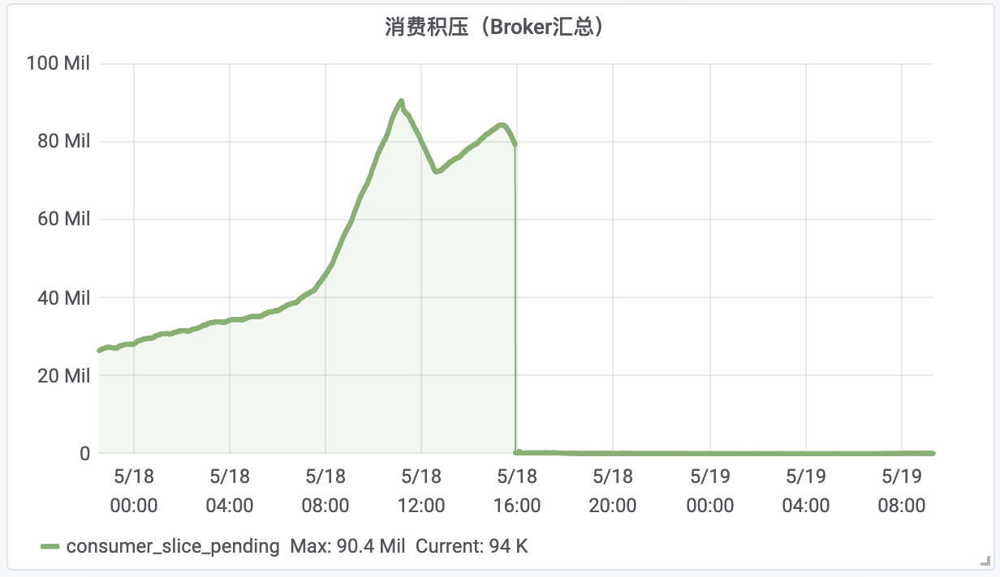

#### 一、问题背景

今日EDI日请求剧增，日产日志消息也随之倍增，然后就频繁收到MQ积压告警，通过观察消费者积压数量发现存在MQ消息积压陡增的情况。如下图所示：

而，该Topic的另一个消费分组出现了积压断崖情况，如下图所示。

#### 二、问题原因

经和MQ的技术支持沟通，可能原因：

1）若消费者消费消息的耗时超过了两次poll的间隔（参数max.poll.interval.ms），被Broker踢除，导致rebalance。

2）rebalance之后，消费者会重新询问消费位点，若没有获取位点，则根据配置的位点重置策略进行位点重置。

3）消费者的位点重置策略参数为auto.offset.reset：

* 如果auto.offset.reset=earliest，则重新消费，导致积压都增高；

* 如果auto.offset.reset=lastest，则就近消费，导致积压断崖。

#### 三、修改方案

把max.poll.interval.ms的值由10000改为30000后，观察发现问题修复。

#### 四、其他

位点获取失败长期看来是不可避免的，配置重置策略时可以评估以下因素：

1）如果可以接受重复消费，不接受消息丢失，选择earliest；

2）如果可以接受部分丢失，不想去重复消费，选择lasteat；

