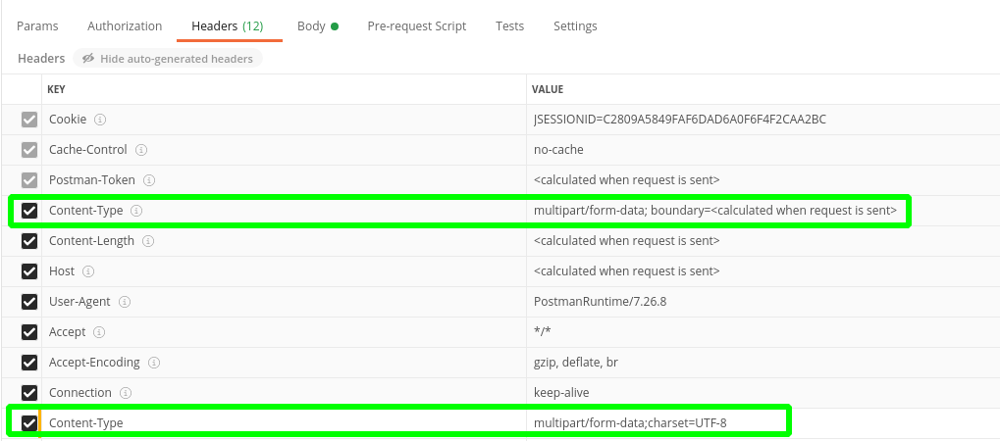
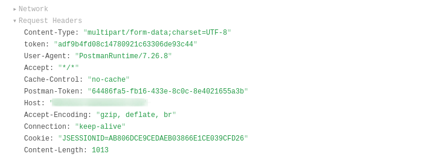
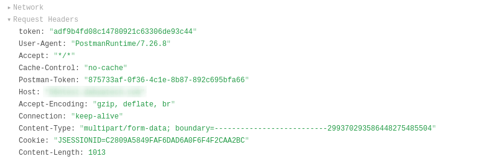

<!-- date: 2021.01.07 11:22 -->
#### 一、问题描述

昨天研发反馈使用EDI的HTTP调用结点时，http响应报错如下：`
Failed to parse multipart servlet request; nested exception is java.io.IOException: org.apache.tomcat.util.http.fileupload.FileUploadException: the request was rejected because no multipart boundary was found`。

#### 二、原因

EDI在构建http请求头时设置了**Content-Type**为“multipart/form-data;charset=UTF-8”，缺失了**boundary**，导致了如上错误。
正确的Content-Type格式应该为：“multipart/form-data; boundary=<calculated when request is sent>”

#### 三、代码修改

设置Camel Body的时候需要一起设置header，最终发送请求的header格式类似：

> "Content-Type": "multipart/form-data; boundary=BL6dpsdzxPuead3_GSOFXzNdhK6e85Wth_"

```java
/*
 * 此处必须复写Content-Type，使其格式为：multipart/form-data; boundary=<get after entity has been builded>
 * 否则，服务端会报错如下：“the request was rejected because no multipart boundary was found”
 */
exchange.getIn().setHeader(Exchange.CONTENT_TYPE, httpEntity.getContentType().getValue());
exchange.getIn().setBody(httpEntity);
```

#### 四、Postman验证

上面的Content-Type是postman内置的，下面的是手动加上的。


实验：
1）两者都勾选，上传成功


2）只勾选手动添加的Content-Type，上传失败，错误同上


3）只勾选内置的Content-Type，上传成功


#### 参考

1. [Camel send multipart/form-data request](https://www.manongdao.com/article-422394.html)
2. https://stackoverflow.com/questions/17415084/multipart-data-post-using-python-requests-no-multipart-boundary-was-found