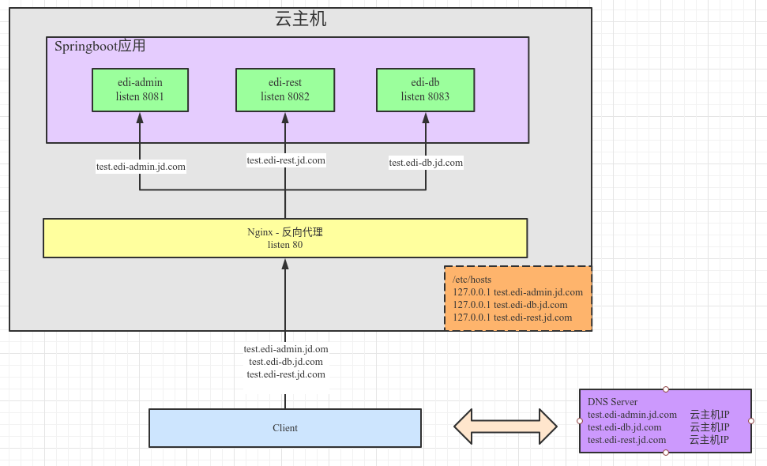

<!-- date: 2021.01.17 15:13 -->
#### 一、背景

最近为了响应公司“降本增效”，提高资源使用率，我们EDI小组决定要整合*edi-db*、*edi-rest*、*edi-admin*三个springboot应用到一个云主机上，通过Nginx反向代理进行分流。最终配置结果如下图：



附：Ngnix方向代理配置

```json
server {
        listen      80;
        server_name  test.edi-admin.jd.com;
            location /{
              proxy_pass         http://127.0.0.1:8081;
              proxy_set_header   Host             $host;
              proxy_set_header   X-Real-IP        $remote_addr;
              proxy_set_header   X-Forwarded-For  $proxy_add_x_forwarded_for;
                           proxy_set_header   X-Forwarded-Proto  $scheme;
        }
}

server {
        listen      80;
        server_name  test.edi-rest.jd.com;
            location /{
              proxy_pass         http://127.0.0.1:8082;
              proxy_set_header   Host             $host;
              proxy_set_header   X-Real-IP        $remote_addr;
              proxy_set_header   X-Forwarded-For  $proxy_add_x_forwarded_for;
                           proxy_set_header   X-Forwarded-Proto  $scheme;
        }
}

server {
        listen      80;
        server_name  test.edi-db.jd.com;
            location /{
              proxy_pass         http://127.0.0.1:8083;
              proxy_set_header   Host             $host;
              proxy_set_header   X-Real-IP        $remote_addr;
              proxy_set_header   X-Forwarded-For  $proxy_add_x_forwarded_for;
                           proxy_set_header   X-Forwarded-Proto  $scheme;
        }
}
```

#### 二、遇到问题

*edi-admin*应用运行时通过HttpClient请求*edi-rest*模块提供的Rest时，会返回404。

这些URL经验证：1）云主机上通过curl命令访问正常；2）客户端通过postman访问正常

#### 三、排查

##### 1. 远程debug调试edi-admin观察http的请求信息

* 请求URI：

```shell
test.edi-rest.jd.com/organize/query
```

* 请求头信息如下：

```properties
host: test.edi-admin.jd.com, 
x-real-ip: 172.22.141.3, 
x-forwarded-for: 172.22.141.3, 
x-forwarded-proto: http, 
connection: close, 
user-agent: Mozilla/5.0 (X11; Ubuntu; Linux x86_64; rv:84.0) Gecko/20100101 Firefox/84.0, 
accept: text/html, */*; q=0.01, 
accept-language: en-US,en;q=0.5, 
accept-encoding: gzip, deflate, 
x-requested-with: XMLHttpRequest, 
referer: http://test.edi-admin.jd.com/systemComfig, 
cookie: xxxxxx, 
Content-Type: application/json;charset=utf-8
```

##### 2. 观察nginx的access.log

* curl请求对应日志

```shell
127.0.0.1 - - [15/Jan/2021:12:48:12 +0800] "GET /organize/query HTTP/1.1" 302 0 "-" "curl/7.29.0"
127.0.0.1 - - [15/Jan/2021:12:49:16 +0800] "GET /organize/query HTTP/1.1" 302 0 "-" "curl/7.29.0"
127.0.0.1 - - [15/Jan/2021:12:49:28 +0800] "GET /organize/query HTTP/1.1" 200 70 "-" "curl/7.29.0"
```

* 客户端Postman请求对应日志

```shell
172.22.141.3 - - [15/Jan/2021:15:07:47 +0800] "GET /organize/query HTTP/1.1" 200 70 "-" "PostmanRuntime/7.26.8"
```

* edi-admin请求日志

```shell
127.0.0.1 - - [15/Jan/2021:12:57:44 +0800] "GET /organize/query HTTP/1.1" 404 254 "http://test.edi-admin.jd.com/systemComfig" "Mozilla/5.0 (X11; Ubuntu; Linux x86_64; rv:84.0) Gecko/20100101 Firefox/84.0"
127.0.0.1 - - [15/Jan/2021:12:58:09 +0800] "GET /organize/query HTTP/1.1" 404 252 "http://test.edi-admin.jd.com/systemComfig" "Mozilla/5.0 (X11; Ubuntu; Linux x86_64; rv:84.0) Gecko/20100101 Firefox/84.0"
```

##### 3. 猜测验证

猜测应该是*edi-admin*在请求时的请求头和正常有区别。经过postman验证发现，是由于*edi-admin*请求的Header里的host导致的异常。

```properties
host: test.edi-admin.jd.com,
```

#### 四、原因

##### 1）nginx在转发请求时会判断header里是否有host

* 如果header里有host，把其作为转发的目标host

* 否则，使用请求URI的域名host作为转发的host。

##### 2）验证

* postman中加上header：`host: test.edi-admin.jd.com` ，复现404错误；

* 再此修改header为：`host: test.edi-rest.jd.com`，访问正常；

##### 3）检查edi-admin代码

发现其在使用httpclient进行请求前，把请求*edi-admin*的header全量复制给了请求*edi-rest*的请求里。

```java
private static void copyHeader(HttpServletRequest req, AbstractHttpMessage post) {
    Enumeration<String> headers = req.getHeaderNames();
    while (headers.hasMoreElements()) {
        String name = headers.nextElement();
        if (filteredHeader.contains(name.toLowerCase())) {
            continue;
        }
        post.setHeader(name, req.getHeader(name));
    }
}
```

#### 五、解决

修改edi-admin中复制Header的逻辑，全量复制改为只复制Cookie（为了认证）。重新部署后问题解决。
