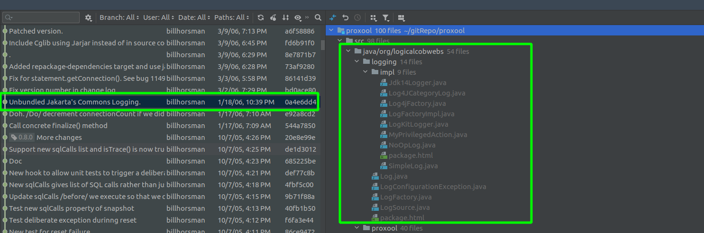
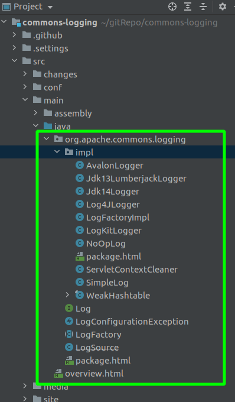

#### 一、背景

应用代码的日志框架使用slf4j，绑定log4j2实现。不使用log4j1。

近期对日志依赖调整后，发现如下异常

```java
Caused by: java.lang.NoClassDefFoundError: org/apache/log4j/ConsoleAppender
at org.logicalcobwebs.logging.impl.Log4JCategoryLog.initialize(Log4JCategoryLog.java:134)
at org.logicalcobwebs.logging.impl.Log4JCategoryLog.<init>(Log4JCategoryLog.java:120)
at org.logicalcobwebs.logging.impl.Log4jFactory.getInstance(Log4jFactory.java:134)
at org.logicalcobwebs.logging.impl.LogFactoryImpl.getInstance(LogFactoryImpl.java:247)
at org.logicalcobwebs.logging.LogFactory.getLog(LogFactory.java:380)
at org.logicalcobwebs.proxool.configuration.PropertyConfigurator.<clinit>(PropertyConfigurator.java:79)
... 66 more
Caused by: java.lang.ClassNotFoundException: org.apache.log4j.ConsoleAppender
at java.net.URLClassLoader.findClass(URLClassLoader.java:381)
at java.lang.ClassLoader.loadClass(ClassLoader.java:424)
at sun.misc.Launcher$AppClassLoader.loadClass(Launcher.java:331)
at java.lang.ClassLoader.loadClass(ClassLoader.java:357)
... 79 more
```

#### 二、查看proxool-0.8.0源码

```java
package org.logicalcobwebs.logging.impl;
    
public class LogFactoryImpl extends LogFactory {
    public LogFactoryImpl () {
        super ();
        // 尝试使用log4j
        guessConfig ();
    }
    
    public Log getInstance (Class clazz) throws LogConfigurationException {
        if (proxyFactory != null) {
            return proxyFactory.getInstance (clazz); // line number: 247，调用时发生异常
        }

        return (getInstance (clazz.getName ()));
    }
    
    // 判断Classpath是否有log4j相关类，有的使用它作为日志框架
    protected void guessConfig () {
        if (isLog4JAvailable ()) {
            proxyFactory = null;
            try {
                Class proxyClass = loadClass ("org.logicalcobwebs.logging.impl.Log4jFactory");
                if (proxyClass != null) {
                    proxyFactory = (LogFactory) proxyClass.newInstance ();
                }
            } catch (Throwable t) {
            }
        }
    }
    
    // 判断classpath是否有log4j的类：org.apache.log4j.Category
    protected boolean isLog4JAvailable () {
        try {
            loadClass ("org.apache.log4j.Category");
            loadClass ("org.logicalcobwebs.logging.impl.Log4JCategoryLog");
            return (true);
        } catch (Throwable t) {
            return (false);
        }
    }
}
```

#### 三、解决方案1

1、移除classpath中含org.apache.log4j.Category的类。如log4j-x.jar，log4j-1.2-x.jar。

2、通过配置指定日志框架为JUL。新增配置文件commons-logging.properties。

```properties
org.logicalcobwebs.logging.Log=org.logicalcobwebs.logging.impl.Jdk14Logger
```


代码逻辑参考：org.logicalcobwebs.logging.impl.LogFactoryImpl#getLogConstructor。

> Concrete subclass of LogFactory that implements the following algorithm to dynamically select a logging implementation class to instantiate a wrapper for.
>
> Use a factory configuration attribute named org.logicalcobwebs.logging.Log to identify the requested implementation class.
>
> Use the org.logicalcobwebs.logging.Log system property to identify the requested implementation class.
>
> If Log4J is available, return an instance of org.logicalcobwebs.logging.impl.Log4JCategoryLog.
>
> If JDK 1.4 or later is available, return an instance of org.logicalcobwebs.logging.impl.Jdk14Logger.
> Otherwise, return an instance of org.logicalcobwebs.logging.impl.NoOpLog.

#### 四、解决方案2

1）**proxool**的*org.logicalcobwebs.logging*包的源码来自**JCL**包*org.apache.commons.logging*。

2）**proxool**在0.9.x，源码里不再绑定JCL，而是通过依赖形式引入。

所以，直接把proxool的版本由0.8.0升级至0.9.1，然后新增proxool-cglib-0.9.1。

```xml
<dependency>
    <groupId>proxool</groupId>
    <artifactId>proxool</artifactId>
    <version>0.9.1</version>
</dependency>
<dependency>
    <groupId>proxool-cglib</groupId>
    <artifactId>proxool-cglib</artifactId>
    <version>0.9.1</version>
</dependency>
```

附、proxool的CHANGE LOG

> Jakarta's Commons Logging is now longer bundled with the source and is now a dependency.
>We had forked this component (at their version 1.02) to make it simpler for us to deploy but
> there are advantages, particular with respect to configuration, to just using
> the component direct from Jakarta.

图示：proxool源码里移除了JCL的类，注意包名不同。



图示：JCL中的类

