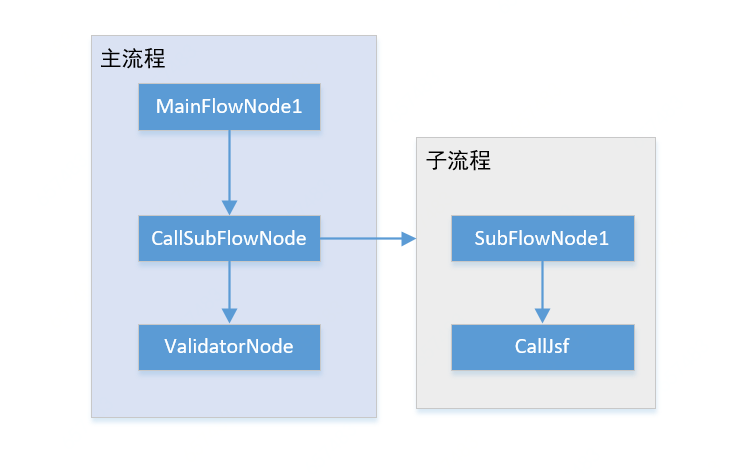

#### 一、问题描述

昨天，一个研发同时在使用EDI的IDE在本地运行时报错，原因是由于jsf泛化不支持枚举，把流程发布到测试环境后解决。其中有个问题令我困惑，就是异常堆栈显示的抛出异常的位置并不是真正的位置。

#### 二、原因

1. 发生异常的子流程设置了全局异常捕获，把异常信息封装为固定的格式返回。

2. 直到遇到数据校验结点，校验子流程的结果时，校验失败，并抛出了校验的异常。异常信息是上个结点的数据的内容。
   
   

#### 三、反思

1. 产生困惑的原因是，校验结点的异常信息描述不清楚。
