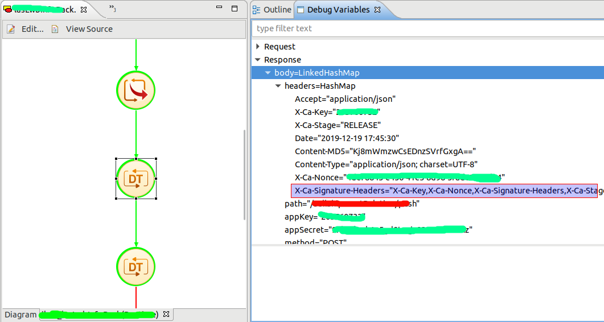
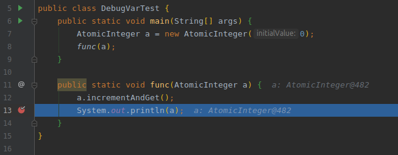
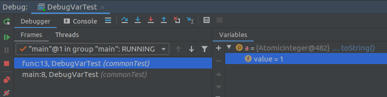
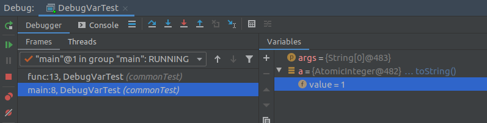

一、问题描述
近日晚间有开发使用EDI的IDE开发完流程后，执行调试时，发现流程中的第一个数据转换结点的结果多出了一个属性值`X-Ca-Signature-Headers`。

二、原因
1）第二个DT结点对第一个DT结点的输出做了修改；
2）Debug视图看到的变量值是当前值，而非过去时刻的某个值；
三、Demo
目的：验证Debug视图，在不同的栈帧中查看同一变量，其值都是当前值，而非程序运行到此栈帧的值。

