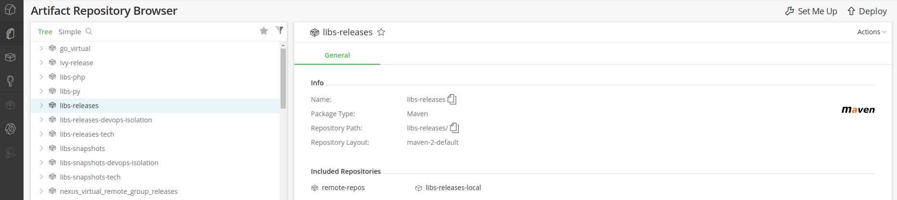

### 一、问题描述

昨日收到一个告警，内容如下：

```
2021-11-09 15:01:04 警告，
应用：xxx，
自定义监控：exception.write.kafka，
告警内容："消费本地失败消息写入Kafka失败java.lang.NoClassDefFoundError: net/jpountz/lz4/LZ4Factory"，
报警主机：xxx.xxx.xxx.xxx
```

### 二、解决路径

#### 1）依赖不存在or依赖错版本

1.1 定位net/jpountz/lz4/LZ4Factory所在Jar的Maven坐标

```xml
<dependency>
    <groupId>net.jpountz.lz4</groupId>
    <artifactId>lz4</artifactId>
    <version>xxx</version>
</dependency>
```

1.2 从问题主机应用的*libs/*中未发现该依赖，**定位问题是包缺失**。

#### 2）定位依赖缺失原因

2.1 本地查看应用依赖树，发现`lz4-xxx.jar`由kafka-clients引入

```bash
$ mvn dependency:tree -Dverbose -X -U -f pom.xml | tee tree.txt

+- org.apache.kafka:kafka-clients:jar:0.11.0.1:compile
    +- net.jpountz.lz4:lz4:jar:1.3.0:compile
    +- org.xerial.snappy:snappy-java:jar:1.1.2.6:compile
    \- (org.slf4j:slf4j-api:jar:1.7.25:compile - omitted for conflict with 1.7.22)
```

2.2 清空本地Maven缓存，再次查看依赖树

```bash
# 清空pom中依赖树中的本地缓存
$ mvn dependency:purge-local-repository -DreResolve=false -DactTransitively=false
# 查看依赖树
$ mvn dependency:tree -Dverbose -X -U -f pom.xml | tee tree.txt

+- org.apache.kafka:kafka-clients:jar:0.11.0.1:compile 
```

2.3 **判定私服仓库`kafka-clients-0.11.0.1.pom`发生变化**


私服仓库中存在两个`kafka-clients-0.11.0.1.pom`，而`libs-release-local`仓库的pom内容为空，如下图。


#### 3）解决问题

联系上传人和私服管理员进行删除，打包恢复正常。

### 三、原因总结

1）研发把`kafka-clients-0.11.0.1.jar`上传到仓库`libs-release-local`，且`pom.xml`未正确设置。

2）私服仓库里`lib-release-local`比`remote-repos`优先级高，导致maven解析了错误依赖。

