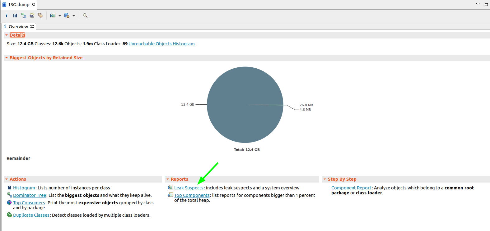
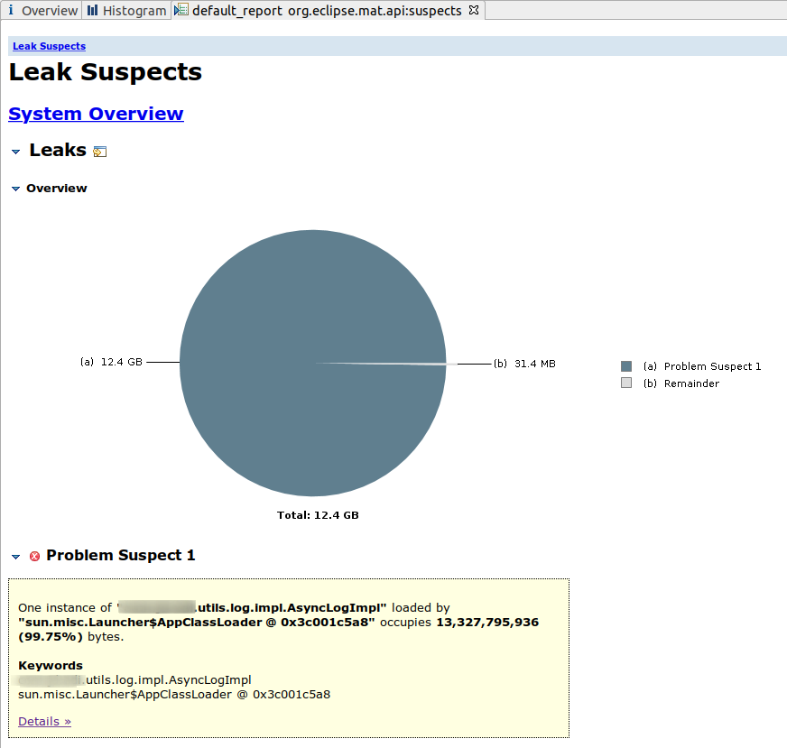
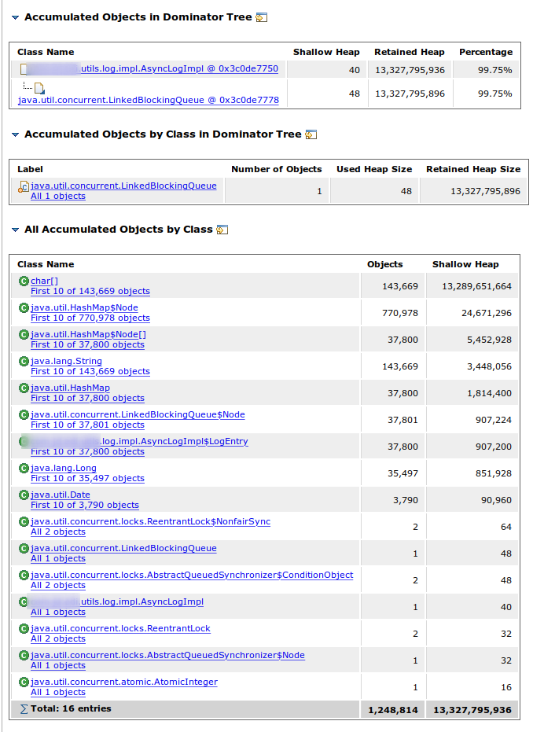
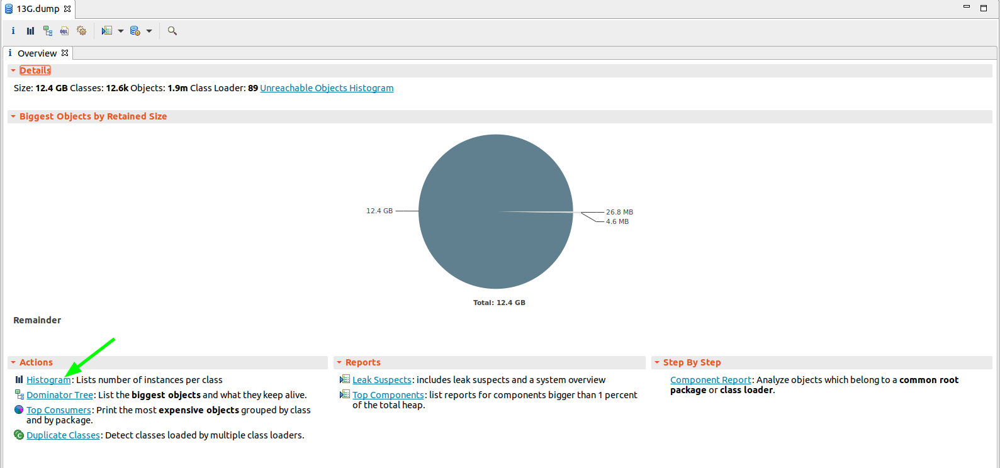
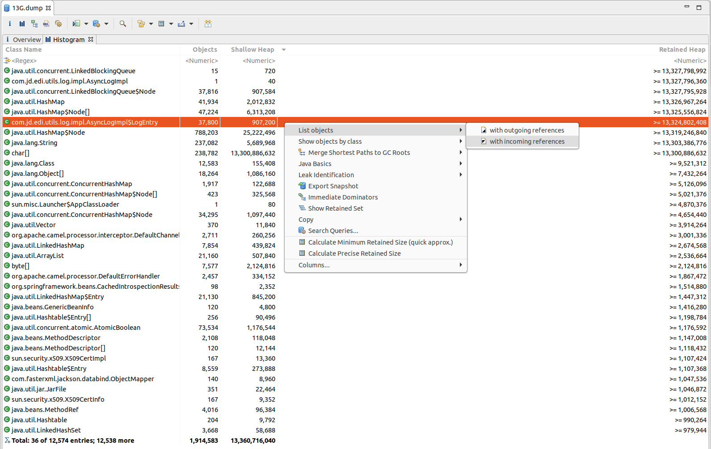
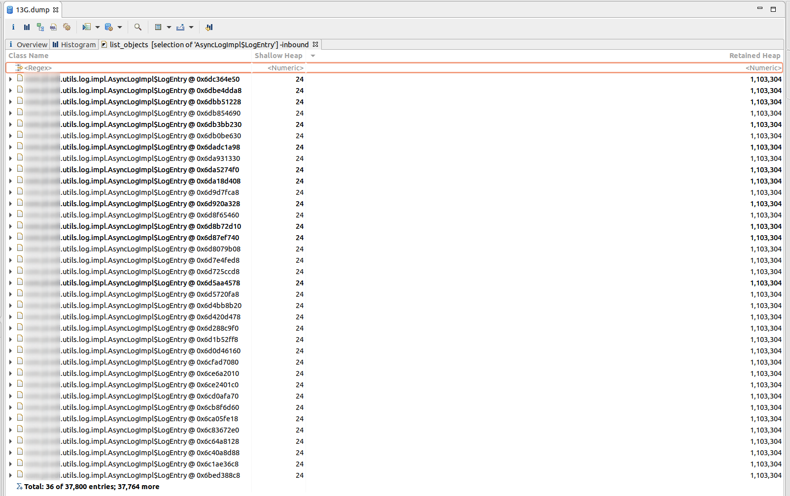
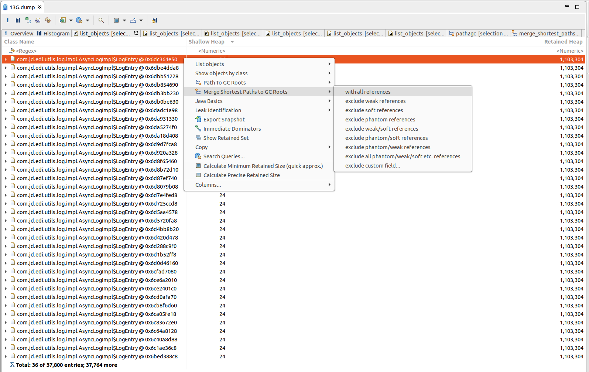
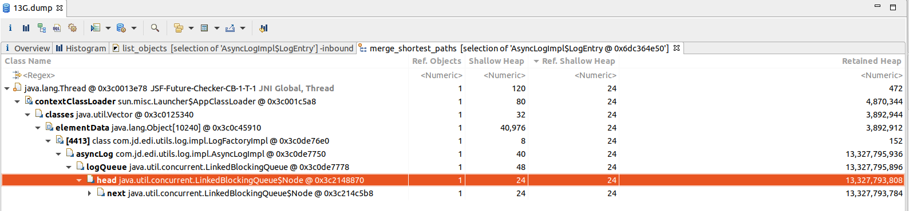

### 一、问题描述

研发反馈EDI应用请求无响应。

### 二、排查路径

#### 1）查看日志

日志中发现异常信息：`java.lang.OutOfMemoryError: GC overhead limit exceeded`。

#### 2）查看GC

```bash
$ jstat -gc 9459
 S0C    S1C    S0U    S1U      EC       EU        OC         OU       MC     MU    CCSC   CCSU   YGC     YGCT    FGC    FGCT     GCT   
1863680.0 1863680.0  0.0    0.0   1864704.0 1864704.0 11185152.0 11185145.3 74112.0 71884.7 9344.0 8819.3     82    7.997 3574  1139.764 1147.761
1863680.0 1863680.0  0.0    0.0   1864704.0 1864704.0 11185152.0 11185152.0 74112.0 71884.7 9344.0 8819.3     82    7.997 3944  1219.075 1227.072
1863680.0 1863680.0  0.0    0.0   1864704.0 1864704.0 11185152.0 11185145.1 74112.0 71884.7 9344.0 8819.3     82    7.997 3945  1219.501 1227.498
1863680.0 1863680.0  0.0    0.0   1864704.0 1864704.0 11185152.0 11185145.1 74112.0 71884.7 9344.0 8819.3     82    7.997 3945  1219.501 1227.498
1863680.0 1863680.0  0.0    0.0   1864704.0 1864702.6 11185152.0 11185145.0 74112.0 71884.7 9344.0 8819.3     82    7.997 3947  1219.709 1227.705
```

#### 3）Dump内存

`jmap -dump:live,format=b,file=heap.dump [pid]`  

### 三、分析Dump文件

#### 1）根据Leak Suspects分析






由以上图可以看出是AsyncLogImpl占用较高。



由以上可推出是AsyncLogImpl中的阻塞队列导致的内存溢出。

#### 2）根据类实例直方图分析





从类直方图中可观察出是应用的类`com.jd.edi.utils.log.impl.AsyncLogImpl$LogEntry`中有大量String对象导致的内存过高。然后查看该类的实例数为`37,764`，Top15都在1MB以上。



此时，通过GCRoot链（下图）可以分析出来是由于`com.jd.edi.utils.log.impl.AsyncLogImpl`的阻塞队列过长导致。





### 四、修改代码

1）修改AsyncLogImpl中阻塞队列大小，且支持配置。

2）增加消费线程数量，且支持配置。