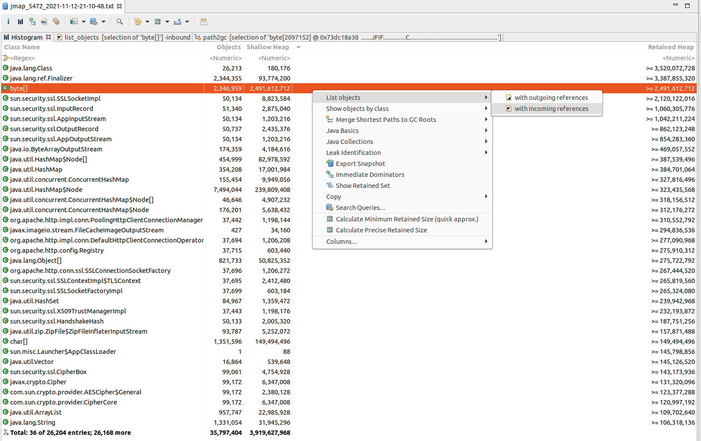
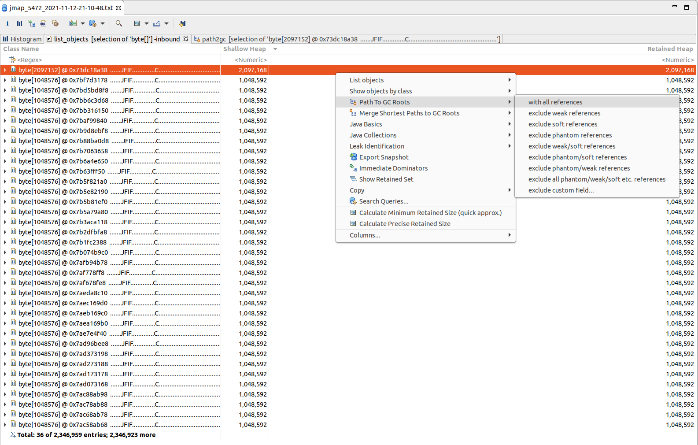
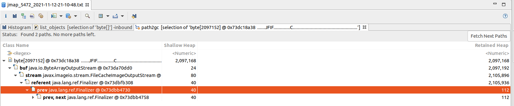
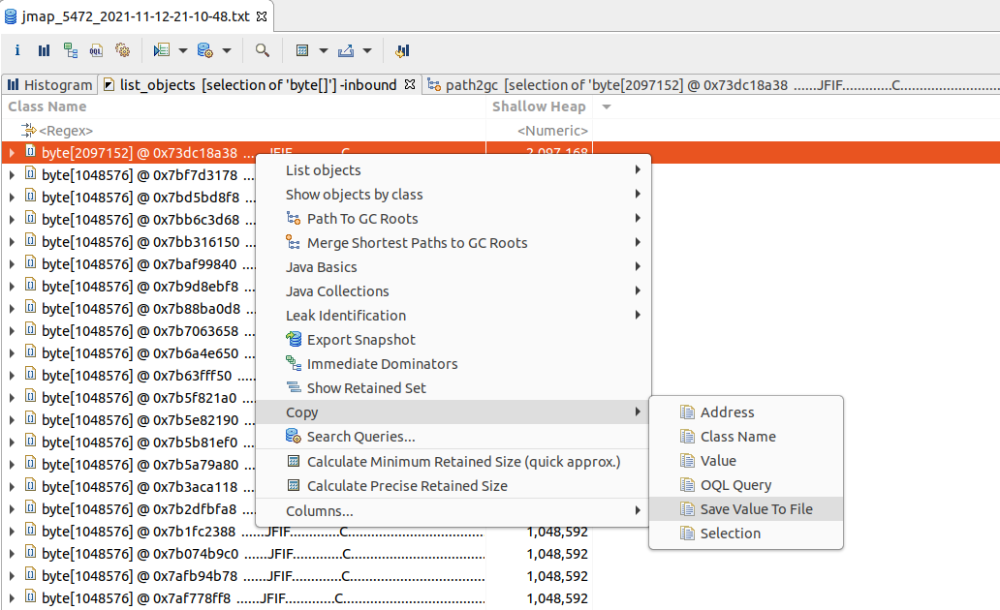

### 一、问题描述

近期线上容器频发FullGC，于是对进程执行`jstack`、`jmap`命令，保存现场信息而后分析。

### 二、分析Dump

1）查看`byte[]`对象列表



2）查看`GC Root`到`byte[]`引用链



由引用链发现`byte[]`内容为图片。



3）`byte[]`内容验证



保存图片，文件后缀为jif或者不加后缀。可通过图片工具查看。

4）原因分析

以上这些对象都被Finalizer所引用，而根据Finalizer机制，其会创建一个消费线程去依次执行队列里的方法。需要查看其线程栈`java.lang.ref.Finalizer`，确认Finalizer线程是否阻塞或死锁了。

### 三、分析JStack

从当时的线程栈分析，该线程在等待与IMAP邮件服务器的断连。此时分析是由于使用IMAP处理邮件后未正确关闭导致的Finalizer阻塞在此处。

```java
"Finalizer" #3 daemon prio=8 os_prio=0 tid=0x00007f0f040d5800 nid=0x156c waiting on condition [0x00007f0ee442f000]
   java.lang.Thread.State: WAITING (parking)
	at sun.misc.Unsafe.park(Native Method)
	- parking to wait for  <0x00000006fba4b440> (a java.util.concurrent.locks.ReentrantLock$NonfairSync)
	at java.util.concurrent.locks.LockSupport.park(LockSupport.java:175)
	at java.util.concurrent.locks.AbstractQueuedSynchronizer.parkAndCheckInterrupt(AbstractQueuedSynchronizer.java:836)
	at java.util.concurrent.locks.AbstractQueuedSynchronizer.acquireQueued(AbstractQueuedSynchronizer.java:870)
	at java.util.concurrent.locks.AbstractQueuedSynchronizer.acquire(AbstractQueuedSynchronizer.java:1199)
	at java.util.concurrent.locks.ReentrantLock$NonfairSync.lock(ReentrantLock.java:209)
	at java.util.concurrent.locks.ReentrantLock.lock(ReentrantLock.java:285)
	at java.util.concurrent.ScheduledThreadPoolExecutor$DelayedWorkQueue.drainTo(ScheduledThreadPoolExecutor.java:1184)
	at java.util.concurrent.ThreadPoolExecutor.drainQueue(ThreadPoolExecutor.java:854)
	at java.util.concurrent.ThreadPoolExecutor.shutdownNow(ThreadPoolExecutor.java:1422)
	at java.util.concurrent.ScheduledThreadPoolExecutor.shutdownNow(ScheduledThreadPoolExecutor.java:786)
	at com.sun.mail.util.WriteTimeoutSocket.close(WriteTimeoutSocket.java:273)
	at com.sun.mail.iap.Protocol.disconnect(Protocol.java:578)
	- locked <0x00000006fba6e338> (a com.sun.mail.imap.protocol.IMAPProtocol)
	at com.sun.mail.imap.protocol.IMAPProtocol.disconnect(IMAPProtocol.java:461)
	at com.sun.mail.iap.Protocol.finalize(Protocol.java:664)
	at java.lang.System$2.invokeFinalize(System.java:1270)
	at java.lang.ref.Finalizer.runFinalizer(Finalizer.java:98)
	at java.lang.ref.Finalizer.access$100(Finalizer.java:34)
	at java.lang.ref.Finalizer$FinalizerThread.run(Finalizer.java:210)
```

### 四、查看源码

从源码中发现Mail的close方法在上面逻辑发生异常时不会执行，导致未断连。

```java
public void process(Endpoint endpoint, MailConfig mailConfig) {
        LOGGER.info("{}开始处理邮件", endpoint.getUrl());
        MailReader mailReader = getMailReaderInstance(mailConfig);
        int success = 0;
        int fail = 0;
        MailMessage message;
        while ((message = mailReader.nextMessage()) != null) {
            boolean isSuccess = processMail(endpoint, mailReader, message);
            if (isSuccess) {
                success++;
            } else {
                fail++;
            }
        }
        LOGGER.info("{}处理邮件{}封,成功{}封,失败{}封", endpoint.getUrl(), success + fail, success, fail);
    
    	// 此处可能由于上面异常而导致未执行
        mailReader.close();
    }
```

### 五、查看日志

观察当天日志，确实发现出现了异常，导致`mailReader.close();`未执行。

```java
2021-11-12 16:40:37[ Thread-23631:139929940 ] - [WARN ] com.xx.xx.mail.component.ImapConsumer-run:91 - 处理邮件失败，错误消息为:This operation is not allowed on a closed folder
java.lang.IllegalStateException: This operation is not allowed on a closed folder
at com.sun.mail.imap.IMAPFolder.checkOpened(IMAPFolder.java:476)
at com.sun.mail.imap.IMAPFolder.copymoveMessages(IMAPFolder.java:2097)
at com.sun.mail.imap.IMAPFolder.copyMessages(IMAPFolder.java:2016)
at com.xx.xx.protocol.mail.core.reader.ImapReader.moveMessage(ImapReader.java:55)
at com.xx.xx.protocol.mail.core.reader.MailReader.proccessComplete(MailReader.java:97)
at com.xx.xx.protocol.mail.core.reader.MailReader.proccessComplete(MailReader.java:85)
at com.xx.xx.protocol.mail.core.MailProcessor.processMail(MailProcessor.java:69)
at com.xx.xx.protocol.mail.core.MailProcessor.process(MailProcessor.java:35)
at com.xx.xx.mail.component.ImapConsumer$1.run(ImapConsumer.java:89)
at java.lang.Thread.run(Thread.java:745)
```

### 六、修改代码

```java
public void process(Endpoint endpoint, MailConfig mailConfig) {
    LOGGER.info("{}开始处理邮件", endpoint.getUrl());
    MailReader mailReader = getMailReaderInstance(mailConfig);
    int success = 0;
    int fail = 0;
    MailMessage message;
    try {
        while ((message = mailReader.nextMessage()) != null) {
            boolean isSuccess = processMail(endpoint, mailReader, message);
            if (isSuccess) {
                success++;
            } else {
                fail++;
            }
        }
        LOGGER.info("{}处理邮件{}封,成功{}封,失败{}封", endpoint.getUrl(), success + fail, success, fail);
    } finally {
        mailReader.close();
    }
}
```

