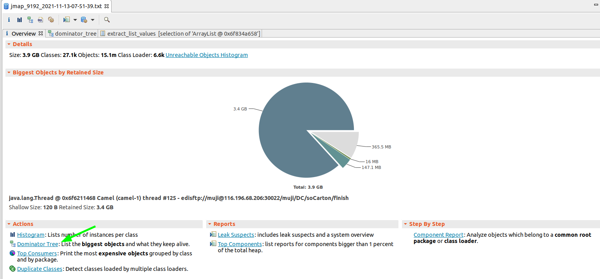
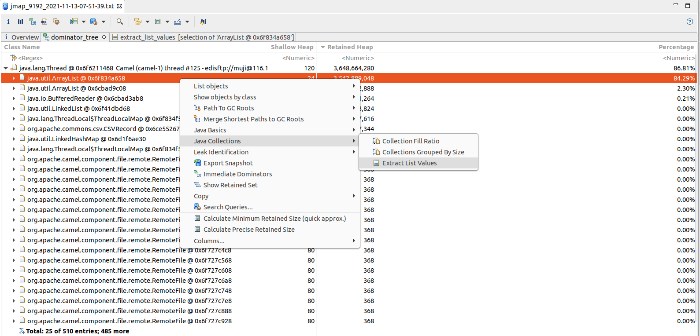
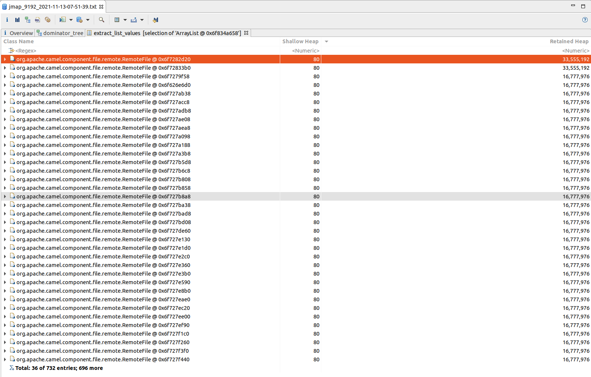
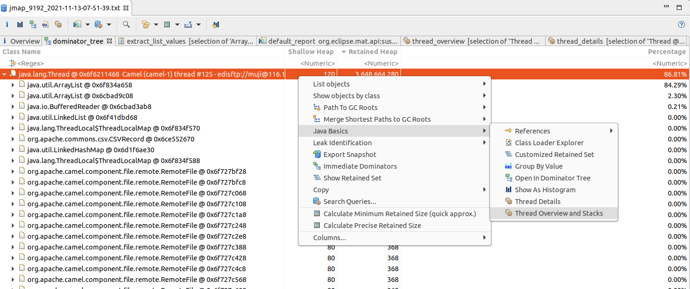
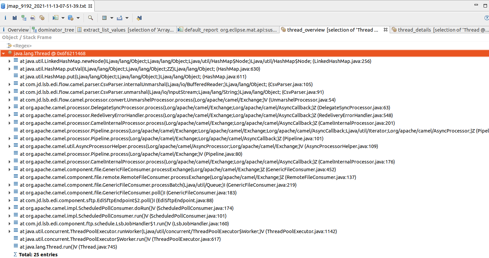

### 一、问题描述

喜闻乐见，我们的应用又又内存飚高了，FullGC告警多到麻木。老套路，dump内存开始分析。

### 二、分析Dump

1）查看存活大对象树图

2）从中发现有个线程下有个List，823个元素，占用内存大小3.5GB。

3）查看该集合元素值，排序后发现最大的RetainedHeap占用了33MB。

4）查看其线程栈

通过观察发现是FTP下载文件导致的内存溢出。

### 三、结论

Camel的FTP下载应该是串行的，理论上可达的文件对象应该每线程最多一个。此处需要分析下Camel源码是如何处理文件的。