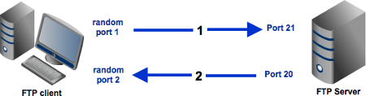
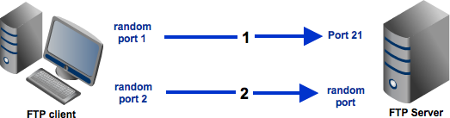
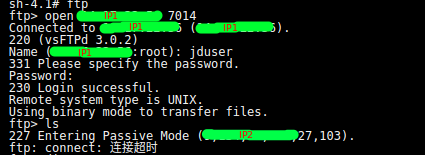

#### 0. FTP的两种模式



#### 1. 背景

前几日EDI支持时，有研发反馈一个FTP上传超时的问题：
1）运行环境： 测试环境（已加至商家网络的白名单）
2）EDI结点：FTP上传结点（Passive模式）
3）FTP服务器：商家的FTP服务器
4）错误信息：


#### 2. 尝试路径

1. 测试环境执行FTP命令
   
* 此时发现IP1和IP2不是同一个IP；
* IP2（类似9.x,x,x）看上去是公网IP，但其实是内网IP
2. 本地FileZilla通过sshuttle连接
   
   ```shell
   # 代理控制端口
   sshuttle -r user@测试服务器IP IP1/32
   # 代理数据端口
   sshuttle -r user@测试服务器IP IP2/32
   ```
* 错误同执行命令一致
  
#### 3. 解决方案
  
猜测出商家侧配置错误，返回的IP2可能是内网地址，于是在我方测试服务器通过iptable开启DNET后解决。
  
  ```shell
  sudo iptables -t nat -A OUTPUT -p tcp -d IP2 -j DNAT --to-destination IP1
  ```