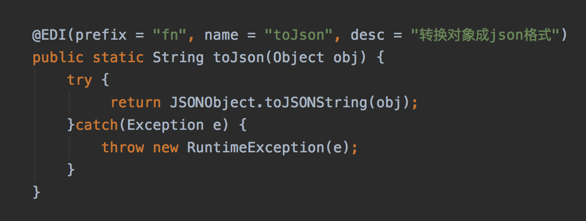

<!-- date: 2020.03.06 14:48 -->
#### 1. 背景

昨日晚，edi开发人员反应线上有个商家从下午3点13分开始签名校验一直失败，导致业务无法正常处理。该集群近期没有上线，重启操作，一起都是那么莫名其妙。

#### 2. 解决路径

1. 通过查看日志发现签名校验的原数据在3点13分前后不一致，类似如下：   
   
   ```java
   // 3点13分前：
   appSercretKey{"key1": value1, "key2": value2}
   // 3点13分后：
   appSercretKey"{\"key1\": value1, \"key2\": value2}"
   ```

2. 查看流程中签名原数据的el表达式，类似：`${prop.appSecretKey}${fn:toJson(body)}`

3. 查看函数：
   
   ```java
   @EDI(prefix = "fn", name = "toJson", desc = "将obj转为Json字符串")
   public static String objectToJson(Object obj) {
     if (obj == null) {
         return null;
     }
     if (String.class.isInstance(obj)) {
         return (String) obj;
     } else {
         return JSON.toJSONString(obj);
     }
   }
   ```

4. 中间错误的判断：
   1）被“反序化”节点名称迷惑，认为输入的body可能前后不一致，String或Map导致走了上面函数的不同分支；`后通过日志和代码逻辑确认body没有被反序列化。`
   2）怀疑并发产生的问题；`后通过测试没有复现，并且并发的问题一般都是偶发的问题，可当时的问题是自某个时间点后问题一直都在`

5. 通过仔细对比3点13分前后的数据，发现输入之后肯定是调用了toJson的方法，导致加上了引号。并且确认上面的函数在正常情况下会因为是字符串类型直接返回。

6. 以上，推测大概率并没有调用上面的函数，而是有商家自定义同名函数，覆盖了全局函数导致异常。`通过搜索发现确实有另一个商家自定义了相同的fn:toJson函数。`
   

7. 通过日志查询发现就是3点13分，该商家确实有请求。

8. 由此，返回去确认代码的逻辑发现，虽然商家的函数都是隔离的，但是在组合全局函数和商家函数时，由于全局函数返回的map不是副本，导致其他商家的函数会被注册进来。主要逻辑如下：
   
   ```java
      private static Map<String, Method> getGlobalFunctionList() {
       return globalFunctionMap;
   }
   
   public static Map<String, Method> getFunctionList() {
       Map<String, Method> functionList = getGlobalFunctionList();
       Map<String, Method> partnerFunctionList = getPartnerFunctionList();
       if (partnerFunctionList != null) {
           functionList.putAll(partnerFunctionList);
       }
       return functionList;
   }
   ```

#### 总结

函数的返回值，尽量是副本或者是unmodify的。否则就有被污染的风险。以上的函数也做了如下修改：

```java
private static Map<String, Method> getGlobalFunctionList() {
    return new HashMap(globalFunctionMap);
} 

public static Map<String, Method> getFunctionList() {
    Map ret = new HashMap();
    Map<String, Method> functionList = getGlobalFunctionList();
    if (functionList != null) {
        ret.putAll(functionList);
    }
    Map<String, Method> partnerFunctionList = getPartnerFunctionList();
    if (partnerFunctionList != null) {
        ret.putAll(partnerFunctionList);
    }
    return ret;
}
```