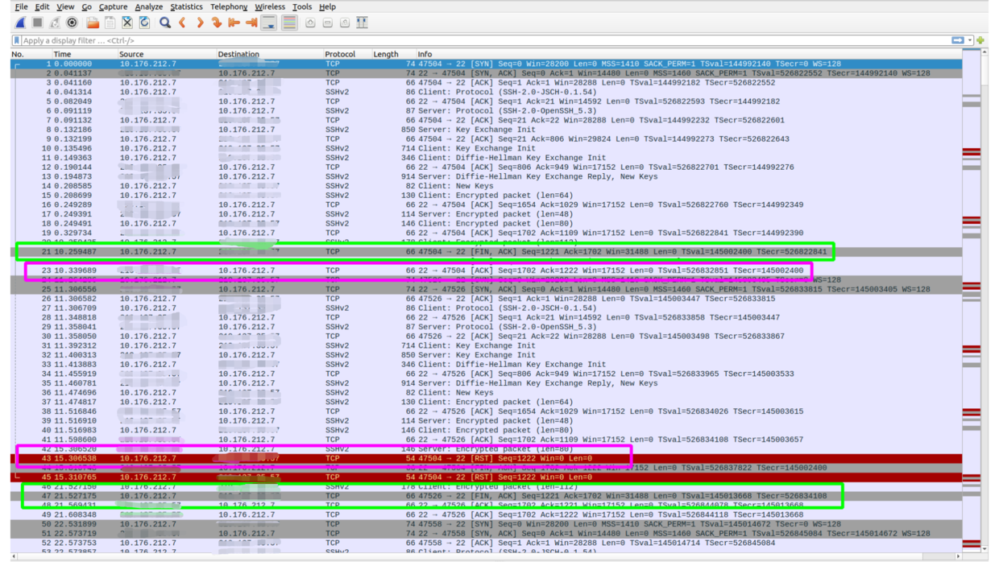
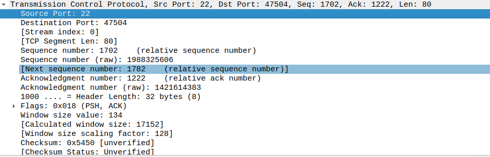

#### 一、背景

近期公司推上云，于是把某集群的非公有云机器缩容了。导致有个商家的sftp上传失败，后通过日志发现之前成功的日志也都是非公有云容器。
关键堆栈如下：

```java
Caused by: org.apache.camel.component.file.GenericFileOperationFailedException: Cannot connect to sftp://testuser@demo.sftp.com.cn:22
    at org.apache.camel.component.file.remote.SftpOperations.connect(SftpOperations.java:149)
    at org.apache.camel.component.file.remote.RemoteFileProducer.connectIfNecessary(RemoteFileProducer.java:214)
    at org.apache.camel.component.file.remote.RemoteFileProducer.recoverableConnectIfNecessary(RemoteFileProducer.java:206)
    at org.apache.camel.component.file.remote.RemoteFileProducer.preWriteCheck(RemoteFileProducer.java:133)
    at org.apache.camel.component.file.GenericFileProducer.processExchange(GenericFileProducer.java:114)
    at org.apache.camel.component.file.remote.RemoteFileProducer.process(RemoteFileProducer.java:58)
    at org.apache.camel.util.AsyncProcessorConverterHelper$ProcessorToAsyncProcessorBridge.process(AsyncProcessorConverterHelper.java:61)
    at org.apache.camel.processor.SendProcessor$2.doInAsyncProducer(SendProcessor.java:178)
    at org.apache.camel.impl.ProducerCache.doInAsyncProducer(ProducerCache.java:445)
    at org.apache.camel.processor.SendProcessor.process(SendProcessor.java:173)
    at org.apache.camel.processor.RedeliveryErrorHandler.process(RedeliveryErrorHandler.java:548)
    ... 96 more
Caused by: com.jcraft.jsch.JSchException: Session.connect: java.net.SocketTimeoutException: Read timed out
    at com.jcraft.jsch.Session.connect(Session.java:565)
    at org.apache.camel.component.file.remote.SftpOperations.connect(SftpOperations.java:121)
    ... 106 more
```

#### 二、排查路径

> 预备：申请线上环境的运维权限和堡垒机，登陆线上机器；

1. 观察以往日志里
   
     * 同一台公有云机器运行时，sftp下载正常，但是上传超时

2. 线上机器执行sftp的命令，查看是否正常
   
     * sftp通过命令连接登陆有点慢
     * 上传和下载速度都很快，测试速度为90 kb/s

3. 线上机器通过log4j抽取SftpOperations的日志
   
     * 发现sftp的connectTimeout为10秒
     * 且出现反复重连现象

相关日志如下：

```
2020-12-08 11:40:32[ JSF-BZ-22000-14-T-692:52229673 ] - [TRACE] org.apache.camel.component.file.remote.SftpOperations-connect:150 - Cannot connect due: Cannot connect to sftp://testuser@demo.sftp.com.cn:22
2020-12-08 11:40:33[ JSF-BZ-22000-14-T-692:52230673 ] - [TRACE] org.apache.camel.component.file.remote.SftpOperations-connect:112 - Reconnect attempt #3 connecting to + sftp://testuser@demo.sftp.com.cn:22
2020-12-08 11:40:33[ JSF-BZ-22000-14-T-692:52230674 ] - [TRACE] org.apache.camel.component.file.remote.SftpOperations-connect:117 - Session isn't connected, trying to recreate and connect.
2020-12-08 11:40:33[ JSF-BZ-22000-14-T-692:52230674 ] - [DEBUG] org.apache.camel.component.file.remote.SftpOperations-createSession:263 - Using knownhosts file: ../conf/ssh_knownhosts
2020-12-08 11:40:33[ JSF-BZ-22000-14-T-692:52230675 ] - [DEBUG] org.apache.camel.component.file.remote.SftpOperations-createSession:288 - Using known hosts information from file: ../conf/ssh_knownhosts
2020-12-08 11:40:33[ JSF-BZ-22000-14-T-692:52230677 ] - [DEBUG] org.apache.camel.component.file.remote.SftpOperations-createSession:295 - Using StrickHostKeyChecking: no
2020-12-08 11:40:33[ JSF-BZ-22000-14-T-692:52230677 ] - [TRACE] org.apache.camel.component.file.remote.SftpOperations-connect:120 - Connecting use connectTimeout: 10000 ...
2020-12-08 11:40:39[ JSF-BZ-22000-14-T-683:52235816 ] - [TRACE] org.apache.camel.component.file.remote.SftpOperations-connect:117 - Session isn't connected, trying to recreate and connect.
2020-12-08 11:40:39[ JSF-BZ-22000-14-T-683:52235816 ] - [DEBUG] org.apache.camel.component.file.remote.SftpOperations-createSession:263 - Using knownhosts file: ../conf/ssh_knownhosts
2020-12-08 11:40:39[ JSF-BZ-22000-14-T-683:52235818 ] - [DEBUG] org.apache.camel.component.file.remote.SftpOperations-createSession:288 - Using known hosts information from file: ../conf/ssh_knownhosts
2020-12-08 11:40:39[ JSF-BZ-22000-14-T-683:52235820 ] - [DEBUG] org.apache.camel.component.file.remote.SftpOperations-createSession:295 - Using StrickHostKeyChecking: no
```

4. 线上机器执行tcpdump，然后下载本地后使用wireshark分析
   `tcpdump -i 网卡名称 -vv host sftp域名 -w tcpdump.pcap`
   
   

从wireshark里发现两个问题：
1）我方机器等待对方包10秒还没有返回时，会发送**FIN**，表示不再接受数据
2）由于我方关闭后仍收到之前sftp服务器发出的包（即RST上面的SSHv2包），我方机器会发送**RST**，表示重置连接


#### 三、解决方案

由以上可知sftp连接会超过10秒，故设置为30秒后解决。

NOTE：下载正常是它和上传使用的不是一套代码（下载使用的是自己封装的部分配置，而上传使用的是camel原生配置），而这两部分的默认超时时间不同。