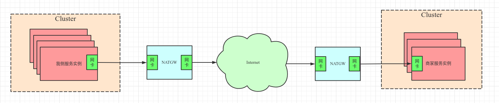
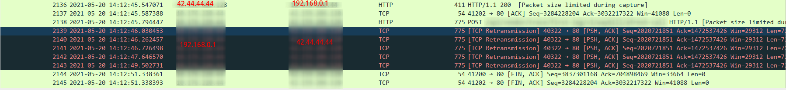
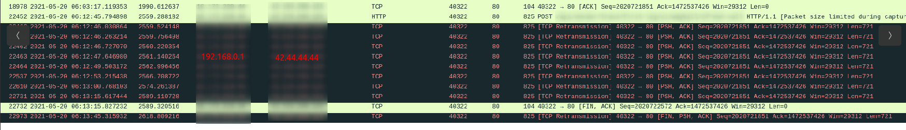
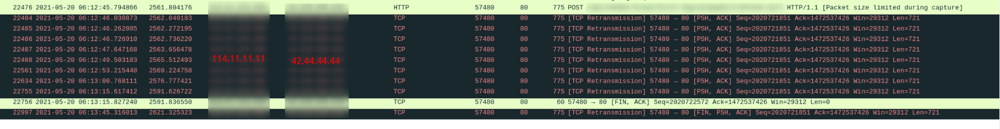

### 一、问题背景

EDI某商家回传场景近期高频出现Http回传商家超时现象，关键堆栈如下：

```java
Caused by: java.net.SocketTimeoutException: Read timed out
	at java.net.SocketInputStream.socketRead0(Native Method)
	at java.net.SocketInputStream.socketRead(SocketInputStream.java:116)
	at java.net.SocketInputStream.read(SocketInputStream.java:170)
	at java.net.SocketInputStream.read(SocketInputStream.java:141)
	at org.apache.http.impl.io.SessionInputBufferImpl.streamRead(SessionInputBufferImpl.java:137)
	at org.apache.http.impl.io.SessionInputBufferImpl.fillBuffer(SessionInputBufferImpl.java:153)
	at org.apache.http.impl.io.SessionInputBufferImpl.readLine(SessionInputBufferImpl.java:280)
	at org.apache.http.impl.conn.DefaultHttpResponseParser.parseHead(DefaultHttpResponseParser.java:138)
	at org.apache.http.impl.conn.DefaultHttpResponseParser.parseHead(DefaultHttpResponseParser.java:56)
	at org.apache.http.impl.io.AbstractMessageParser.parse(AbstractMessageParser.java:259)
	at org.apache.http.impl.DefaultBHttpClientConnection.receiveResponseHeader(DefaultBHttpClientConnection.java:163)
	at org.apache.http.impl.conn.CPoolProxy.receiveResponseHeader(CPoolProxy.java:157)
	at org.apache.http.protocol.HttpRequestExecutor.doReceiveResponse(HttpRequestExecutor.java:273)
	at org.apache.http.protocol.HttpRequestExecutor.execute(HttpRequestExecutor.java:125)
	at org.apache.http.impl.execchain.MainClientExec.execute(MainClientExec.java:272)
	at org.apache.http.impl.execchain.ProtocolExec.execute(ProtocolExec.java:186)
	at org.apache.http.impl.execchain.RetryExec.execute(RetryExec.java:89)
	at org.apache.http.impl.execchain.RedirectExec.execute(RedirectExec.java:110)
	at org.apache.http.impl.client.InternalHttpClient.doExecute(InternalHttpClient.java:185)
	at org.apache.http.impl.client.CloseableHttpClient.execute(CloseableHttpClient.java:83)
	at org.apache.http.impl.client.CloseableHttpClient.execute(CloseableHttpClient.java:56)
	at org.apache.camel.component.http4.HttpProducer.executeMethod(HttpProducer.java:334)
	at org.apache.camel.component.http4.HttpProducer.process(HttpProducer.java:193)
	at org.apache.camel.util.AsyncProcessorConverterHelper$ProcessorToAsyncProcessorBridge.process(AsyncProcessorConverterHelper.java:61)
	at org.apache.camel.processor.SendProcessor.process(SendProcessor.java:148)
	at org.apache.camel.processor.RedeliveryErrorHandler.process(RedeliveryErrorHandler.java:548)
	... 41 more
```

于是拉上云主机运维同事，京东云同事和商家侧研发，一起通过抓包来定位问题。

### 二、网络拓扑

拓扑图如下：



为避免信息泄流，现设定如下：

1）我侧服务实例网卡：192.168.0.1

2）我侧NATGW对内网卡：192.168.1.1

3）我侧NATGW对外网卡：114.11.11.11

3）商家侧NATGW对外网卡：42.44.44.44

4）商家侧实例网卡：172.1.1.1

### 三、排查路径

> 相关同事在我侧服务实例网卡，NATGW两个网卡，商家侧NATGW两个网卡，商家侧服务实例网卡开启抓包。等待超时问题复现。超时发生后，分析如下tcp包。

1）分析我侧服务实例网卡的数据包



由图中可看出在2021-05-20 14:12:46开始连续重传了几次数据没收到商家侧响应（图不全，后面应该会一直重试30秒，同我侧NATGW）

2）分析我侧NATGW的对内网卡数据包



由图中可看出在2021-05-20 14:12:46直到14:13:15重传了30秒后，一直未收到响应，我侧发送了[FIN]结束会话。

3）分析我侧NATGW的对外网卡数据包



由图中可看出在2021-05-20 14:12:46直到14:13:15重传了30秒后，一直未收到响应，我侧发送了[FIN]结束会话。（同其对内网卡）。

4）分析商家侧NATGW对外网卡数据包


由图中可看出商家NATGW接收到请求，也执行了重传30秒超时后发送[FIN]。

5）分析商家侧NATGW对内网卡数据包


由图中可看出，建立链接后，商家内部服务实例ACK侧失败。且没有收到商家侧NATGW对外网卡的数据包。

由此可推断商家NATGW的对外网卡和对内网卡间链接中断。

6）分析商家服务实例网卡数据包

商家侧的数据包没有2021-05-20 14:12:46的HTTP类型请求，验证了上述逻辑。

### 三、问题结论

1）原因：

* 我侧HTTP请求时使用的线程池，第二次请求会复用前一个TCP port。

* 商家侧NATGW两个网卡，检测到TCP port空闲10分钟后会断开与我侧TCP链接，当我侧再次请求且复用之前TCP port时会失败（10分钟是由上次成功的时间间隔推算得出）。

2）修改方案：

我侧HTTP请求不再使用链接池。

### 其他

进行抓包时需要把tcp_timestamps设为0，查看方式：`cat /proc/sys/net/ipv4/tcp_timestamps`。参见：http://bbs.jfh.com/topic/18471