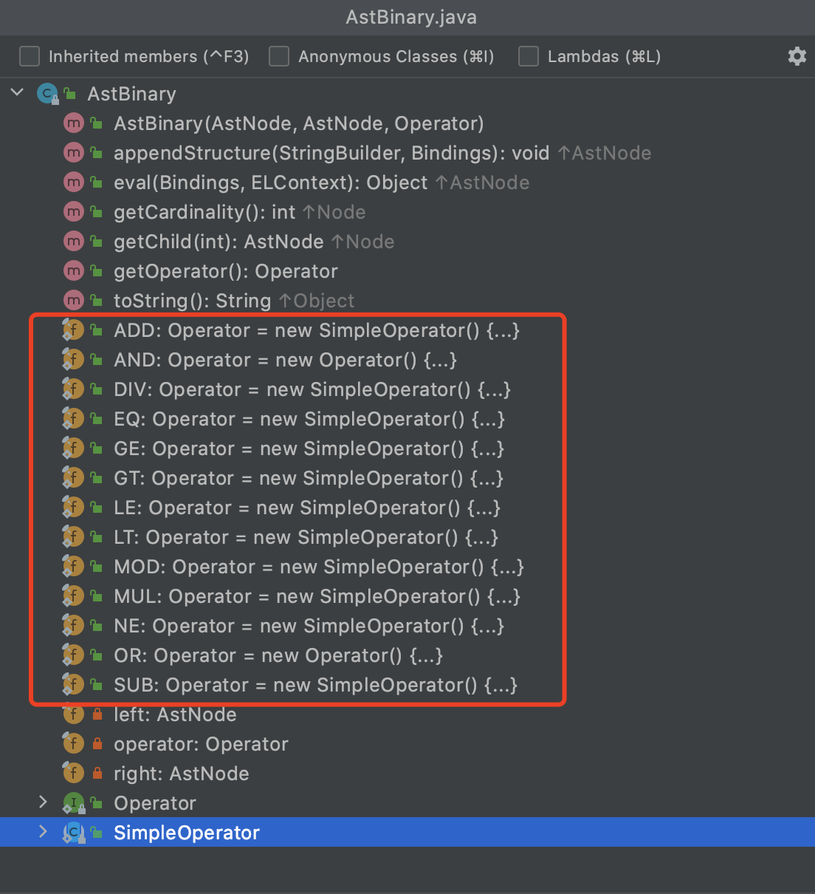
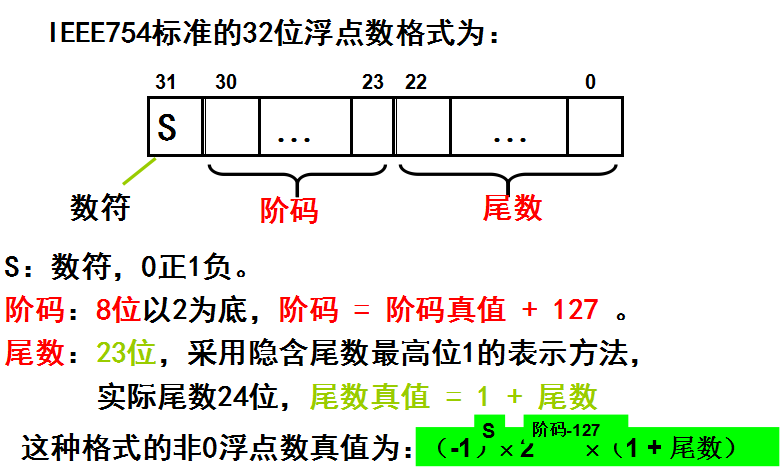
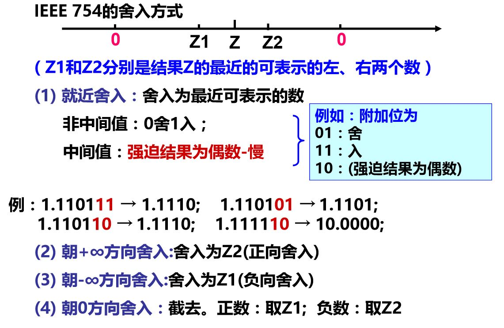
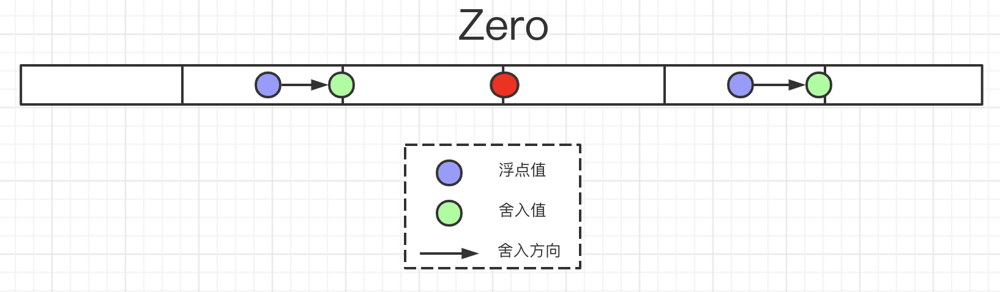
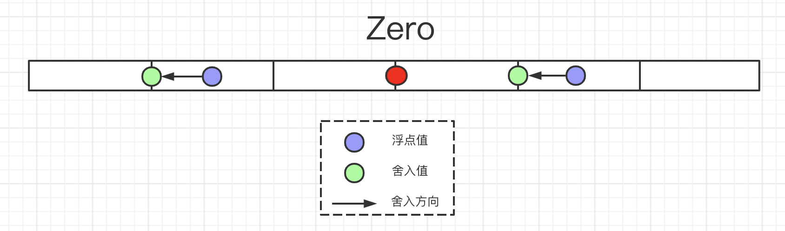
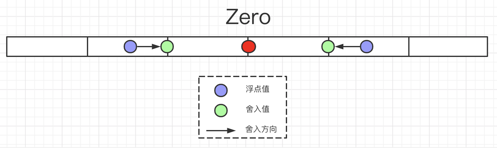
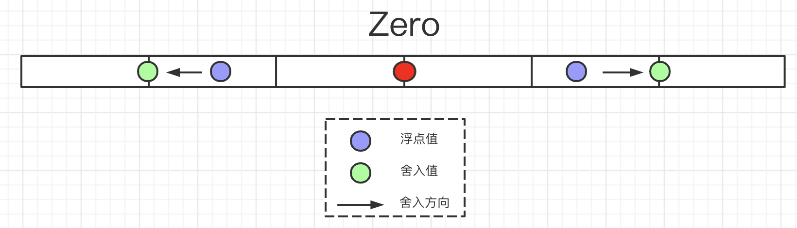

### 一、问题描述

产品反馈与商家对账时，有单运费金额对不上：本该是10块2，可商家侧收到的是10块1毛9，莫名少了一分钱。然后紧急根据单号查询日志信息。

本场景是消费一个MQ，把消息通过数据转换文件转换为商家侧数据格式，然后推送给商家。其中出问题的字段，仅做了一个逻辑，金额单位由元转分，类似如下：

```xml
<set var="fenVar" expr="${yuanVar * 100}" class="long"/>
```

通过日志观察此单的`yuanVar`为10.2，而数据转换结果就变为了1019。第一时间反应是精度损失导致的问题，于是直接用我们的EL表达式工具进行测试，结果如下。el表达式计算`${10.2 * 100}`后结果为`1019.9999999999999`。


### 二、解决方案

自定义一个函数如下：


```java
@EDI(prefix = "fn", name = "yuanToFen", desc = "元转分，使用BigDecimal避免损失精度")
public static long yuanToFen(float yuan) {
    BigDecimal bigDecimal = new BigDecimal(String.valueOf(yuan)).setScale(2, BigDecimal.ROUND_HALF_UP);
    BigDecimal ret = bigDecimal.multiply(new BigDecimal(100));	
    return ret.longValue();
}
```

然后数据转换文件中通过该函数对金额进行转换。

```xml
<set var="fenVar" expr="${fn:yuanToFen(yuanVar)}" class="long"/>
```


### 三、溯因

#### 1. 探究EL表达式相关逻辑

假设当前数据转换定义如下：

```xml
<set var="test" expr="${10.2 * 100}" class="long"/>
```

则数据转换引擎最终会调用如下等效代码进行计算：

```java
public <T> T evalExpr(String expr, Class<T> clazz) {
    // 此时expr为${10.2 * 100}，clazz为long.class。
    ValueExpression valueExpr = exprFactory.createValueExpression(elContext, expr, clazz);
    return (T) valueExpr.getValue(elContext);
}  
```

通过断点调试关注以下两个逻辑：

ø 浮点计算的过程及结果

ø 最终类型转换的过程及结果

##### 1）浮点计算过程

EL表达式子首先调用AstBinary的MUL进行乘法运算。

```java
public class AstBinary extends AstRightValue {
  public static final Operator MUL = new SimpleOperator() {
    @Override 
    public Object apply(TypeConverter converter, Object o1, Object o2) { 
      return NumberOperations.mul(converter, o1, o2); 
    }
    @Override 
    public String toString() { return "*"; }
  };
}
```

接下来看`NumberOperations#mul`方法：

```java
public static final Number mul(TypeConverter converter, Object o1, Object o2) {
    if (o1 == null && o2 == null) {
        return LONG_ZERO;
    }

    if (o1 instanceof BigDecimal || o2 instanceof BigDecimal) {
        return converter.convert(o1, BigDecimal.class).multiply(converter.convert(o2, BigDecimal.class));
    }

    if (isFloatOrDoubleOrDotEe(o1) || isFloatOrDoubleOrDotEe(o2)) {
        if (o1 instanceof BigInteger || o2 instanceof BigInteger) {
            return converter.convert(o1, BigDecimal.class).multiply(converter.convert(o2, BigDecimal.class));
        }
        // 由于两个入参10.2和100的类型为Double和Long，故执行此方法。
        return converter.convert(o1, Double.class) * converter.convert(o2, Double.class);
    }

    if (o1 instanceof BigInteger || o2 instanceof BigInteger) {
        return converter.convert(o1, BigInteger.class).multiply(converter.convert(o2, BigInteger.class));
    }

    return converter.convert(o1, Long.class) * converter.convert(o2, Long.class);
}
```

##### 2）浮点计算结果

此方法返回值类型为Double，值为`1019.9999999999999`。

##### 3）类型转换过程

由于数据转换指定结果类型为long，故其会调用的`TypeConverterImpl#coerceToLong`方法。

```java
protected Long coerceToLong(Object value) {
    if (value == null || "".equals(value)) {
        return Long.valueOf(0l);
    }
    if (value instanceof Long) {
        return (Long) value;
    }
    if (value instanceof Number) {
        // 当前value为Double类型，故执行此处逻辑
        return Long.valueOf(((Number) value).longValue());
    }
    if (value instanceof String) {
        try {
            return Long.valueOf((String) value);
        } catch (NumberFormatException e) {
            throw new ELException(LocalMessages.get("error.coerce.value", value, value.getClass(), Long.class));
        }
    }
    if (value instanceof Character) {
        return Long.valueOf((short) ((Character) value).charValue());
    }
    throw new ELException(LocalMessages.get("error.coerce.type", value, value.getClass(), Long.class));
}
```

由于当前value为Double类型，执行`Long.valueOf(((Number)value).longValue());`。

```java
public final class Double extends Number implements Comparable<Double> {
   /**
     * Returns the value of this {@code Double} as a {@code long}
     * after a narrowing primitive conversion.
     *
     * @return  the {@code double} value represented by this object
     *          converted to type {@code long}
     * @jls 5.1.3 Narrowing Primitive Conversions
     */  
    public long longValue() {
        return (long)value;
    }
}
```

##### 4）类型转换结果

Double#longValue会根据`Narrowing Primitive Conversions`（原生类型窄化约束）把`1019.9999999999999`转为`1019`。可见精度损失是发生在el表达式计算的结果类型转换。

**NOTE：**

AstBinary，顾名思义是抽象语法树二目运算类，其包含了加减乘除等二目运算操作，如下图。



#### 2. 类型窄化—浮点转Long

以下摘自：https://docs.oracle.com/javase/specs/jls/se7/html/jls-5.html#jls-5.1.3

>A narrowing primitive conversion may lose information about the overall magnitude of a numeric value and may also lose precision and range.
>
>A narrowing conversion of a floating-point number to an integral type T takes two steps:
>
>1. In the first step, the floating-point number is converted either to a `long`, if T is `long`, or to an `int`, if T is `byte`, `short`, `char`, or `int`, as follows:
>    - If the floating-point number is NaN ([§4.2.3](https://docs.oracle.com/javase/specs/jls/se7/html/jls-4.html#jls-4.2.3)), the result of the first step of the conversion is an `int` or `long` `0`.
>    - Otherwise, if the floating-point number is not an infinity, the floating-point value is rounded to an integer value `V`, rounding toward zero using IEEE 754 round-toward-zero mode ([§4.2.3](https://docs.oracle.com/javase/specs/jls/se7/html/jls-4.html#jls-4.2.3)). Then there are two cases:
>        1. If T is `long`, and this integer value can be represented as a `long`, then the result of the first step is the `long` value `V`.
>        2. Otherwise, if this integer value can be represented as an `int`, then the result of the first step is the `int` value `V`.
>    - Otherwise, one of the following two cases must be true:
>        1. The value must be too small (a negative value of large magnitude or negative infinity), and the result of the first step is the smallest representable value of type `int` or `long`.
>        2. The value must be too large (a positive value of large magnitude or positive infinity), and the result of the first step is the largest representable value of type `int` or `long`.
>2. In the second step:
>    - If T is `int` or `long`, the result of the conversion is the result of the first step.
>    - If T is `byte`, `char`, or `short`, the result of the conversion is the result of a narrowing conversion to type T ([§5.1.3](https://docs.oracle.com/javase/specs/jls/se7/html/jls-5.html#jls-5.1.3)) of the result of the first step.

由以上可知，当浮点转long时会执行以下步骤：

1）如果浮点时NaN，则转为0；

```java
Fload.NaN ==》 0
```

2）如果浮点是无限类型，则进行如下转换：

```java
Float.NEGATIVE_INFINITY ==》  Long.MIN_VALUE
Float.POSITIVE_INFINITY ==》  Long.MAX_VALUE
```

3）其他情况，使用 IEEE 754 向零舍入模式把浮点数舍入为Long。

#### 3. IEEE 754及向零舍入模式

##### 1）IEEE 754浮点表示

[图片来源](https://www.zhihu.com/question/21711083)



由于计算机是机遇二进制的所以制定了IEEE 754这种浮点存储格式。使用IEEE 754的二进制表示的数必定是离散的，其无法与十进制一一对应，有时只能近似表达一个10进制数，这之间的差距称为精度损失。

例如：十进制0.2转换为二进制，执行以下操作

0.2 * 2 = 0.4，取整数0

0.4 * 2 = 0.8，取整数0

0.8 * 2 = 1.6，取整数1

0.6 * 2 = 1.2，取整数1

0.2 * 2 = 0.4，取整数0

以下会无穷重复上述步骤。

10进制0.2的2进制表示为：`0.0011 0011 0011 0011 ...`。在IEEE 754中尾数长度是有限的，则必然造成精度损失。

也就意味着十进制的0.2经过IEEE 754存储后，再转回十进制就会变为：`0.199999999...`

##### 2）IEEE 754向零舍入

所谓的向零舍入就是简单的截断小数后面值。1019.9999999就被截断为1019。

[图片来源](https://blog.csdn.net/baidu_41667019/article/details/84501574)



### 四、使用BigDecimal 

#### 1. 浮点精度损失案例

```java
public static void main(String[] args) {
    System.out.println(1.2f - 1);
    System.out.println(1.2d - 1);
    System.out.println(10.2f * 100 + " 转为Long:" + (long)(10.2f * 100));
    System.out.println(10.2d * 100 + " 转为Long:" + (long) (10.2d * 100));
}
```

```Java
执行结果：
0.20000005
0.19999999999999996
1020.0 转为Long:1020
1019.9999999999999 转为Long:1019
```

#### 2. BigDecimal及其精度

##### 1）八种舍入模式

ø BigDecimal.ROUND_CEILING



ø BigDecimal.ROUND_FLOOR



ø BigDecimal.ROUND_DOWN



ø BigDecimal.ROUND_UP



ø BigDecimal.ROUND_HALF_UP

BigDecimal.ROUND_UP的限制版，当丢弃的分数>= 0.5时，进行UP，否则DOWN；即十进制的四舍五入。

ø BigDecimal.ROUND_HALF_DOWN

BigDecimal.ROUND_UP的限制版，当丢弃的分数>0.5时，进行UP，否则DOWN；

ø BigDecimal.ROUND_HALF_EVEN

> this is the rounding mode that statistically minimizes cumulative error when applied repeatedly over a sequence of calculations. It is sometimes known as "Banker's rounding," and is chiefly used in the USA。
>
> 当在一系列计算中重复应用时，该舍入模式可以在统计上最小化累积误差。 它有时被称为“银行家的四舍五入”，主要用于美国。

BigDecimal.ROUND_UP的限制版，当丢弃的分数的左侧是奇数时，表现同BigDecimal.ROUND_HALF_UP；否则，表现同BigDecimal.ROUND_HALF_DOWN。

简而言之，主要是对舍弃的分数是0.5时，舍入结果需要是一个偶数。示例如下。

```
5.5  -> 6
2.5  -> 2
1.6  -> 2
1.1  -> 1
1.0  -> 1
-1.0 -> -1
-1.1 -> -1
-1.6 -> -2
-2.5 -> -2
-5.5 -> -6
```

ø BigDecimal.ROUND_UNNECESSARY

不需要舍入，发生舍入时，会抛出异常`throw new ArithmeticException("Rounding necessary");`

##### 2）BigDecimal使用

ø 优先使用字符串入参构造函数

```java
BigDecimal d = new BigDecimal("1.2");
BigDecimal d = new BigDecimal(Double.toString(1.2d));
BigDecimal d = new BigDecimal(Float.toString(1.2f));
```

ø 对运算结果设置合适精度

```java
public long mul(float a, float b, int scale) {
  BigDecimal left = new BigDecimal(Float.toString(a));
  BigDecimal right = new BigDecimal(Float.toString(b));
  return left.multiply(right).setScale(scale, BigDecimal.ROUND_HALF_UP).longValue();
}
```

### 五、结论

1）在进行浮点计算时，要评估结果的精度。尤其是金额场景计算时，一定要有精度敏感。

2）在EDI里使用BigDecimal增加一个内置全局函数，提升开发效率；

3）在EDI的开发工具里考虑增加提示，当运算涉及浮点时提示是否需要关注精度问题；

### # 参考

1. [Java语言规范 - Narrowing Primitive Conversion](https://docs.oracle.com/javase/specs/jls/se7/html/jls-5.html#jls-5.1.3)
2. [知乎：IEEE 754格式是什么?](https://www.zhihu.com/question/21711083)