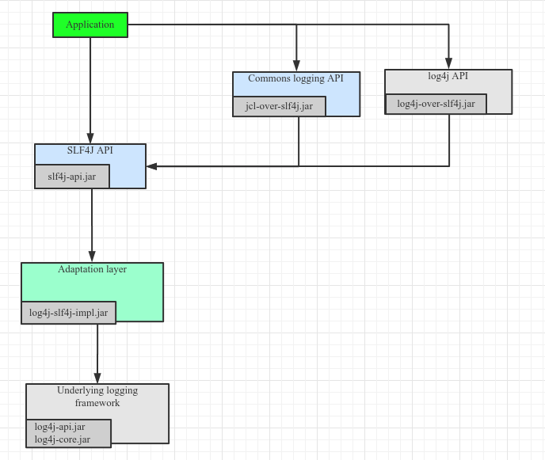

### 一、SLF4j和其他框架适配


**Note: 重点理解SLF4J可以和其他框架双向桥接就可以了。**
### 二、实战
> 以下是我们项目中pom.xml的一段日志配置。
```xml
        <!--=========== log相关配置 begin ============-->
        <!-- slf4j api-->
        <dependency>
            <groupId>org.slf4j</groupId>
            <artifactId>slf4j-api</artifactId>
            <version>${slf4j.version}</version>
        </dependency>

        <!-- jcl桥接至slf4j -->
        <dependency>
            <groupId>org.slf4j</groupId>
            <artifactId>jcl-over-slf4j</artifactId>
            <version>${slf4j.version}</version>
        </dependency>

        <!-- slf4j桥接至Log4j2 -->
        <dependency>
            <groupId>org.apache.logging.log4j</groupId>
            <artifactId>log4j-slf4j-impl</artifactId>
            <version>2.2</version>
        </dependency>

        <!-- log4j桥接至Log4j2 -->
        <dependency>
            <groupId>org.apache.logging.log4j</groupId>
            <artifactId>log4j-1.2-api</artifactId>
            <version>${log4j2.version}</version>
        </dependency>

        <!-- log4j2 -->
        <dependency>
            <groupId>org.apache.logging.log4j</groupId>
            <artifactId>log4j-api</artifactId>
            <version>${log4j2.version}</version>
        </dependency>
        <dependency>
            <groupId>org.apache.logging.log4j</groupId>
            <artifactId>log4j-core</artifactId>
            <version>${log4j2.version}</version>
        </dependency>
        <!-- web工程需要包含log4j-web，非web工程不需要 -->
        <dependency>
            <groupId>org.apache.logging.log4j</groupId>
            <artifactId>log4j-web</artifactId>
            <version>${log4j2.version}</version>
        </dependency>
        <!-- 使用log4j2的AsyncLogger需要包含disruptor -->
        <dependency>
            <groupId>com.lmax</groupId>
            <artifactId>disruptor</artifactId>
            <version>${disruptor.version}</version>
        </dependency>
        <!--============ log相关配置 end ==============-->
```

解析图：


##### 本项目中也可以将lo4j API桥接至SFL4J API，如下图所示：


#### 参考：
1. http://www.slf4j.org/manual.html
1. http://www.slf4j.org/legacy.html