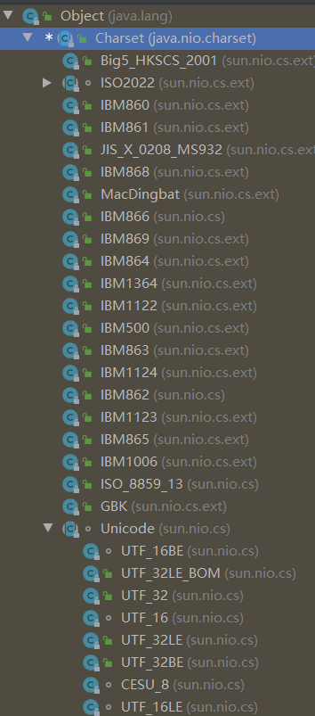
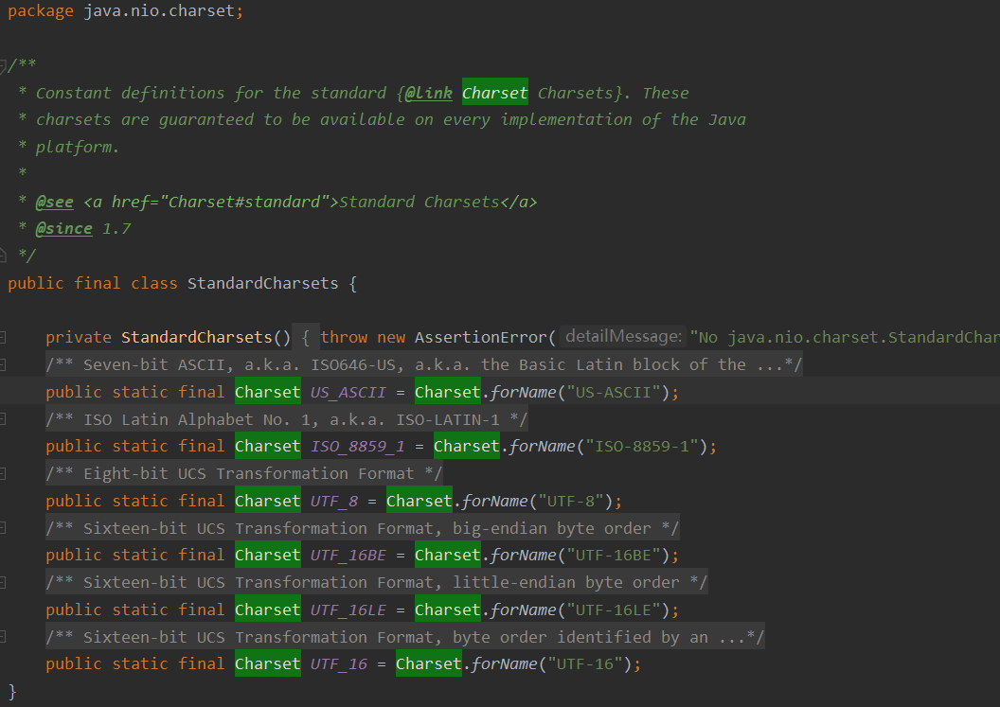

#### 1.字节数组和字符串间转换时指定编码
1）第一种方式，通过字符串指定编码，需要catch或throw检查异常UnsupportedEncodingException。
```java
byte[] bytes = "你好，世界".getBytes("utf-8");

String str = new String(bytes, "utf-8");
```
2）第二种方式，使用StandardCharsets的编码常量
```java
byte[] bytes = "你好，世界".getBytes(StandardCharsets.UTF_8);

String str = new String(bytes, StandardCharsets.UTF_8);
```
#### 2. 编码类



