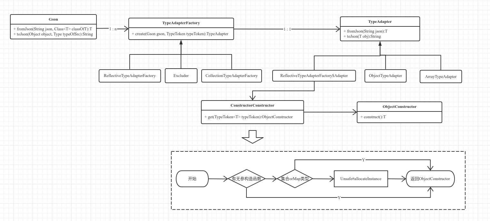
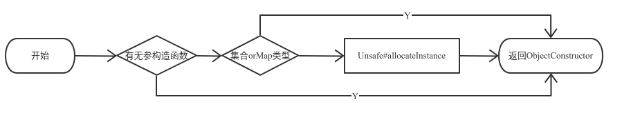

#### 一、Gson类图及实例化流程



#### 二、Gson实例化流程

##### 1）获取构造器流程



```java
public final class ConstructorConstructor {

  public <T> ObjectConstructor<T> get(TypeToken<T> typeToken) {
    final Type type = typeToken.getType();
    final Class<? super T> rawType = typeToken.getRawType();

    // first try an instance creator
    // types must agree
    final InstanceCreator<T> typeCreator = (InstanceCreator<T>) instanceCreators.get(type);
    if (typeCreator != null) {
      return new ObjectConstructor<T>() {
        @Override public T construct() {
          return typeCreator.createInstance(type);
        }
      };
    }

    // Next try raw type match for instance creators
    // types must agree
    final InstanceCreator<T> rawTypeCreator =
        (InstanceCreator<T>) instanceCreators.get(rawType);
    if (rawTypeCreator != null) {
      return new ObjectConstructor<T>() {
        @Override public T construct() {
          return rawTypeCreator.createInstance(type);
        }
      };
    }

    // 使用默认无参构造函数      
    ObjectConstructor<T> defaultConstructor = newDefaultConstructor(rawType);
    if (defaultConstructor != null) {
      return defaultConstructor;
    }
      
    // 集合类和Map类型指定构造器
    ObjectConstructor<T> defaultImplementation = newDefaultImplementationConstructor(type, rawType);
    if (defaultImplementation != null) {
      return defaultImplementation;
    }

    // finally try unsafe
    return newUnsafeAllocator(type, rawType);
  }
}
```

##### 2）Unsafe实例化类

当要实例化的类没有无参构造函数时，Gson会使用Unsafe#allocateInstance方法来实例化类。该方法只会在JVM内存区域根据类的定义分配空间，不会调用`<init>`方法。

```java
public abstract class UnsafeAllocator {
  public static UnsafeAllocator create() {  
    // TRY JVM
    try {
      Class<?> unsafeClass = Class.forName("sun.misc.Unsafe");
      Field f = unsafeClass.getDeclaredField("theUnsafe");
      f.setAccessible(true);
      final Object unsafe = f.get(null);
      final Method allocateInstance = unsafeClass.getMethod("allocateInstance", Class.class);
      return new UnsafeAllocator() {
        @Override
        @SuppressWarnings("unchecked")
        public <T> T newInstance(Class<T> c) throws Exception {
          assertInstantiable(c);
          return (T) allocateInstance.invoke(unsafe, c);
        }
      };
    } catch (Exception ignored) {
    }
      
    // TRY dalvikvm  
    ...  
  }
}
```

