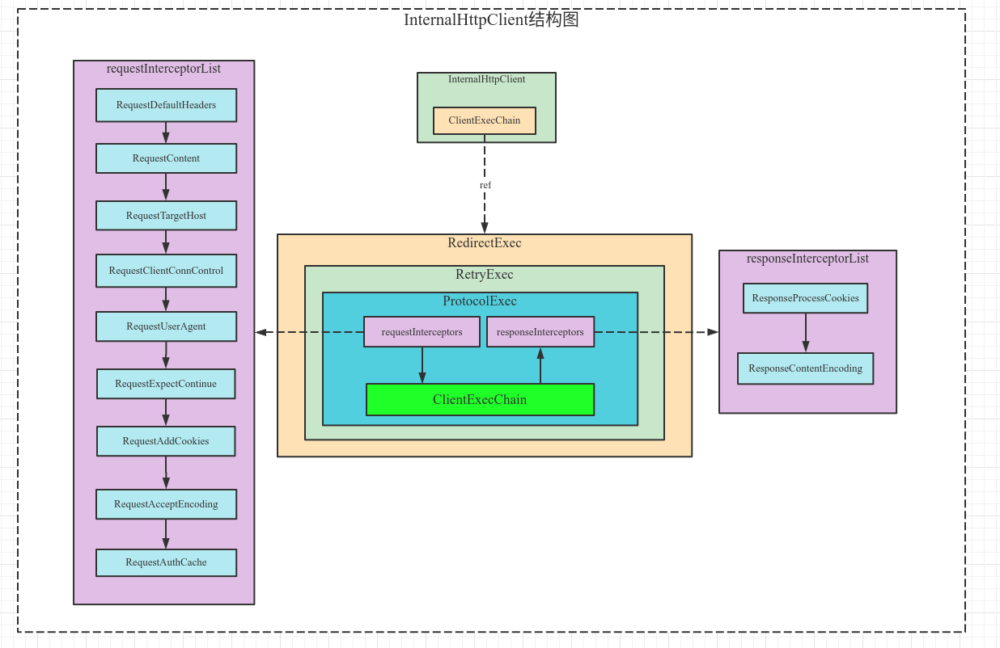

#### 一、HttpClient结构图

> 下图来源于对`org.apache.httpcomponents:httpclient:4.5.13`的源码分析。



#### 二、HttpClient扩展口

1）HttpClientBuilder中有对ClientExecChain的装饰方法

```java
HttpClientBuilder#decorateMainExec
HttpClientBuilder#decorateProtocolExec
```

2）HttpClientBuilder中对ProtocolExec请求和响应拦截器的扩展

```java
HttpClientBuilder#addInterceptorFirst(org.apache.http.HttpRequestInterceptor)
HttpClientBuilder#addInterceptorLast(org.apache.http.HttpRequestInterceptor)
    
HttpClientBuilder#addInterceptorFirst(org.apache.http.HttpResponseInterceptor)
HttpClientBuilder#addInterceptorLast(org.apache.http.HttpResponseInterceptor)
```

#### 三、示例

> [代码来源](https://www.yiibai.com/httpclient/httpclient-get-server-certificates.html) - 内容为HTTP获取服务器证书示例，通过增加ProtocolExec的拦截器实现。

```java
public class HttpClientGetServerCertificate {
    public static final String PEER_CERTIFICATES = "PEER_CERTIFICATES";

    public static void main(String... args) throws IOException {
        // create http response certificate interceptor
        HttpResponseInterceptor certificateInterceptor = (httpResponse, context) -> {
            ManagedHttpClientConnection routedConnection = (ManagedHttpClientConnection)context.getAttribute(HttpCoreContext.HTTP_CONNECTION);
            SSLSession sslSession = routedConnection.getSSLSession();
            if (sslSession != null) {

                // get the server certificates from the {@Link SSLSession}
                Certificate[] certificates = sslSession.getPeerCertificates();

                // add the certificates to the context, where we can later grab it from
                context.setAttribute(PEER_CERTIFICATES, certificates);
            }
        };

        // create closable http client and assign the certificate interceptor
        CloseableHttpClient httpClient = HttpClients.custom().addInterceptorLast(certificateInterceptor).build();

        try {

            // make HTTP GET request to resource server
            HttpGet httpget = new HttpGet("https://www.baidu.com");
            System.out.println("Executing request " + httpget.getRequestLine());

            // create http context where the certificate will be added
            HttpContext context = new BasicHttpContext();
            httpClient.execute(httpget, context);

            // obtain the server certificates from the context
            Certificate[] peerCertificates = (Certificate[])context.getAttribute(PEER_CERTIFICATES);

            // loop over certificates and print meta-data
            for (Certificate certificate : peerCertificates){
                X509Certificate real = (X509Certificate) certificate;
                System.out.println("----------------------------------------");
                System.out.println("Type: " + real.getType());
                System.out.println("Signing Algorithm: " + real.getSigAlgName());
                System.out.println("IssuerDN Principal: " + real.getIssuerX500Principal());
                System.out.println("SubjectDN Principal: " + real.getSubjectX500Principal());
                System.out.println("Not After: " + DateUtils.formatDate(real.getNotAfter(), "dd-MM-yyyy"));
                System.out.println("Not Before: " + DateUtils.formatDate(real.getNotBefore(), "dd-MM-yyyy"));
            }

        } finally {
            // close httpclient
            httpClient.close();
        }
    }
}
```


