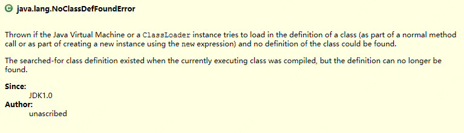
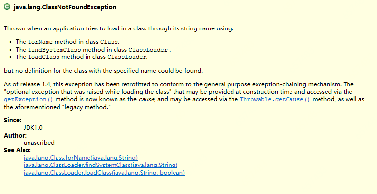

相信java的开发者经常会遇到这两个异常，乍一看两个就长得很像，有时候真的是老虎，老鼠傻傻让人分不清楚。
#### 1. 两者对比
| 类别 | ClassNotFoundException                         | NoClassDefFoundError                                         |
| ---- | ---------------------------------------------- | ------------------------------------------------------------ |
| 含义 | 找不到类定义                                   | 找不到类定义                                                 |
| 继承 | extends ReflectiveOperationException           | extends LinkageError                                         |
| 类型 | 反射操作引起的一种**异常**                     | 一种链接**错误**                                             |
| 捕获 | catch Exception/Throwable                      | catch Error/Throwable                                        |
| 原因 | 通过反射根据指定类名无法找到类时，会引起该异常 | 编译时有类定义，运行时丢失类定义会引起该异常。运行时类定义丢失往往有两种情况：1）类不在ClassPath内，导致无法加载类定义，即由ClassNotFoundException引起。2）类初始化失败，导致加载不到类定义，此时会伴随着一个初始化异常（ExceptionInInitializerError）。 |
#### 2. 两者关系
NoClassDefFoundError可由ClassNotFoundException引起。

#### 3. 两者定义


> 当JVM或类加载器去加载一个类定义（无论是通过普通的方法调用，还是用new语句去创建该类的实例所触发的类加载），如果该类的定义丢失，那么就会抛出NoClassDefFoundError.
> **被加载的类定义**在**当前执行类**编译时是存在的，但是再也找不到了。



>当应用使用类的字符串名，通过以下方式尝试去加载类，但是根据指定的名称无法找到类定义时会抛出ClassNotFoundException：
>1）Class.forName()
>2）ClassLoader.findSystemClass()
>3）ClassLoader.loadClass()

#### 4. 实例
##### 4.1 ClassNotFoundExcption

```java
package qiweiTest;

public class ClassNotFoundExcptionTest {
	public static void main(String[] args) {
		Class.forName("anyNoexistClassName"); // 任何一个不存在的className
	}
}
```
##### 4.2 NoClassDefError
###### 4.2.1 类不在ClassPath引发的异常

```java
package qiweiTest;

public class NoClassDefErrorTest {
     // 运行时，删除ClassPath中的ClassNotFoundExceptionTest.class
	public static void main(String[] args) {
		ClassNotFoundExceptionTest.class.getClass();
	}
}
```
输出：
```java
Exception in thread "main" java.lang.NoClassDefFoundError: qiweiTest/ClassNotFoundExceptionTest
	at qiweiTest.NoClassDefErrorTest.main(NoClassDefErrorTest.java:9)
Caused by: java.lang.ClassNotFoundException: qiweiTest.ClassNotFoundExceptionTest
	at java.net.URLClassLoader.findClass(Unknown Source)
	at java.lang.ClassLoader.loadClass(Unknown Source)
	at sun.misc.Launcher$AppClassLoader.loadClass(Unknown Source)
	at java.lang.ClassLoader.loadClass(Unknown Source)
	... 1 more
```
###### 4.2.2 类初始化失败引发的异常
```java
package qiweiTest;

public class NoClassDefErrorTest2 {
       	public static void main(String[] args) {
		int tmp;
		try {
			tmp = InterClass.a;
		} catch (Throwable e) {
            // 异常类型：ExceptionInInitializerError
			e.printStackTrace();
		}
		try {
			tmp = InterClass.a;
		} catch (Throwable e) {
            // 异常类型：NoClassDefFoundError
			e.printStackTrace();
		}
	}

	static class InterClass {
		static int a;
		static {
			a = 1 / 0;
		}
	}
```
输出：
```java
java.lang.ExceptionInInitializerError
	at qiweiTest.NoClassDefErrorTest2.main(NoClassDefErrorTest2.java:8)
Caused by: java.lang.ArithmeticException: / by zero
	at qiweiTest.NoClassDefErrorTest2$InterClass.<clinit>(NoClassDefErrorTest2.java:22)
	... 1 more
java.lang.NoClassDefFoundError: Could not initialize class qiweiTest.NoClassDefErrorTest2$InterClass
	at qiweiTest.NoClassDefErrorTest2.main(NoClassDefErrorTest2.java:13)

```