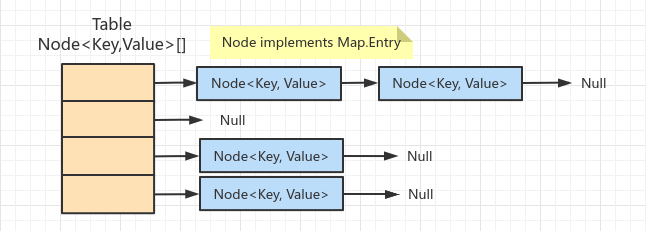
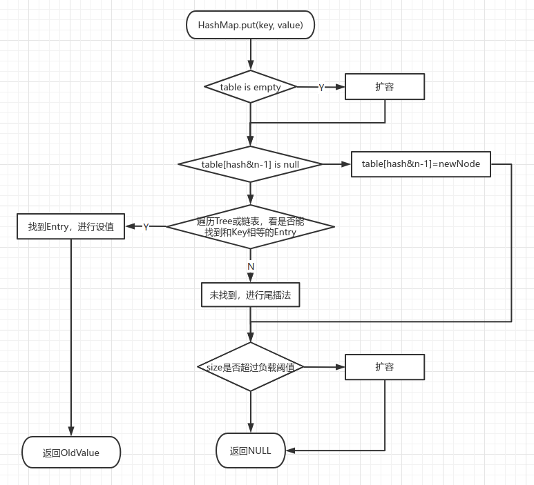

## 一、存储结构

## 二、HashMap.put流程

1）遍历Tree时根据Hash值进行查询。Tree是根据Hash构建的红黑树。

2）new HashMap不设置初始容量时table为null，put第一个元素时会创建长度为16的table。

3）放入元素后，判定size超过负载后会扩容，负载 = tablesize * 负载因子默认0.75。

I、不扩容条件：预期元素数量 < tableSize * 0.75，那么tableSize > 预期元素数量 / 0.75 = 预期元素个数 * 4 / 3。

II、如预期放一个元素，那么初始容量设置最小为2。

4）初始size会经过计算转换为大于它的最小2的幂值。便于计算下标：keyHash & (table.size - 1)

## 三、ConcurrentHashMap

1）JDK8通过syncronized锁定bucket，也就是bucket的第一个Node。