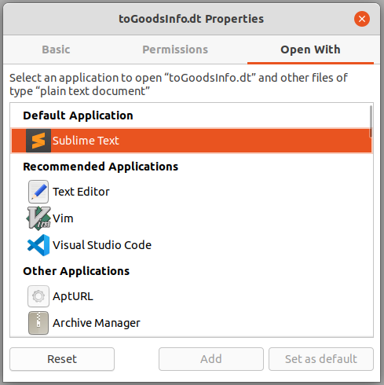
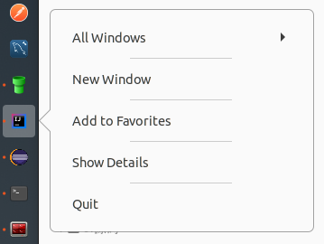

### 一、常用软件

> 使用Ubuntu作为工作机一年多，较之于Windows，有以下几个优点：
> 1）干扰更少，从此告别弹窗广告；
> 2）包管理更成熟，命令`apt install xxx`让安装从未如此简单；
> 3）开源软件更多，大都比较精巧；
> 4）命令操作更流畅，ssh/scp/ftp/maven/vim/git...信手拈来；

本文介绍下，Ubuntu工作机下的常用软件：
#### 1. 系统
1. System Monitor Indicator - 顶部栏显示系统监控信息
1. Conky - 桌面显示系统监控信息
1. Synergy - 局域网多设备共享键鼠
1. Barrier - 局域网共享键鼠（开源）
1. Dukto - 局域网通讯 - [ubuntu 20.04安装](https://www.cnblogs.com/zzugyl/p/13261329.html)
1. [chrome - 浏览器](./2.高效使用Chrome.md)       
1. firefox - 浏览器
1. Shutter - 截屏/编辑工具
1. Flameshot - 截屏/编辑工具（支持Pin功能）
1. WPS - 办公软件
1. Tweaks - 美化
1. Xmind - 脑图
1. VLC - 视频
1. Thunderbird - 邮件
1. Typora - markdown编辑器
1. SwitchHosts
1. [Clipboard Indicator - 剪切板Gnome扩展](https://extensions.gnome.org/extension/779/clipboard-indicator/)
1. Variety - Ubuntu壁纸管理
1. GoldenDict - 本地程序词典，可绑定有道等翻译网站
#### 2. 开发
1. Eclipse - Java开发
1. Intellij IDEA - Java开发
1. Sublime Text - 编辑器
1. Beyond Compare - 文件比较
1. Meld - 文件比较
1. JD-GUI - Java反编译
1. VisualVM - Java性能调优
1. Mysql Workbench - mysql客户端
1. Postman - http接口测试工具
1. SoapUI - soap测试工具
1. Virtual Box - 虚拟机
1. Terminator - 终端分屏
1. classpy - 查看java字节码
1. sshuttle - 穷人的VPN
1. FileZilla - FTP客户端
1. [Git - 版本控制](../7.git)
1. maven - 项目构建
1. Vim - 编辑器
1. PrettyZoo - zookeeper可视化工具

##### 附桌面


### 二、常见问题

##### 1 重启Gnome操作

`Alt + F2`  然后输入`r`，然后回车。

##### 2 设置文件默认打开应用

1. 文件上右键 -> Properties
1. 在Open With的tab下选择合适应用



##### 3 Launcher增加应用图表，示例增加IDEA社区版图标到任务栏

```shell
cd /usr/share/applications/
touch jetbrains-idea.desktop # 创建文件
chmod 644 jetbrains-idea.desktop # 设置权限
sudo vim jetbrains-idea.desktop # 参见下面内容
```

```properties
[Desktop Entry]                                                                                     
Version=1.0
Type=Application
Name=IntelliJ IDEA Community Edition
Icon=/opt/idea-IC-203.7148.57/bin/idea.svg
Exec="/opt/idea-IC-203.7148.57/bin/idea.sh" %f
Comment=Capable and Ergonomic IDE for JVM 
Categories=Development;IDE;
Terminal=false
StartupWMClass=jetbrains-idea-ce
```

然后正常打开应用后，右键任务栏图表，会出现“Add to Favorites”。点击即可添加到任务栏。 



##### 4 开机启动程序延迟启动

> 参考：https://www.linuxuprising.com/2020/11/how-to-launch-startup-applications-with.html 

进入以下目录找到自启动的应用desktop文件，`~/.config/autostart`或者`/etc/xdg/autostart/`；

编辑应用对应的desktop文件，可通过以下两种方式实现延迟启动：

1）配置延迟参数`X-GNOME-Autostart-Delay=10`

```properties
[Desktop Entry]
Name=MyApp
GenericName=My app
Comment=Application to do something
Exec=myapp
Terminal=false
Type=Application
Icon=myapp
Categories=GNOME;GTK;Utility
X-GNOME-Autostart-Delay=10
```

2）命令参数增加sleep指令`bash -c "sleep <xx> && <original_command>"`

```properties
[Desktop Entry]
Name=MyApp
GenericName=My app
Comment=Application to do something
Exec=bash -c "sleep 7 && myapp"
Terminal=false
Type=Application
Icon=myapp
Categories=GNOME;GTK;Utility
```

**附：需要设置延迟启动的应用**

| 软件                     | 延迟启动方式 | 非延迟的问题                                             |
| ------------------------ | ------------ | -------------------------------------------------------- |
| Synergy                  | 延迟参数     | 异常：system tray is unavailable don't close your window |
| System Monitor Indicator | sleep命令    | 状态栏异常显示为三个点                                   |


