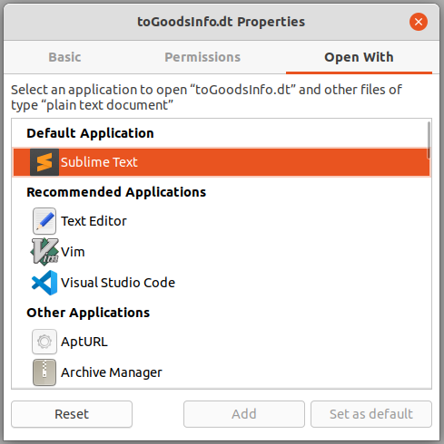
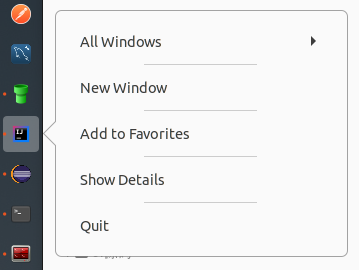
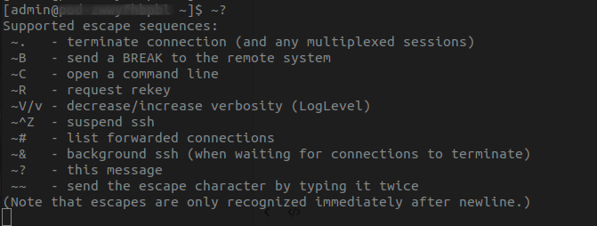
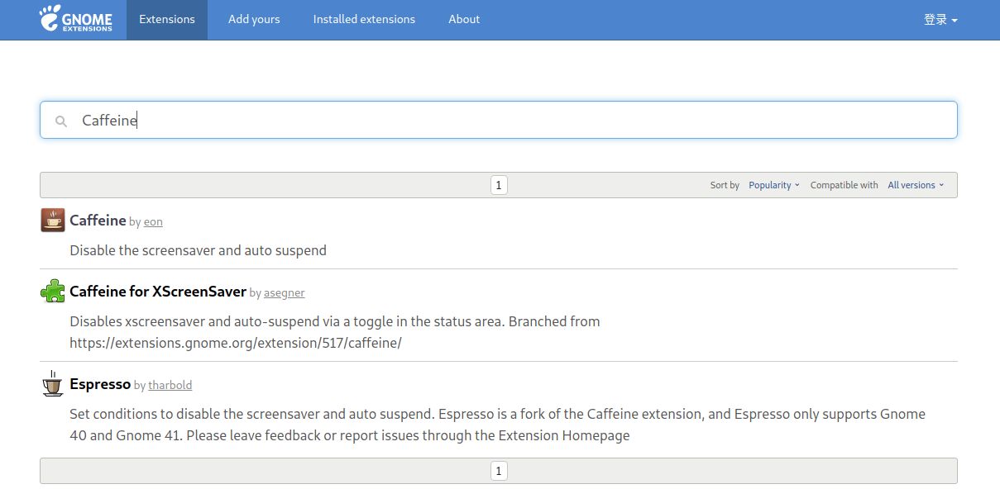
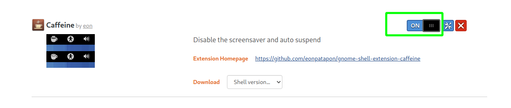
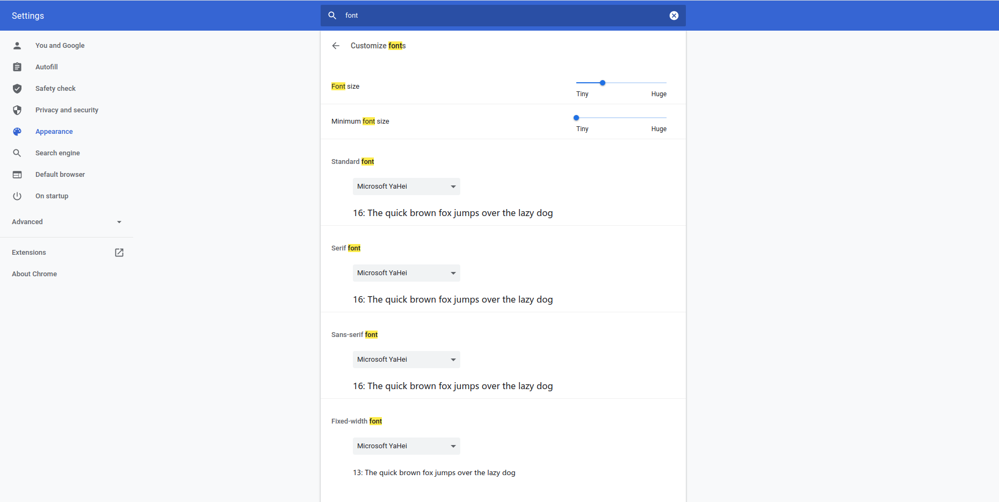
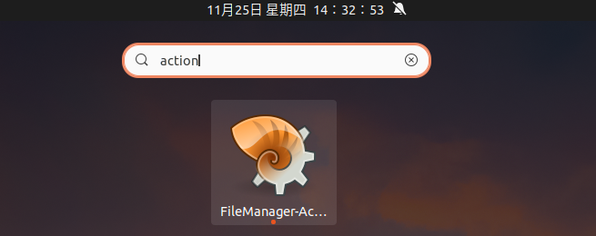
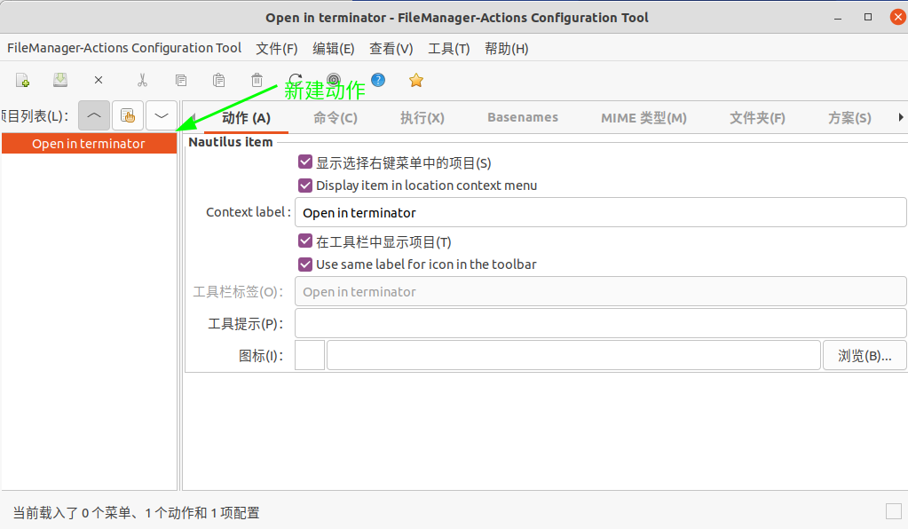
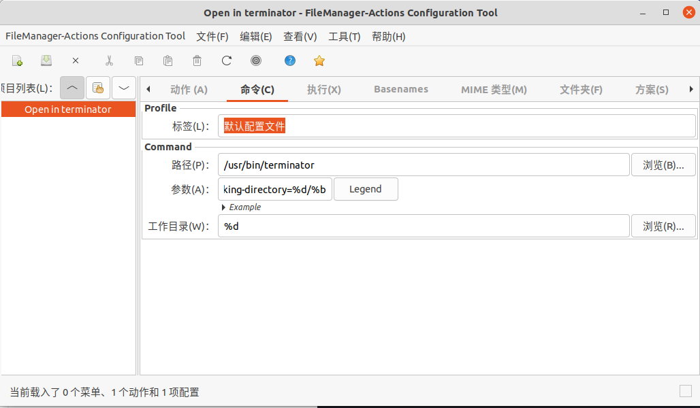
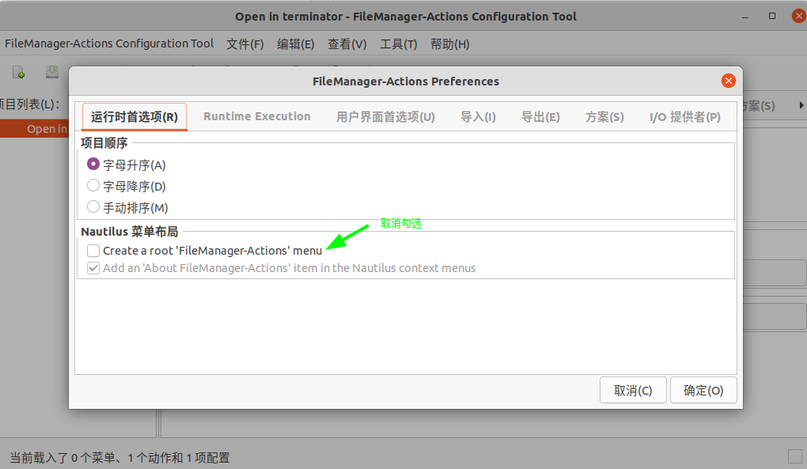

## 一、常用软件

> 使用Ubuntu作为工作机一年多，较之于Windows，有以下几个优点：
> 
> 1）干扰更少，从此告别弹窗广告；
> 
> 2）包管理更成熟，命令`apt install xxx`让安装从未如此简单；
> 
> 3）开源软件更多，大都比较精巧；
> 
> 4）命令操作更流畅，ssh/scp/ftp/maven/vim/git...信手拈来；

本文介绍下，Ubuntu工作机下的常用软件：

### 1、系统

1. Gnome插件
   
     1. System Monitor Indicator - 顶部栏显示系统监控信息
     2. [Simple system monitor](https://extensions.gnome.org/extension/4506/simple-system-monitor/) - 顶部栏显示系统监控信息
     3. Dynamic Panel Transparency  - 顶栏透明设置
     4. [Clipboard Indicator](https://extensions.gnome.org/extension/779/clipboard-indicator/) - 剪切板Gnome扩展
     5. Remove Dropdown Arrows - 移除顶栏右侧向下箭头
     6. Hide Activities Button - 移除顶栏左侧Activities按钮
     7. TopIconsFix - 系统托盘修复，顶栏显示wine运行中程序

2. 键鼠多设备共享
   
     1. Synergy - 局域网多设备共享键鼠
     2. Barrier - 局域网共享键鼠（开源）

3. 浏览器
   
     1. [chrome - 浏览器](./2.高效使用Chrome.md)       
     2. firefox - 浏览器

4. 截图/录屏
   
     1. Shutter - 截屏/编辑工具
     2. Flameshot - 截屏/编辑工具（支持Pin功能）
     3. [Peek](https://launchpad.net/~peek-developers/+archive/ubuntu/stable) - 录屏生成gif/mp4，便于客户答疑

5. 翻译软件
   
     1. GoldenDict - 翻译程序，可绑定有道等翻译网站，长于查词
     2. [CopyTranslator](https://github.com/CopyTranslator/CopyTranslator) - 翻译程序，长于翻译文本

6. 壁纸
   
     1. Variety - Ubuntu壁纸管理
     2. komorebi - 动态壁纸

7. 音乐/视频
   
     1. 网易云
     2. 酷狗
     3. VLC - 视频

8. 办公
   
     1. WPS - 办公软件
     2. Xmind - 脑图
     3. Typora - markdown编辑器_收费
     4. [marktext](https://github.com/marktext/marktext) - markdown编辑器_免费
     5. Thunderbird - 邮件

9. Conky - 桌面显示系统监控信息 [配置](../../src/main/resources/conf/.conkyrc)

10. Dukto - 局域网通讯 - [ubuntu 20.04安装](https://www.cnblogs.com/zzugyl/p/13261329.html)

11. Tweaks - 美化

12. SwitchHosts

13. [openfortivpn](https://github.com/adrienverge/openfortivpn) - compatible with Fortinet VPNs

14. zsh + ohmyzsh（自动补全 & 语法提示插件）- shell

### 2、开发

15. Eclipse - Java开发

16. Intellij IDEA - Java开发

17. Sublime Text - 编辑器

18. Beyond Compare - 文件比较

19. Meld - 文件比较

20. JD-GUI - Java反编译

21. VisualVM - Java堆分析工具

22. Mysql Workbench - mysql客户端

23. Postman - http接口测试工具

24. SoapUI - soap测试工具

25. Virtual Box - 虚拟机

26. Terminator - 终端分屏

27. classpy - 查看java字节码

28. sshuttle - 穷人的VPN

29. FileZilla - FTP客户端

30. [Git - 版本控制](../5.Git)

31. maven - 项目构建

32. Vim - 编辑器

33. PrettyZoo - zookeeper可视化工具

34. [KeyStore Explorer](https://keystore-explorer.org/index.html) - keytool GUI工具，管理cacerts证书库

35. [EDIdEv SefReader](https://www.edidev.com/eval_SefReader.html) - SEF文件读取工具


#### 附桌面


## 二、常见问题

### 1、重启Gnome操作

`Alt + F2`  然后输入`r`，然后回车。

### 2、设置文件默认打开应用

1. 文件上右键 -> Properties
2. 在Open With的tab下选择合适应用



### 3、Launcher增加应用图表

示例增加IDEA社区版图标到任务栏

```shell
cd /usr/share/applications/
touch jetbrains-idea.desktop # 创建文件
chmod 644 jetbrains-idea.desktop # 设置权限
sudo vim jetbrains-idea.desktop # 参见下面内容
```

```properties
[Desktop Entry]                                                                                     
Version=1.0
Type=Application
Name=IntelliJ IDEA Community Edition
Icon=/opt/idea-IC-203.7148.57/bin/idea.svg
Exec="/opt/idea-IC-203.7148.57/bin/idea.sh" %f
Comment=Capable and Ergonomic IDE for JVM 
Categories=Development;IDE;
Terminal=false
StartupWMClass=jetbrains-idea-ce
```

然后正常打开应用后，右键任务栏图表，会出现“Add to Favorites”。点击即可添加到任务栏。 



### 4、开机启动程序延迟启动

> 参考：https://www.linuxuprising.com/2020/11/how-to-launch-startup-applications-with.html 

进入以下目录找到自启动的应用desktop文件，`~/.config/autostart`或者`/etc/xdg/autostart/`；

编辑应用对应的desktop文件，可通过以下两种方式实现延迟启动：

1）配置延迟参数`X-GNOME-Autostart-Delay=10`

```properties
[Desktop Entry]
Name=MyApp
GenericName=My app
Comment=Application to do something
Exec=myapp
Terminal=false
Type=Application
Icon=myapp
Categories=GNOME;GTK;Utility
X-GNOME-Autostart-Delay=10
```

2）命令参数增加sleep指令`bash -c "sleep <xx> && <original_command>"`

```properties
[Desktop Entry]
Name=MyApp
GenericName=My app
Comment=Application to do something
Exec=bash -c "sleep 7 && myapp"
Terminal=false
Type=Application
Icon=myapp
Categories=GNOME;GTK;Utility
```

**附：需要设置延迟启动的应用**

| 软件                       | 延迟启动方式  | 非延迟的问题                                                |
| ------------------------ | ------- | ----------------------------------------------------- |
| Synergy                  | 延迟参数    | 异常：system tray is unavailable don't close your window |
| System Monitor Indicator | sleep命令 | 状态栏异常显示为三个点                                           |

### 5、Terminal退出无响应SSH链接

1）按键步骤：

1. `Enter`
2. `~`，(shift + `)
3. `.`

2）`～？`可查看帮助



3）ssh手册：man ssh

```bash
ESCAPE CHARACTERS
     When a pseudo-terminal has been requested, ssh supports a number of functions through the use
     of an escape character.

     A single tilde character can be sent as ~~ or by following the tilde by a character other than
     those described below.  The escape character must always follow a newline to be interpreted as
     special.  The escape character can be changed in configuration files using the EscapeChar con‐
     figuration directive or on the command line by the -e option.

     The supported escapes (assuming the default ‘~’) are:

     ~.      Disconnect.

     ~^Z     Background ssh.

     ~#      List forwarded connections.

     ~&      Background ssh at logout when waiting for forwarded connection / X11 sessions to ter‐
             minate.

     ~?      Display a list of escape characters.

     ~B      Send a BREAK to the remote system (only useful if the peer supports it).

     ~C      Open command line.  Currently this allows the addition of port forwardings using the
             -L, -R and -D options (see above).  It also allows the cancellation of existing port-
             forwardings with -KL[bind_address:]port for local, -KR[bind_address:]port for remote
             and -KD[bind_address:]port for dynamic port-forwardings.  !command allows the user to
             execute a local command if the PermitLocalCommand option is enabled in ssh_config(5).
             Basic help is available, using the -h option.

     ~R      Request rekeying of the connection (only useful if the peer supports it).

     ~V      Decrease the verbosity (LogLevel) when errors are being written to stderr.

     ~v      Increase the verbosity (LogLevel) when errors are being written to stderr.
```

### 6、sudo取消输入密码

> see：https://linuxconfig.org/configure-sudo-without-password-on-ubuntu-20-04-focal-fossa-linux

```bash
$ sudo vim /etc/sudoers

#
# This file MUST be edited with the 'visudo' command as root.
#
# Please consider adding local content in /etc/sudoers.d/ instead of
# directly modifying this file.
#
# See the man page for details on how to write a sudoers file.
#
Defaults        env_reset
Defaults        mail_badpass
Defaults        secure_path="/usr/local/sbin:/usr/local/bin:/usr/sbin:/usr/bin:/sbin:/bin:/snap/bin"

# Host alias specification

# User alias specification

# Cmnd alias specification

# User privilege specification
root    ALL=(ALL:ALL) ALL

# Members of the admin group may gain root privileges
%admin ALL=(ALL) ALL

# Allow members of group sudo to execute any command
%sudo   ALL=(ALL:ALL) ALL

# Disable sudo password for below users
kivi ALL=(ALL) NOPASSWD:ALL

# See sudoers(5) for more information on "#include" directives:

#includedir /etc/sudoers.d
```

### 7、通过Chrome安装gnome扩展

参考：https://zhuanlan.zhihu.com/p/36265103

1）ubuntu上执行命令：

```
apt install chrome-gnome-shell
```

2）浏览器安装插件：chrome-gnome-shell

3）浏览器点击该插件，搜索gnome扩展并安装





### 8、SSH免密登陆

```bash
$ mkdir ~/.ssh
# 修改权限
$ chmod 700 ~/.ssh
# 添加公钥
$ vim ~/.ssh/authorized_keys
# 修改权限
$ chmod 600 ~/.ssh/authorized_keys
```

参考：`man ssh` or http://linuxcommand.org/lc3_man_pages/ssh1.html

| Directory or File                                               | Man Page                                                                                                                                                                                                               | Recommended Permissions | Mandatory Permissions |
| --------------------------------------------------------------- | ---------------------------------------------------------------------------------------------------------------------------------------------------------------------------------------------------------------------- | ----------------------- | --------------------- |
| ~/.ssh/                                                         | There is no general requirement to keep the entire contents of this directory secret, but the recommended permissions are read/write/execute for the user, and not accessible by others.                               | 700                     |                       |
| ~/.ssh/authorized_keys                                          | This file is not highly sensitive, but the recommended permissions are read/write for the user, and not accessible by others.                                                                                          | 600                     |                       |
| ~/.ssh/config                                                   | Because of the potential for abuse, this file must have strict permissions: read/write for the user, and not writable by others.  It may be group-writable provided that the group in question contains only the user. |                         | 600                   |
| ~/.ssh/identity<br/>~/.ssh/id_dsa<br/>~/.ssh/id_rsa             | These files contain sensitive data and should be readable by the user but not accessible by others (read/write/execute).                                                                                               |                         | 600                   |
| ~/.ssh/identity.pub<br/>~/.ssh/id_dsa.pub<br/>~/.ssh/id_rsa.pub | Contains the public key for authentication.  These files are not sensitive and can (but need not) be readable by anyone.                                                                                               | 644                     |                       |

### 9、安装中文字体

https://help.accusoft.com/PrizmDoc/v12.2/HTML/Installing_Asian_Fonts_on_Ubuntu_and_Debian.html

```bash
$ sudo apt-get install language-pack-zh*
$ sudo apt-get install chinese*
```

### 10、安装微软字体

https://linuxhint.com/ttf-mscorefonts-installer/

```bash
$ sudo add-apt-repository multiverse
$ sudo apt update
$ sudo apt install ttf-mscorefonts-installer
# 点错时，可通过以下命令重新安装
$ sudo apt install -reinstall ttf-mscorefonts-installer

# 重建字体缓存
$ sudo fc-cache -vr

# 查看字体
$ fc-list
```

### 11、配置Chrome字体

> Ubuntu安装的chrome，其默认字体非等宽。阅读网页时感觉很别扭，安装完上面字体后修改chrome字体。



### 12、鼠标右键增加Terminator

1）安装`nautilus-actions`

```bash
$ sudo apt-get install nautilus-actions
```

2）打开软件



3）配置动作



4）配置命令

路径：`/usr/bin/terminator`

参数：`--working-directory=%d/%b`



5）首选项中取消菜单中的根菜单



6）去掉之前的'在终端打开'

```bash
$ sudo apt remove nautilus-extension-gnome-terminal
```

7）重启系统

### 13、多工作区间禁止任务栏共享

任务栏只显示当前工作区打开的窗口的OPEN状态，[参考](https://askubuntu.com/questions/992558/how-can-i-configure-the-ubuntu-dock-to-show-windows-only-from-the-current-worksp)。

```bash
$ gsettings set org.gnome.shell.extensions.dash-to-dock isolate-workspaces true
```

### 14、配置蓝牙

[驱动位置](./.20201202_LINUX_BT_DRIVER)

```bash
$ cd 20201202_LINUX_BT_DRIVER
$ sudo make install INTERFACE=all
$ reboot
```

### 15、Dock透明度

```shell
$ gsettings set org.gnome.shell.extensions.dash-to-dock background-opacity 0.2
```

### 16、更新Chrome到最新版本

```shell
$ wget https://dl.google.com/linux/direct/google-chrome-stable_current_amd64.deb
$ sudo dpkg -i google-chrome-*
```

### 17、微信在任务栏显示两个图标

1）启动微信程序

2）终端执行

```shell
$ xprop WM_CLASS
WM_CLASS(STRING) = "wechat.exe", "Wine"
```

3）终端执行

```shell
$ sudo find / -name "*weixin*.desktop"
/home/kivi/.local/share/applications/com.qq.weixin.deepin.desktop
```

4）修改*~/.local/share/applications/com.qq.weixin.deepin.desktop*

```ini
#!/usr/bin/env xdg-open

[Desktop Entry]
Encoding=UTF-8
Type=Application
X-Created-By=Deepin WINE Team
Categories=chat;
Icon=com.qq.weixin.deepin
Exec="/opt/apps/com.qq.weixin.deepin/files/run.sh" -f %f
Name=WeChat
Name[zh_CN]=微信
Comment=Tencent WeChat Client on Deepin Wine6
# StartupWMClass修改为第二步获取的命令，区分大小写
StartupWMClass=wechat.exe                                                                             
MimeType=
NoDisplay=false
Terminal=false
```

5）重新打开微信即可

### 18、微信登陆后取消Wine system tray

按转Gnome扩展**TopIconsFix**，enable即可。
