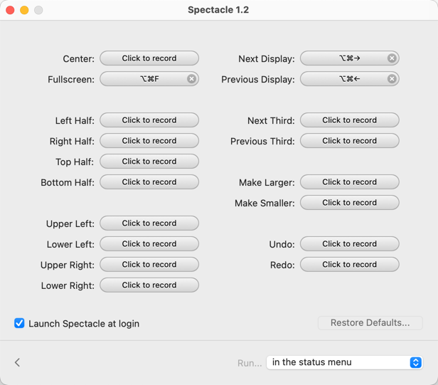
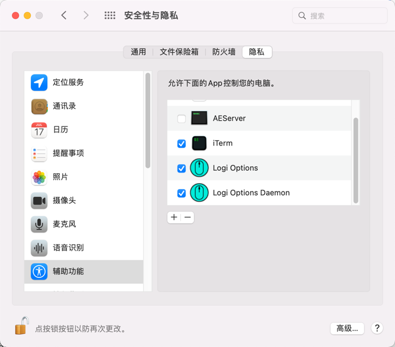
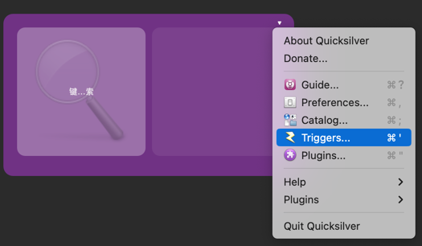
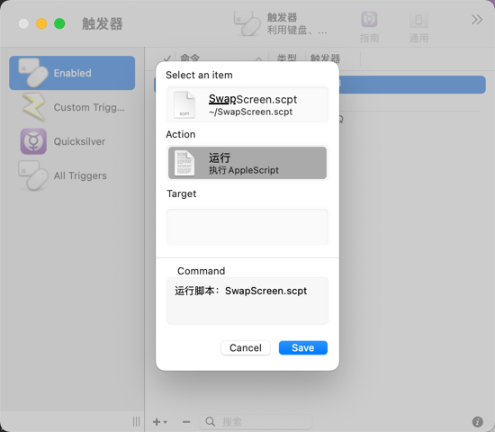
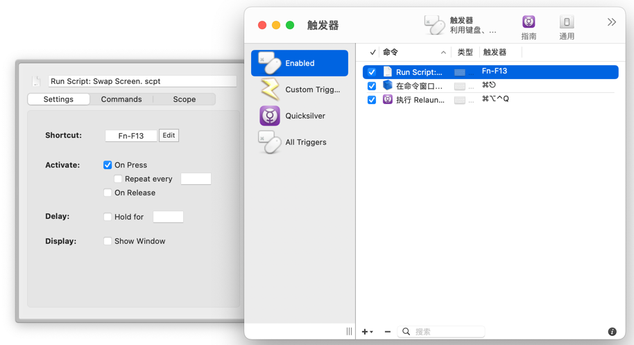
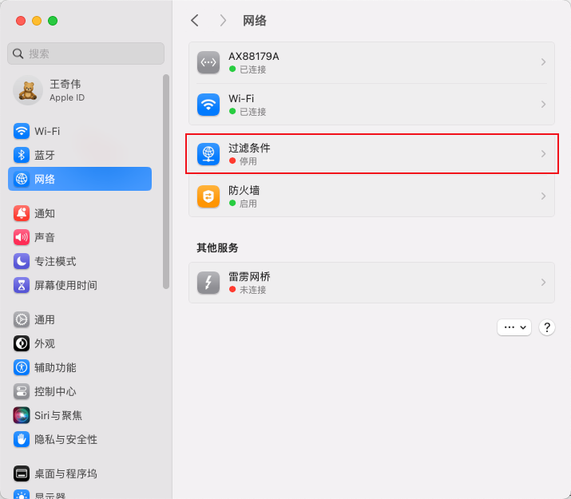
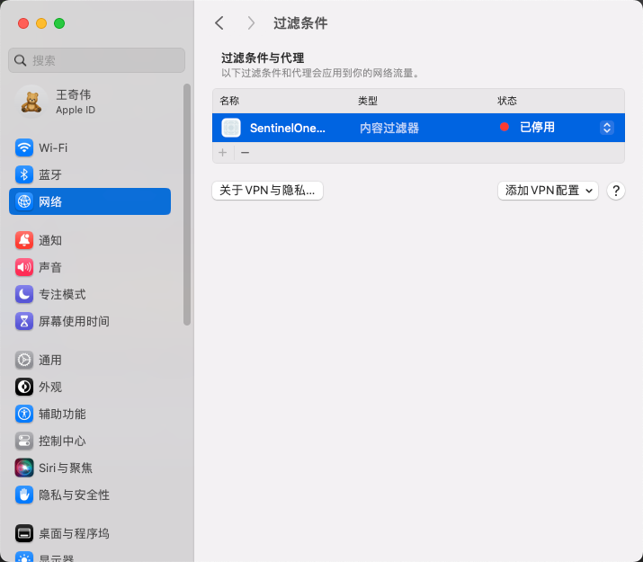

<!-- date: 2020.06.20 20:17 -->

### 一、常用软件

1. Cinch -- 拖动到顶部最大化窗口

2. Go2Shell -- 访达里当前位置打开终端

3. [cdto](https://mac.softpedia.com/get/System-Utilities/cdto.shtml) -- 访达里当前位置打开终端

4. iTerm2 + zsh + Oh My Zsh -- 终端

5. iStat Menus -- 系统状态监控

6. scrollreverser -- 鼠标翻转，鼠标和触摸板独立翻转

7. [Stats](https://github.com/exelban/stats) -- 系统状态监控

8. [Maccy](https://maccy.app/) - 剪切板工具，类似Ubuntu的Clipboard Indicator

9. [Snipaste](https://zh.snipaste.com/download.html) - 剪切板工具，带pin

10. [AltTab](https://alt-tab-macos.netlify.app/) - 同Windows AltTab，支持同应用间切换

11. [Spectacle](https://www.spectacleapp.com/) - 窗口最大化/在屏幕间移动窗口
    快捷键配置：



12. Alfred - 快查

### 二、常见问题

#### 1、逻辑鼠标滚轮失灵

* 位置：系统偏好设置｜安全性与隐私｜隐私｜辅助功能
* 操作：针对逻辑驱动，未勾选的进行勾选，已勾选的取消再重新勾选。



#### 2、Mac交换双屏幕内容

> [how-can-i-swap-the-primary-display-automatically-in-a-dual-monitor-setup](https://apple.stackexchange.com/questions/102192/how-can-i-swap-the-primary-display-automatically-in-a-dual-monitor-setup/103830#103830)

步骤：

1. 下载[cscreen](https://formulae.brew.sh/cask/cscreen)

2. 新建一个脚本swap_src.scpt
   
   ```applescript
   do shell script "/opt/homebrew/bin/cscreen -l | perl -lane 'print $F[0] if $F[1] == 2' | xargs -I id /opt/homebrew/bin/cscreen -i id -p"
   ```

3.使用[quicksilver](https://qsapp.com/download.php)绑定脚本到快捷键





#### 3、Mac外接键盘Home/End键改为跳行首/行尾

> https://blog.csdn.net/howeres/article/details/122388484

1. 创建默认的按键映射文件
   
   ```bash
   $ mkdir -p ~/Library/KeyBindings
   $ vim ~/Library/KeyBindings/DefaultKeyBinding.dict
   ```

2. 写入映射内容
   
   ```dict
   {
    /* Remap Home/End keys */
    /* Home Button*/
    "\UF729" = "moveToBeginningOfLine:";
    /* End Button */
    "\UF72B" = "moveToEndOfLine:";
    /* Shift + Home Button */
    "$\UF729" = "moveToBeginningOfLineAndModifySelection:";
    /* Shift + End Button */
    "$\UF72B" = "moveToEndOfLineAndModifySelection:";
    /* Ctrl + Home Button */
    "^\UF729" = "moveToBeginningOfDocument:";
    /* Ctrl + End Button */
    "^\UF72B" = "moveToEndOfDocument:";
    /* Shift + Ctrl + Home Button */
    "$^\UF729" = "moveToBeginningOfDocumentAndModifySelection:";
    /* Shift + Ctrl + End Button*/
    "$^\UF72B" = "moveToEndOfDocumentAndModifySelection:";
   }
   ```

3. 重启电脑

#### 4、SentinelOne卸载后，无法联网

> [删除方法](https://www.sonicwall.com/support/knowledge-base/uninstalling-sentinelone-mac-agent-through-recovery-mode/180817075834733/)

系统设置 | 网络 | 过滤条件 -> 停用SentinelOne并删除



#### 5、Mac的`ctrl + w`失灵无法关闭浏览器标签

* 重新插拔键盘

#### 6、Mac外接显示器接的键盘失灵

> https://github.com/xxxzc/xps15-9570-macos/issues/58

尝试以下步骤：

1）更新已有的必要更新，重启Mac

2）重启后若仍失灵，则直接操作Mac电脑，锁屏再解锁。然后观测是否恢复

### #参考

[https://zhuanlan.zhihu.com/p/37195261](https://zhuanlan.zhihu.com/p/37195261)
[https://pilotmoon.com/scrollreverser/](https://pilotmoon.com/scrollreverser/)
