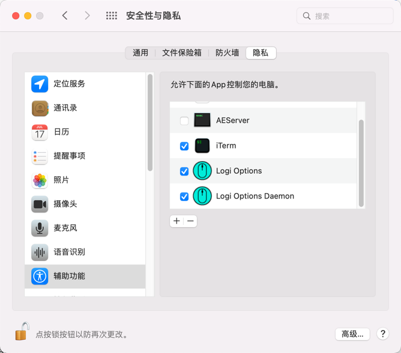

### 一、常用软件

1. Cinch -- 拖动到顶部最大化窗口
1. Go2Shell -- 访达里当前位置打开终端
1. [cdto](https://mac.softpedia.com/get/System-Utilities/cdto.shtml) -- 访达里当前位置打开终端
1. iTerm2 + zsh + Oh My Zsh -- 终端
1. iStat Menus -- 系统状态监控
1. scrollreverser -- 鼠标翻转，鼠标和触摸板独立翻转
1. [maccy](https://maccy.app/) - 剪切板工具，类似Ubuntu的Clipboard Indicator
### 二、常见问题
#### 1、逻辑鼠标滚轮失灵
* 位置：系统偏好设置｜安全性与隐私｜隐私｜辅助功能
* 操作：针对逻辑驱动，未勾选的进行勾选，已勾选的取消再重新勾选。

### #参考

[https://zhuanlan.zhihu.com/p/37195261](https://zhuanlan.zhihu.com/p/37195261)
[https://pilotmoon.com/scrollreverser/](https://pilotmoon.com/scrollreverser/)

