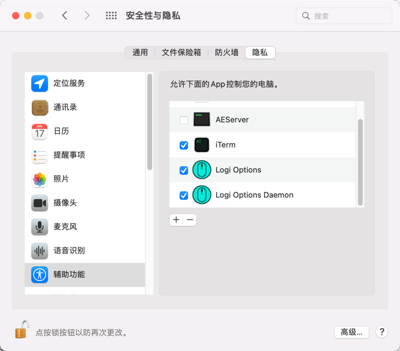
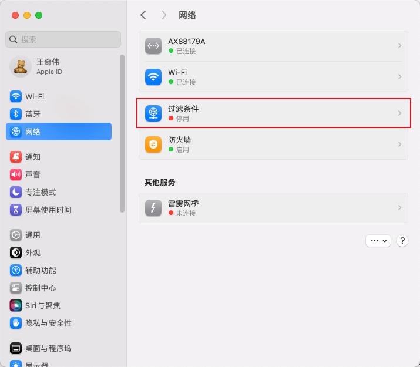
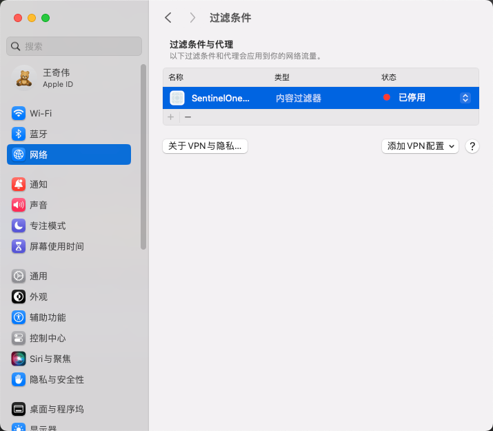

## 常用软件

1. Go2Shell -- 访达里当前位置打开终端
2. iTerm2 + zsh + Oh My Zsh -- 终端
3. iStat Menus -- 系统状态监控
4. [Stats](https://github.com/exelban/stats) -- 系统状态监控
5. [Maccy](https://maccy.app/) - 剪切板工具，类似Ubuntu的Clipboard Indicator
6. [Snipaste](https://zh.snipaste.com/download.html) - 剪切板工具，带pin
7. [AltTab](https://alt-tab-macos.netlify.app/) - 同Windows AltTab，支持同应用间切换
8. [Rectangle](https://rectangleapp.com/) - 窗口最大化/在屏幕间移动窗口

## 配置

### 配置ssh

```shell
ssh-keygen -t ed25519 -C "shichenegyx@sina.com"
```

### 配置vim
~/.vimrc
```
syntax on           " 语法高亮
set nu              " 显示行号
set tabstop=4       " Tab 缩进为 4 个空格
set shiftwidth=4    " 自动缩进为 4 个空格
set expandtab       " 将 Tab 自动转化为空格
set nobackup        " 覆盖文件时不备份
set cursorline      " 突出显示当前行
set ruler           " 在右下角显示光标位置
set autoindent      " 自动缩进
set mouse=a         " 允许鼠标点击
set hls             " 高亮搜索结果
```
### 配置GIT

```shell
git config --global user.email "shichengyx@sina.com"
git config --global user.name "kivi"
```

### 系统设置|触控板

1 光标与点按：开启`轻点来点按`
2 滚动缩放：关闭`自然滚动`

### 系统设置|桌面与程序坞

1 打开`将窗口最小化至应用程序图标`
2 `在台前调度中显示最近使用的App`设置为`仅在台前调度中`
3 关闭`在程序坞中显示建议App和最近使用的App`

### 配置键盘Home/End键

1 创建默认的按键映射文件

```shell
mkdir -p ~/Library/KeyBindings
vim ~/Library/KeyBindings/DefaultKeyBinding.dict
```

2 写入映射内容

```dict
{
    /* Remap Home/End keys */
    /* Home Button*/
    "\UF729" = "moveToBeginningOfLine:";
    /* End Button */
    "\UF72B" = "moveToEndOfLine:";
    /* Shift + Home Button */
    "$\UF729" = "moveToBeginningOfLineAndModifySelection:";
    /* Shift + End Button */
    "$\UF72B" = "moveToEndOfLineAndModifySelection:";
    /* Ctrl + Home Button */
    "^\UF729" = "moveToBeginningOfDocument:";
    /* Ctrl + End Button */
    "^\UF72B" = "moveToEndOfDocument:";
    /* Shift + Ctrl + Home Button */
    "$^\UF729" = "moveToBeginningOfDocumentAndModifySelection:";
    /* Shift + Ctrl + End Button*/
    "$^\UF72B" = "moveToEndOfDocumentAndModifySelection:";
}
```

3 重启电脑后生效

### 配置Snipaste

1 常规：启用“开机启动”
2 输出：配置路径：`/Users/wangqiwei/Pictures/Snapshot/Snipaste_$yyyy-MM-dd_HH-mm-ss$.png`
3 控制：只设置截屏`Ctrl + A`

### 配置访达

1 标签栏：去除所有标签
2 边栏：显示`图片`,`{HOME}`

### 配置Stats

1 只保留CPU、MEM、网络
2 网络|小组件：标识改为箭头
3 打开`合并模块`，关闭`合并详情`

### 配置iTerm2 + zsh + oh my zsh

1 配置iTerm2: Profiles|Colors，Default背景色设置为黑色，前景色设置为白色。Cursor背景色设置为白色，前景色设置为黑色。
2 配置zsh：~/.zshrc，末尾增加

```shell
source ~/.zshrc_user
```

3 配置oh my zsh，安装插件

```shell
brew install zsh-syntax-highlighting
echo "source $(brew --prefix)/share/zsh-syntax-highlighting/zsh-syntax-highlighting.zsh" >> ~/.zshrc_user
source ~/.zshrc

brew install zsh-autosuggestions 
echo "source $(brew --prefix)/share/zsh-autosuggestions/zsh-autosuggestions.zsh" >> ~/.zshrc_user
source ~/.zshrc

brew install autojump
echo "[ -f /opt/homebrew/etc/profile.d/autojump.sh ] && . /opt/homebrew/etc/profile.d/autojump.sh" >> ~/.zshrc_user
source ~/.zshrc
```

### 配置go2shell

配置terminal为iTerm2

## 常见问题

### 罗技鼠标滚轮失灵

* 位置：系统偏好设置｜安全性与隐私｜隐私｜辅助功能
* 操作：针对逻辑驱动，未勾选的进行勾选，已勾选的取消再重新勾选。



### SentinelOne卸载后，无法联网

> [删除方法](https://www.sonicwall.com/support/knowledge-base/uninstalling-sentinelone-mac-agent-through-recovery-mode/180817075834733/)

系统设置 | 网络 | 过滤条件 -> 停用SentinelOne并删除




### `Ctrl + w`失灵无法关闭浏览器标签

* 重新插拔键盘

### 外接显示器接的键盘失灵

> https://github.com/xxxzc/xps15-9570-macos/issues/58

尝试以下步骤：

1）更新已有的必要更新，重启Mac

2）重启后若仍失灵，则直接操作Mac电脑，锁屏再解锁。然后观测是否恢复
