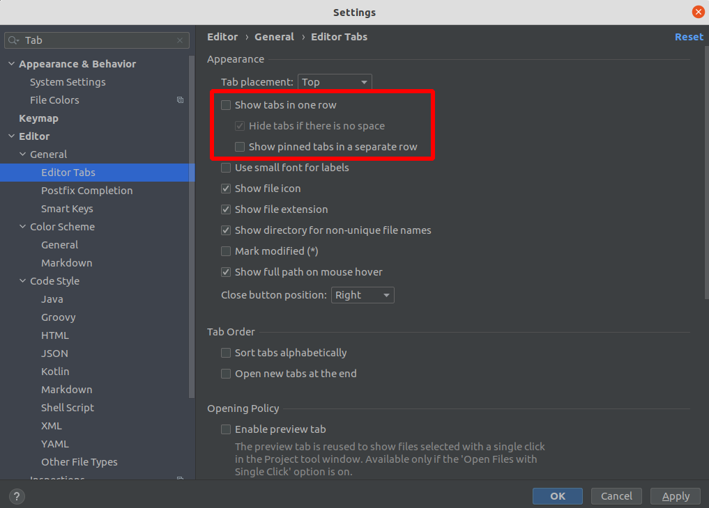
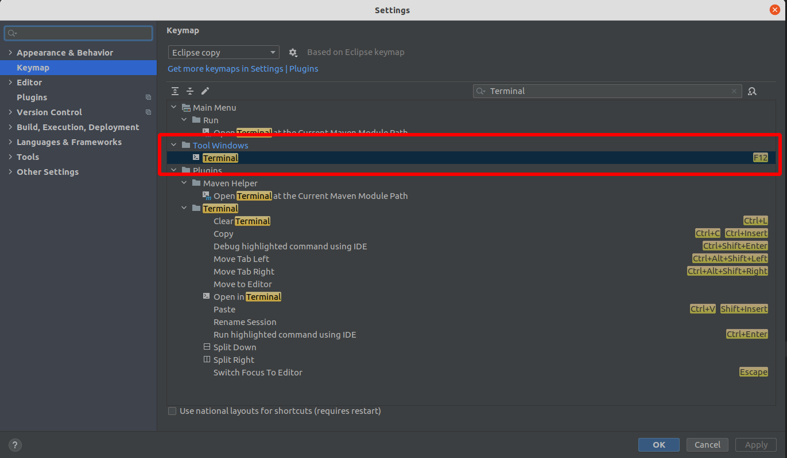
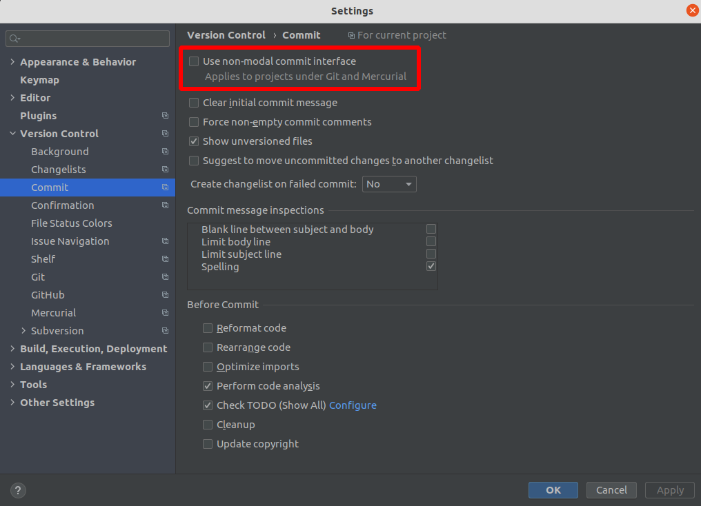

### 一、常用插件及配置

##### 1. 常用插件

1）IdeaVim - 集成vim基础操作

2）Maven Helper  - 查看依赖树，便于排除依赖等

3）Maven Dependency Helper - 便捷查询maven坐标

4）Free Mybaits puglin - 支持接口和mapper跳转等

5）Translation - 翻译

6）SequenceDiagram - 生成时序图

7）Rainbow Brackets - 括号着色

8）GrepConsole - 日志着色

9）FindBugs-IDEA - 代码审查

10）Java Stream Debugger - Stream可视化Debug

11）GenerateAllSetter

12）leetcode editor

13）gittoolbox

##### 2.  常用配置

1）配置maven目录


2）配置编辑器的tab栏




3）配置keymap为eclipse


4）设置常用快捷键



5）设置字体大小


6）打开内存使用器

*View | Appearance | Members in Navigation Bar*

7）设置用户信息

```java
/**
 * @author wangqiwei
 * @date ${YEAR}/${MONTH}/${DAY} ${HOUR}:${MINUTE}
 */
```


8）社区版Git的View中显示*Local Changes*

取消勾选：*Settings | Preferences | Version Control |Commit* 的*Use non-modal commit interface*



### 二、常见问题

##### 1. cannot find symbol

尝试：1）删除.idea/   2）执行mvn idea:module

##### 2. External Libraries下出现Libraray root

如果IDEA的"External Libraries"下出现"Libraray root"，那么其有可能和项目的pom文件的依赖有冲突，此时需要执行以下操作：
1）删除.idea/
2）删除xxx.iml
3）重新导入工程

##### 3. 替换tab为空格

1）取消勾选 *Preferences - Editor - Code Style - Java*页面的*Use tab character*。


2）对已有的文件进行替换tab替换（如粘贴代码后可执行本操作）

*Edit | Convet Indents | To Spaces*

##### 4. idea的terminal中切换输入法卡死

1）goto *Help | Edit Custom VM options...*

2）Add *-Drecreate.x11.input.method=true* to a new line

3）restart IDEA

参考：https://youtrack.jetbrains.com/issue/JBR-2444

