<!-- date: 2020.09.01 15:32 -->

### 一、常用插件

> 导入GoLand配置： File -> Manage IDE Settings -> Import Settings...

#### 1. 通用插件

* IdeaVim - 集成vim基础操作

* GitToolBox - Git插件

* Translation - 翻译

* Rainbow Brackets - 括号着色

* GrepConsole - 日志着色

* Awesome Console - 控制台增强（如文件地址可以点击打开）

* leetcode editor

#### 2. IDEA插件

* Maven Helper - 查看依赖树，便于排除依赖等

* Maven Dependency Helper - 便捷查询maven坐标

* Free Mybaits puglin - 支持接口和mapper跳转等

* SequenceDiagram - 生成时序图

* FindBugs-IDEA - 代码审查

* Java Stream Debugger - Stream可视化Debug

* GenerateAllSetter

### 二、IDE配置

#### 1. 通用配置

1）配置编辑器的tab栏

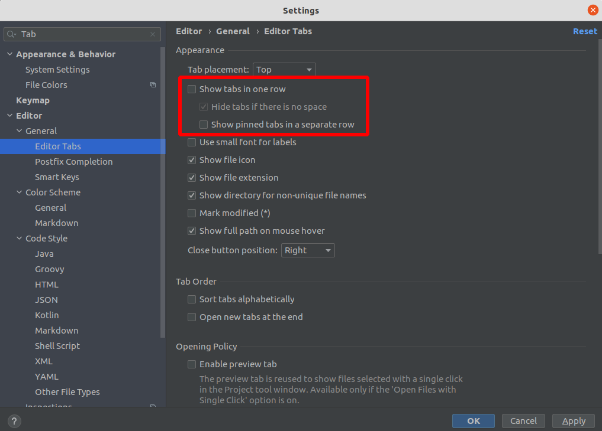

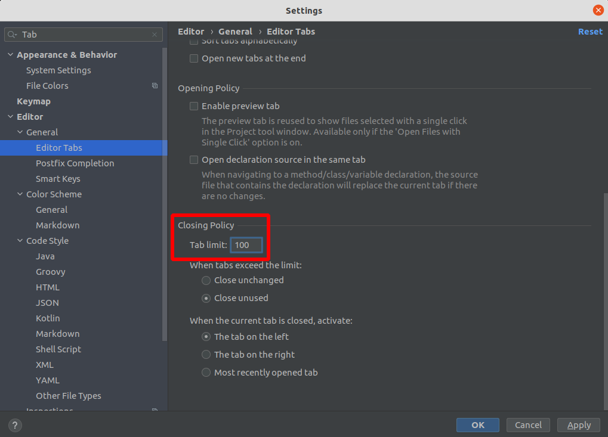

2）配置keymap为eclipse

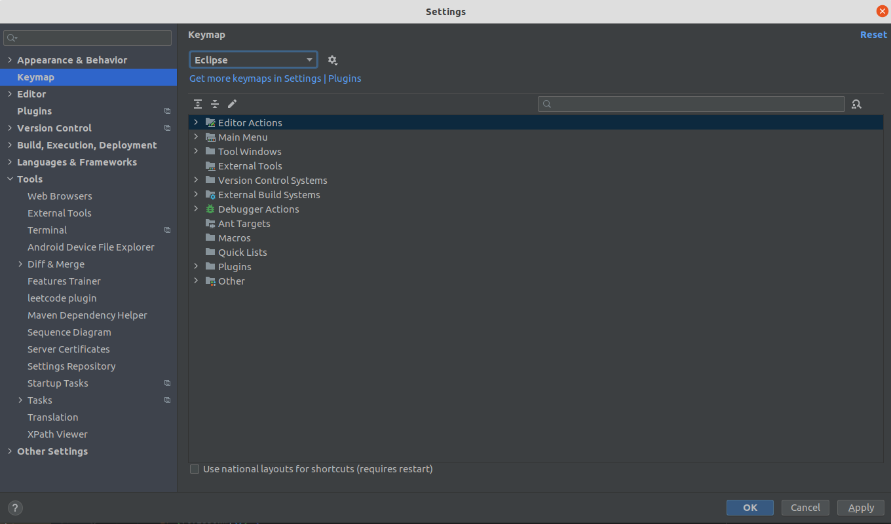

3）设置常用快捷键

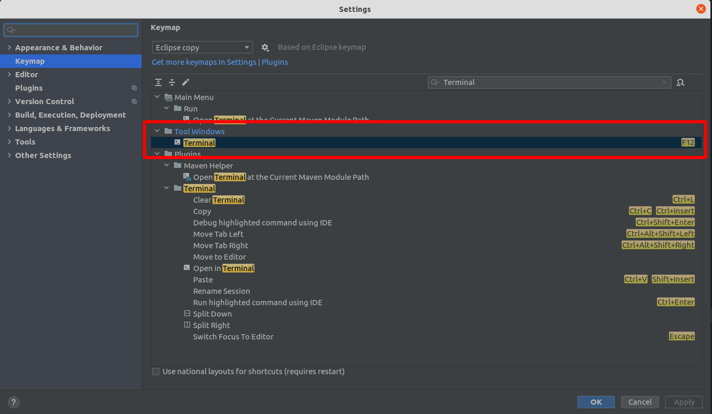

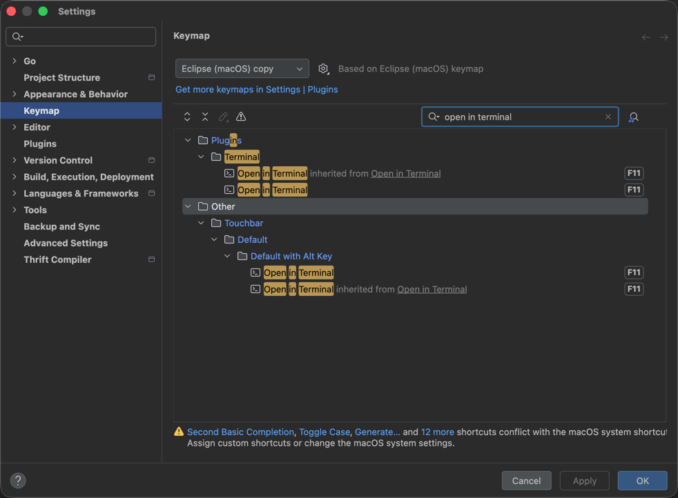

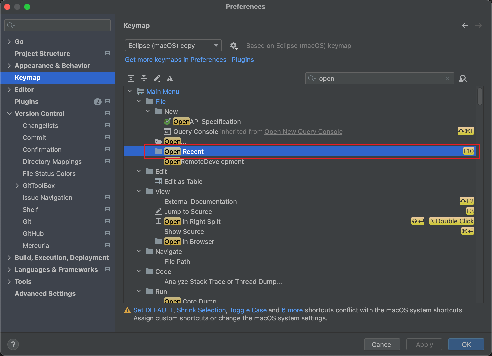

跳转快捷键（场景：ctrl + Click点击函数跳转，修改为command + Click）

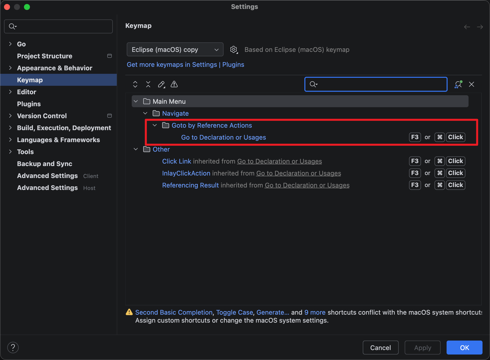

4）设置字体大小

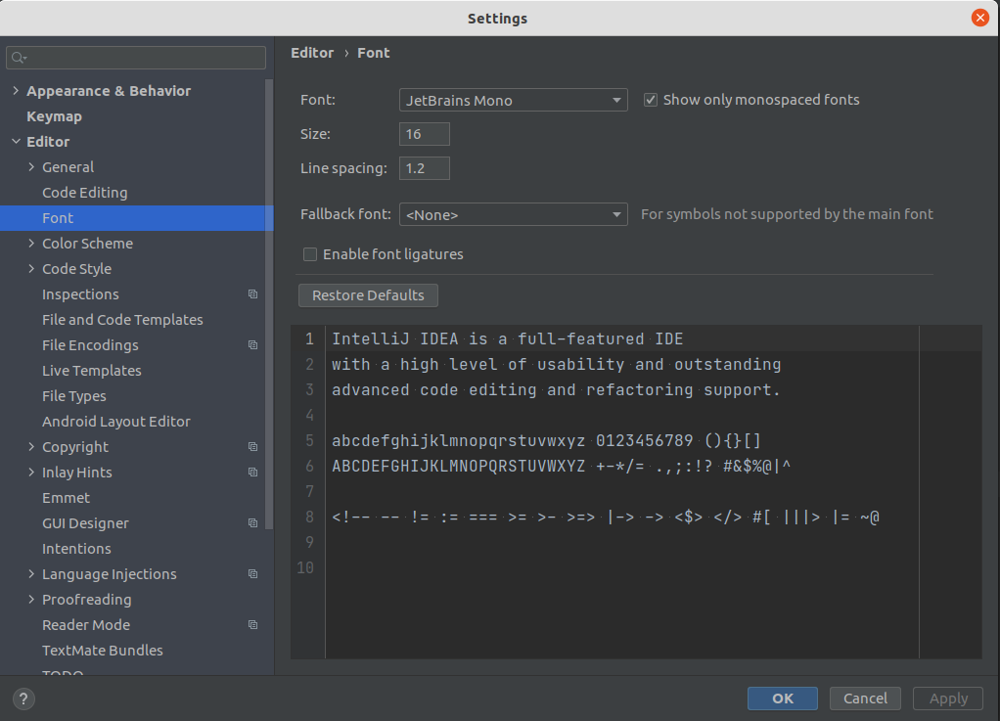

5）打开内存使用器

*View | Appearance | Members in Navigation Bar*


6）Git的显示*Local Changes*

取消勾选：*Settings | Preferences | Version Control |Commit* 的*Use non-modal commit interface*

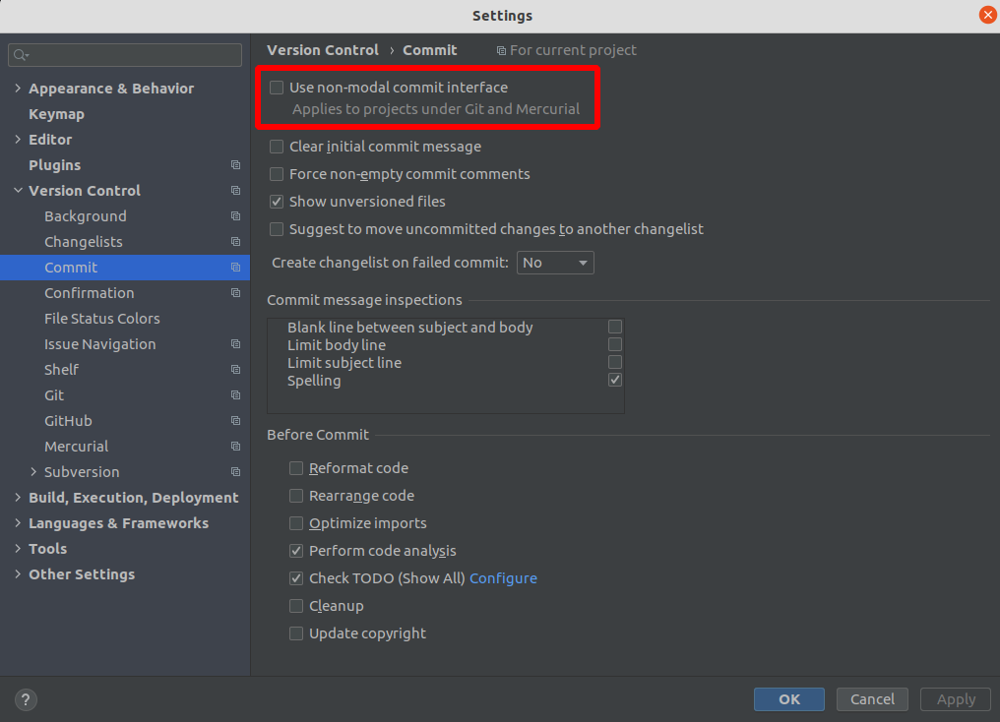

新版本位置变化，需要勾选`Use modal commit interface for Git and Mercurial`

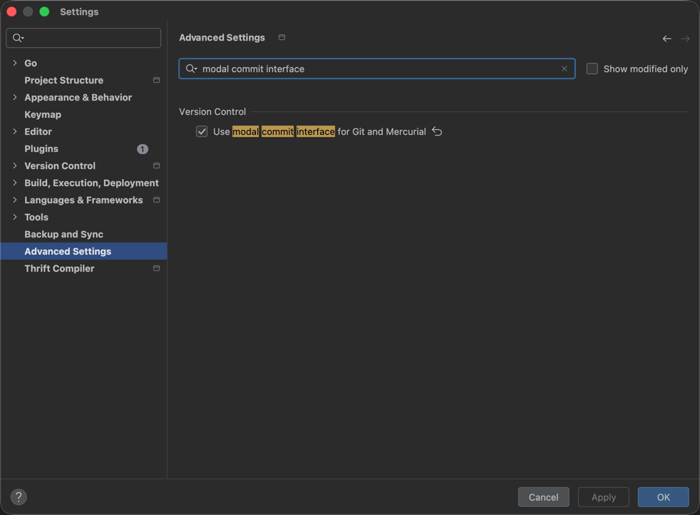


7）替换tab为空格

取消勾选 *Preferences - Editor - Code Style - Java*页面的*Use tab character*。

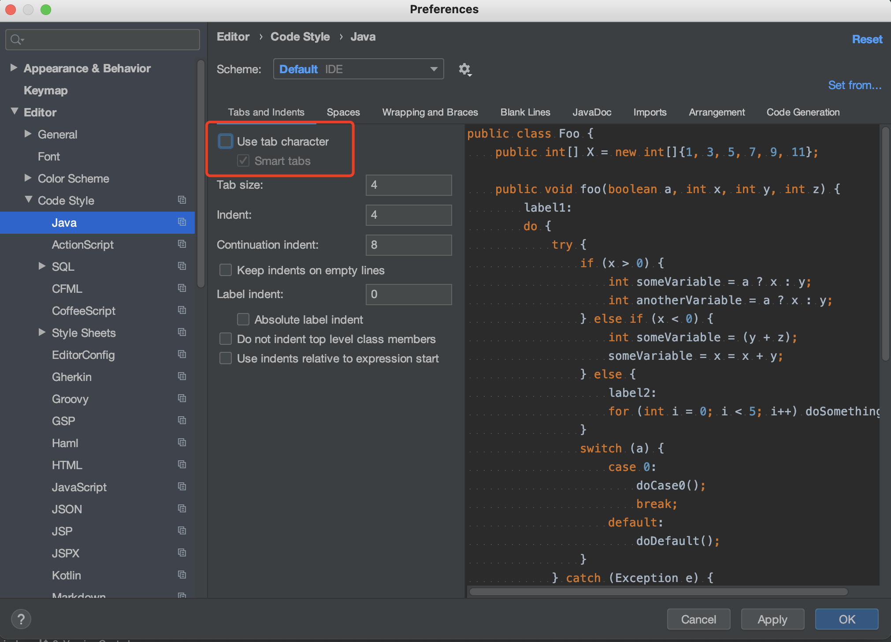

对已有的文件进行替换tab替换（如粘贴代码后可执行本操作）

*Edit | Convert Indents | To Spaces*

#### 2. IDEA配置

1）配置maven目录

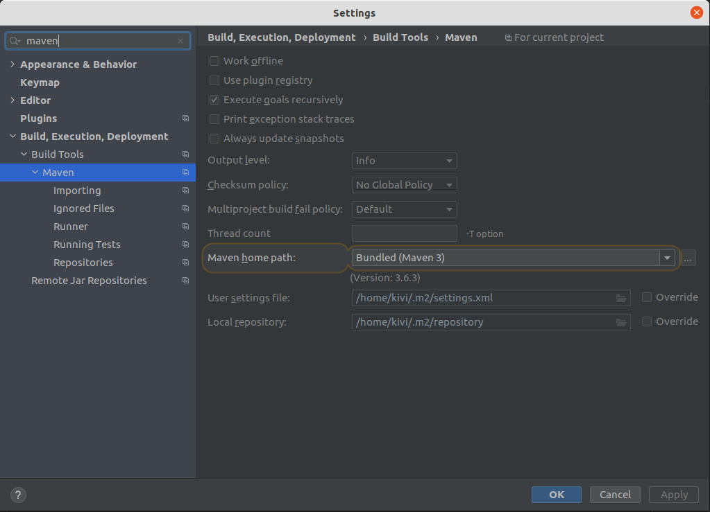

2）设置用户信息

```java
/**
 * @author wangqiwei
 * @date ${YEAR}/${MONTH}/${DAY} ${HOUR}:${MINUTE}
 */
```

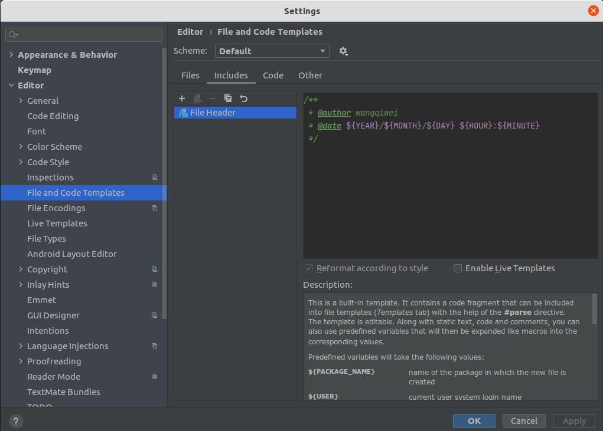

### 三、常见问题
#### 通用问题
##### 含中文的文件无法显示/无法创建

原因：当前系统字符集问题
第一步：查看当前字符集

```shell
echo $LANG
```

第二步：如果不是zh_CN.UTF8，则Google安装中文字符集

第三步：按照完成后，重启IDE即可

#### IDEA常见问题

##### cannot find symbol

尝试：1）删除.idea/   2）执行mvn idea:module

##### External Libraries下出现Library root

如果IDEA的"External Libraries"下出现"Library root"，那么其有可能和项目的pom文件的依赖有冲突，此时需要执行以下操作：
1）删除.idea/
2）删除xxx.iml
3）重新导入工程


##### idea的terminal中切换输入法卡死
> 参考：https://youtrack.jetbrains.com/issue/JBR-2444

1）goto *Help | Edit Custom VM options...*

2）Add *-Drecreate.x11.input.method=true* to a new line

3）restart IDEA

#### Goland常见问题

##### Fix unresolved reference in GoLand

1) 方法一 [>> See More](https://medium.com/@_t/fix-unresolved-reference-in-goland-ebc0ddd749d6)

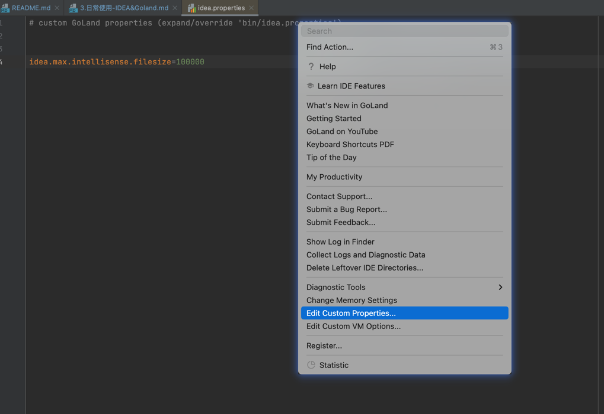

2) 方法二

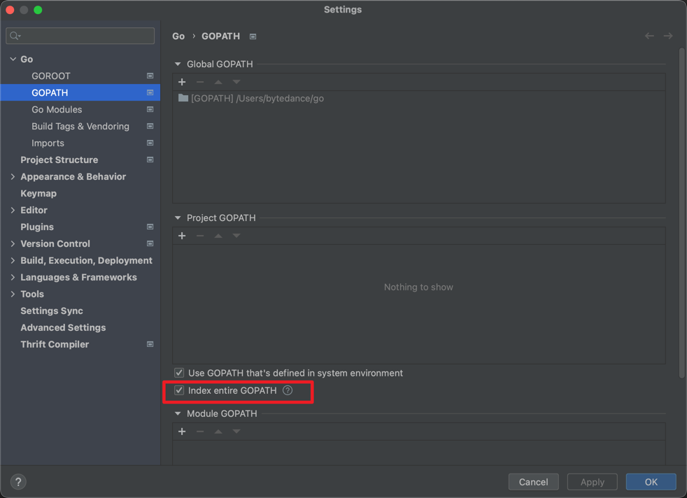

##### Goland中的System Environment与Terminal不一致

> https://intellij-support.jetbrains.com/hc/en-us/community/posts/360000497650/comments/360000793320
> 
> If you set the variable in a terminal inside the IDE, those won't be automatically sent to the run configurations.
> 
> You have to use the way mentioned above to set environment variables. Go to Run | Edit Configurations... | Templates | Go Build and set the environment variables there. Then all new run configurations will inherit those.
> 
> If you wish to set the variables for the terminal specifically, then go to Settings/Preferences | Tools | Terminal | Environment Variables. Note: the environment variables set here will only affect the GoLand terminal after it's closed and started again. And they will not affect the Run Configurations.

如果你使用的是zsh，那么你可以把变量配置到`/etc/zsh/zshenv`，然后`source ~/.zshrc`。具体原因可查看命令解释`man zsh`。