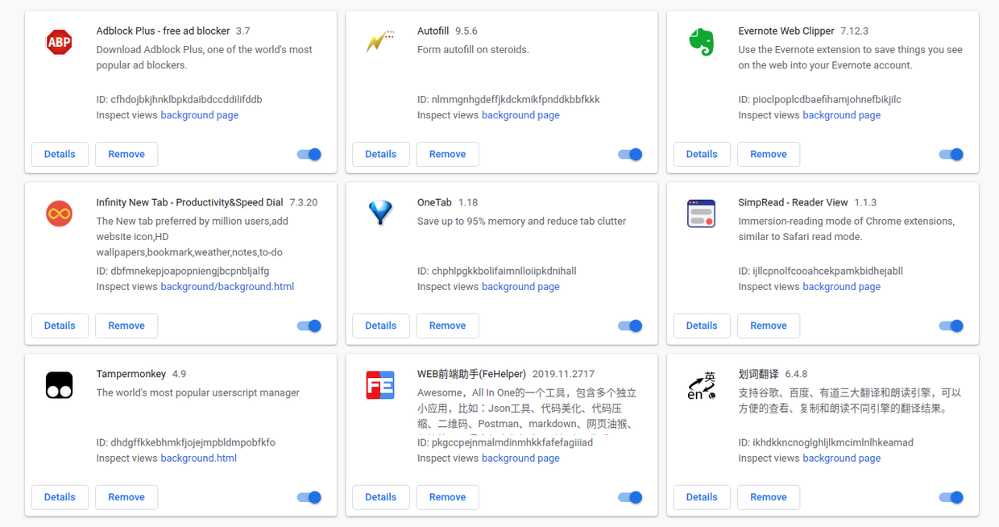

### 一、常用插件

> Chrome简洁高效得到了很多人的青睐。本文总结下我的使用习惯：

1. 开通账号启动同步功能
2. DevTool
3. 书签管理
4. 插件
     * Adblock Plus - 广告拦截
     * Infinity - 标签业美化
     * OneTab - 收缩Tab页
     * SimpRead - 提升阅读体验
     * Tampermokey - 脚本管理
     * 划词翻译 - 翻译
     * Autofill - 表单自动填充（对应火狐上的AutoFormer）
     * Imagus - 鼠标悬停查看大图
     * [Better History](https://chrome.google.com/webstore/detail/better-history/egehpkpgpgooebopjihjmnpejnjafefi) - 浏览器历史
     * 蓝岚日历 - 公历，农历，节日

##### 附图

### 二、常用网址

1. [codelf-程序员变量命名](https://unbug.github.io/codelf/)
2. [数据结构可视化](https://www.cs.usfca.edu/~galles/visualization/Algorithms.html)
3. [在线工具箱子](https://www.sojson.com/gongju/)
4. [mysql官方测试数据库](https://github.com/datacharmer/test_db)

### 三、油猴常用插件

1. Userscript+ : 显示当前网站所有可用的UserJS脚本 Jaeger
2. [CSDN Blog极至简化](https://greasyfork.org/zh-CN/scripts/412200-csdn-blog-super-simplification)
3. csdn 复制
4. [Github, code cloud md file directory](https://greasyfork.org/zh-CN/scripts/387834-github-%E7%A0%81%E4%BA%91-md%E6%96%87%E4%BB%B6%E7%9B%AE%E5%BD%95%E5%8C%96)
5. 百度廣告(首尾推廣及右側廣告)清理
6. 知乎免登录
7. 知乎增强
8. 解锁B站大会员番剧、B站视频解析下载；全网VIP视频免费破解去广告；全网音乐直接下载；油管、Facebook等国外视频解析下载；网盘搜索引擎破解无限下载等

### 四、常见问题

##### 问题1：在chrome里键盘敲击一次会出现两个字符

浏览器油猴插件里的"网页复制解除"脚本引起的，禁用后恢复。
