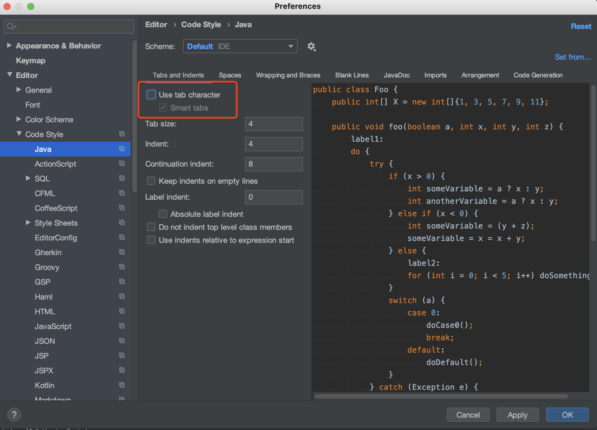
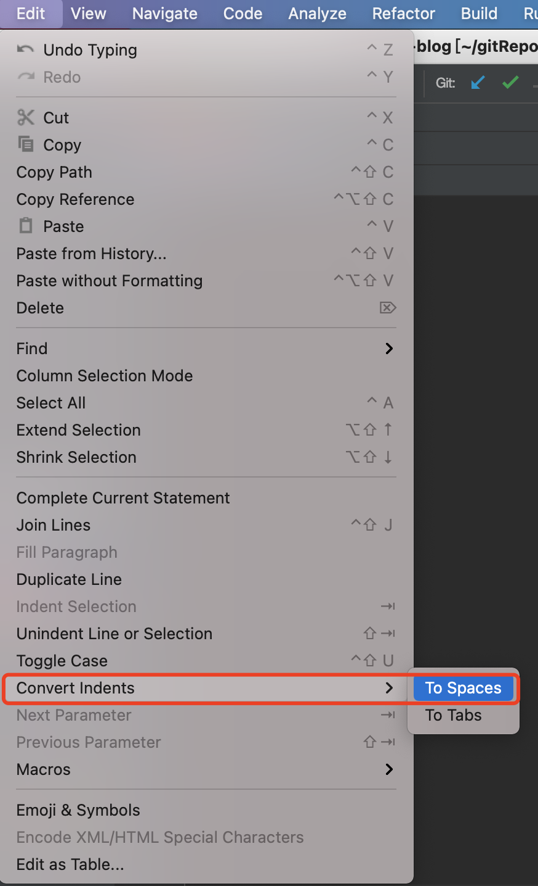

##### 0. 常用插件

1）IdeaVim - 集成vim基础操作

2）Maven Helper  - 查看依赖树，便于排除依赖等

3）Rainbow Brackets - 括号着色

4）Free Mybaits puglin - 支持接口和mapper跳转等

5）Translation - 翻译

6）Maven Dependency Helper - 便捷查询maven坐标

7）SequenceDiagram - 生成时序图

8）GrepConsole - 日志着色

9）FindBugs - 代码审查

10）Java Stream Debugger - Stream可视化Debug

##### 1. IDEA不触发编译，导致cannot find symbol

尝试：1）删除.idea/   2）执行mvn idea:module

##### 2. IDEA的"External Libraries"下出现"Libraray root"

如果IDEA的"External Libraries"下出现"Libraray root"，那么其有可能和项目的pom文件的依赖有冲突，此时需要执行以下操作：
1）删除.idea/
2）删除xxx.iml
3）重新导入工程

##### 3. 替换tab为空格

1）取消勾选 *Preferences - Editor - Code Style - Java*页面的*Use tab character*。

2）对已有的文件进行替换tab替换（如粘贴代码后可执行本操作）

