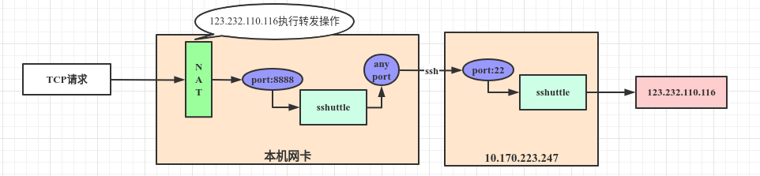

<!-- date: 2020.11.11 10:43 -->
#### 一、使用命令

执行`sudo sshuttle -l 8888 123.232.110.116/32 -r root@10.170.223.247`



#### 二、查看结果:

1. 查看NAT `sudo iptables --list -t nat`
   
   ```shell
   Chain PREROUTING (policy ACCEPT)
   target     prot opt source               destination         
   sshuttle-8888  all  --  anywhere             anywhere            
   DOCKER     all  --  anywhere             anywhere             ADDRTYPE match dst-type LOCAL
   ```

Chain INPUT (policy ACCEPT)
target     prot opt source               destination         

Chain OUTPUT (policy ACCEPT)
target     prot opt source               destination         
sshuttle-8888  all  --  anywhere             anywhere            
DOCKER     all  --  anywhere            !localhost/8          ADDRTYPE match dst-type LOCAL

Chain POSTROUTING (policy ACCEPT)
target     prot opt source               destination         
MASQUERADE  all  --  172.17.0.0/16        anywhere            
MASQUERADE  all  --  172.19.0.0/16        anywhere            
MASQUERADE  tcp  --  172.19.0.2           172.19.0.2           tcp dpt:mysql

Chain DOCKER (2 references)
target     prot opt source               destination         
RETURN     all  --  anywhere             anywhere            
RETURN     all  --  anywhere             anywhere            
DNAT       tcp  --  anywhere             anywhere             tcp dpt:mysql to:172.19.0.2:3306

Chain sshuttle-8888 (2 references)
target     prot opt source               destination         
RETURN     tcp  --  anywhere             https://account.jetbrains.com:443 
REDIRECT   tcp  --  anywhere             123.232.110.116      TTL match TTL != 42 redir ports 8888

```
2. 查看端口监听`netstat -np | grep 10.170.223.247`
```shell
tcp        0      0 192.168.137.19:39792    10.170.223.247:22       ESTABLISHED -
```