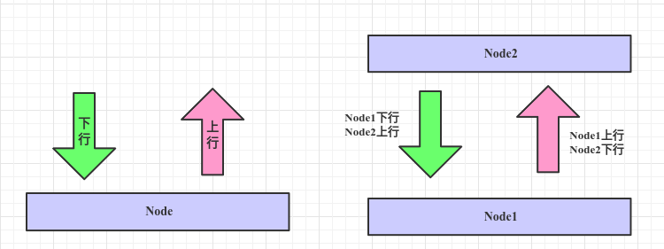
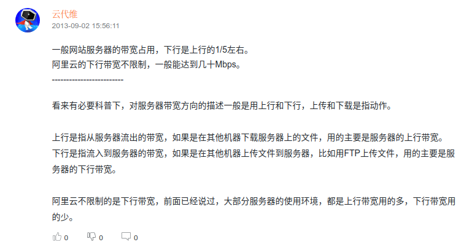

#### 一、上行

数据流出（out）当前结点。

#### 二、下行

数据流入（in）当前结点。

#### 三、引用阿里云社区的回答

#### 参考

1. [UpStream - wikipedia](https://en.wikipedia.org/wiki/Upstream_(networking))
2. [DownStream - wikipedia](https://en.wikipedia.org/wiki/Downstream_(networking))
3. [上行带宽，下行带宽；上传速度，下载速度](https://blog.csdn.net/qq_39086276/article/details/103953957)
4. [求扫盲，服务器的上传和下载的带宽两者互相影响吗](https://developer.aliyun.com/ask/160036?spm=a2c6h.13706215.wenda.9.422263696Micv0)

