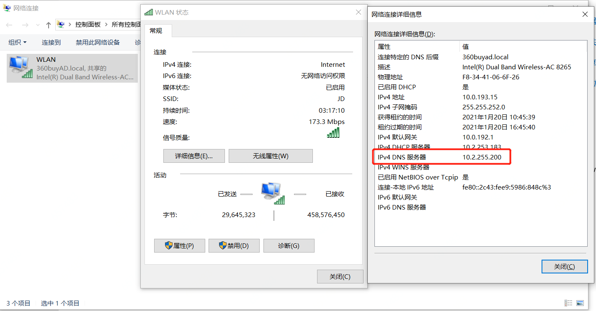

#### 一、环境

1. 一个笔记本，*windows 10*
2. 一个台式机，*Ubuntu 20.04LTS*
3. 一个网线

其中笔记本可以通过无线上网。

#### 二、三步配置

##### 1）通过网线连接笔记本和台式机

网线的线序没有关系，现在网卡可以自动识别线序。

##### 2）配置笔记本侧

配置无限网络的**Internet连接共享**，步骤：

* 右键WLAN无线连接，选择*属性 - 共享*
* 勾选：*允许其他网络通过此计算机的Internet连接来连接*
* *家庭网络连接* 里选择有线网卡


记录下无线网卡的DNS地址和有线网卡的IP地址，供台式机配置。




##### 3）配置台式机侧


* 配置DNS和笔记本无线网卡一致
* 配置IP/mask和笔记本有线网卡在一个网段

#### 其他

有时候通过以上配置后，笔记本和台式机可以互相ping通，但是台式机无法上网。尝试重置笔记本网卡：

```
1. 按键盘Win+R打开"运行",输入cmd然后按Ctrl+Shift+回车,以管理员身份打开命令提示符
2. 在打开的命令提示符窗口中粘贴运行下面的命令:
netsh int ip reset
netsh winsock reset
3. 重启电脑
```

#### 附台式机静态路由


#### 常见问题

1）通过使用网络共享的方式发现台式机访问网络很慢。

- 先尝试设置笔记本设置网卡带宽，路径：*无线网卡上鼠标右键 | 属性 | 配置 | 高级 | Channel Width for 5GHz*；
   - 如果当前是*20 MHz Only*，则改为*Auto*；
   - 如果当前是*Auto*，则改为*20 MHz Only*；


- 如果网速没有恢复，则在笔记本上打开设备管理器，把无线网卡、有线网卡卸载，然后重启机器


2）windows重启后，台式机无法上网

- windows无线网卡的网络共享关闭再打开，就可恢复


3）windows休眠唤醒后，两者都无法上网

- 关闭windows无线网卡的网络共享
- 禁用windows无线网卡，然后在启动
- 打开windows无线网卡的网络共享


