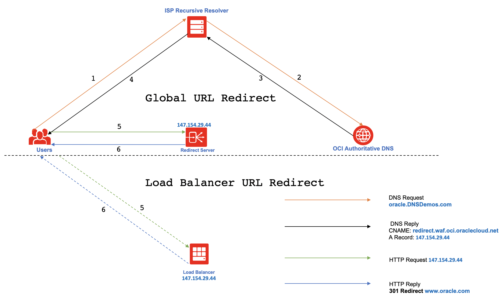

#### 一、DNS流程

DNS是一种应用层协议，DNS客户端请求DNS服务器把域名解析为目标IP。

[图片来源](https://aws.amazon.com/cn/route53/what-is-dns/)

#### 二、Url转发流程

URL转发使用http 301，302状态码响应请求端，使其redirect到另一个URL。

[图片来源](https://blogs.oracle.com/cloud-infrastructure/http-url-redirect-on-oracle-cloud-infrastructure)

#### 三、DNS和Url转发的对比

1）基于协议不同

* DNS基于DNS协议
* URL转发使用的HTTP协议

2）发生阶段不同

* DNS发生在HTTP连接建立前，通过DNS获取目标的IP
* URL转发发生在HTTP连接已建立

3）功能不同

* DNS主要是返回域名对应的IP
* URL转发至完整路径的URI，如果是不同的域名的URI，需要触发DNS再次解析域名。

NOTE：现在大部分提供DNS服务的网站，也提供了URL转发服务。如[腾讯云DNS解析控制台](https://cloud.tencent.com/document/product/302/12649)

#### # 参考

1. https://en.wikipedia.org/wiki/URL_redirection
2. https://en.wikipedia.org/wiki/Domain_Name_System
3. https://zh.wikipedia.org/wiki/%E5%9F%9F%E5%90%8D%E7%B3%BB%E7%BB%9F
4. https://zh.wikipedia.org/wiki/DNS%E8%AE%B0%E5%BD%95%E7%B1%BB%E5%9E%8B%E5%88%97%E8%A1%A8
5. https://aws.amazon.com/cn/route53/what-is-dns/