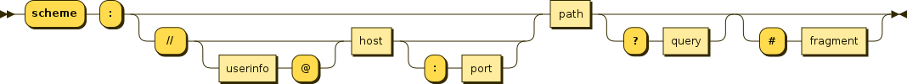
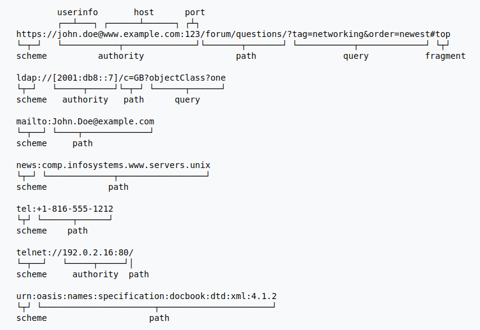

<!-- date: 2020.07.21 11:56 -->
### 一、一个URI异常

#### 示例代码

```
 public static void main(String[] args) throws URISyntaxException {
        new URI("http://test.jd.com /index.html");
 }
```

#### 报错信息

```
Exception in thread "main" java.net.URISyntaxException: Illegal character in authority at index 7: http://test.jd.com /index.html
    at java.net.URI$Parser.fail(URI.java:2848)
    at java.net.URI$Parser.parseAuthority(URI.java:3186)
    at java.net.URI$Parser.parseHierarchical(URI.java:3097)
    at java.net.URI$Parser.parse(URI.java:3053)
    at java.net.URI.<init>(URI.java:588)
    at TmpTest.main(TmpTest.java:17)
```

#### 异常分析

 JAVA中根据格式解析认证模块时，如果出错，`其报错非法字符的位置为认证模块的首位，而不是真正出错的位置。`
如`http://test.jd.com /index.html`解析认证组件 `test.jd.com `时出错（多了一个空格），报错的非法字符位置为7，即`http://`后面的位置。

### 二、URI格式介绍

1. URI的通用格式定义：
   `URI = scheme:[//authority]path[?query][#fragment]`
   其中：`authority = [userinfo@]host[:port]`
   
   

2. URI中的authority组件：
   1）认证组件被互联网Server或特定协议的命名机关注册登记；
   2）认证组件跟在`//`后面；遇到符号`?`，`/`结束。
   3）认证模块是非必须的；

3. URI示例
   
   

### 参考

1. [https://tools.ietf.org/html/rfc2396#section-3.1](https://tools.ietf.org/html/rfc2396#section-3.1)
2. [https://en.wikipedia.org/wiki/Uniform_Resource_Identifier](https://en.wikipedia.org/wiki/Uniform_Resource_Identifier)