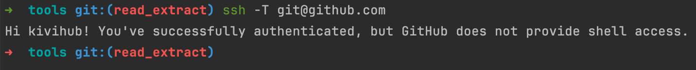

## 一、场景描述

开发机：远程开发环境，无法访问外网

工作机：本地操作机器，链接远程开发机进行开发

## 二、工作机启动代理服务端

> https://github.com/ginuerzh/gost

```bash
gost -L http://:8118
```

如果是MacOS，使用CronTab保活：

```cron
*/10 * * * * screen -dms proxy /opt/homebrew/bin/gost -L "http://:8118"
```

## 三、开发机配置请求代理

### 1、配置SSH请求代理

1）配置 *~/.ssh/config*
【推荐】使用corkscrew，安装命令：`apt install corkscrew`

```nginx
Host github.com
    ProxyCommand corkscrew 工作机IP 8118 %h %p
```

【不推荐】原因：代理时可能会出现异常，详见[wrongnetcat](https://pagekite.net/wiki/Howto/SshOverPageKite/#wrongnetcat)

```nginx
Host github.com
  ProxyCommand nc -X connect -x 工作机IP:8118 %h %p
```

2）验证github联通性

```bash
ssh -T git@github.com
```



3）创建代理IP刷新脚本：*~/.ssh/config_refresh.sh*

```bash
#!/bin/bash

# 检查参数是否正确
if [ $# -ne 1 ]; then
    echo "用法: $0 <新IP>"
    exit 1
fi

file='/home/wangqiwei.bj/.ssh/config'
new_ip="$1"

# 使用sed安全替换（先创建临时文件再覆盖）
sed -i.bak "s/\(corkscrew \)[^ ]\+/\1$new_ip/g" "$file" && rm -f "$file.bak"
echo "SSH  Proxy Refreshed In '$file'"
```

### 2、配置http请求代理

1）配置 *~/.zshrc*

```bash
# no_proxy配置开发机可访问的域名和IP段
export no_proxy="localhost,127.0.0.1,127.0.0.0/8,169.254.0.0/16,172.16.0.0/12,192.168.0.0/16,10.0.0.0/8"
export NO_PROXY="localhost,127.0.0.1,127.0.0.0/8,169.254.0.0/16,172.16.0.0/12,192.168.0.0/16,10.0.0.0/8"

function Proxy() {
        #ip=工作机IP/其他Proxy IP
        ip=`sudo netstat -tpn | grep "ESTABLISHED.*sshd" |grep 「开发地址」 | awk '{ print $5}' | cut -d: -f1 |sort | uniq -c |sort -n| awk '{ print $2}' | head -n 1` 
        if [ "$1" = "on" ]; then 
                /home/wangqiwei.bj/.ssh/config_refresh.sh $ip
                export https_proxy=$ip:8118 
                export http_proxy=$ip:8118 
                echo Http Proxy On $ip 
        else 
                /home/wangqiwei.bj/.ssh/config_refresh.sh "proxy_off"
                unset https_proxy 
                unset http_proxy 
                echo Http Proxy Off 
        fi 
}
```

2）启用配置

```bash
source ~/.zshrc
```

3）启用代理

```bash
Proxy on
```
