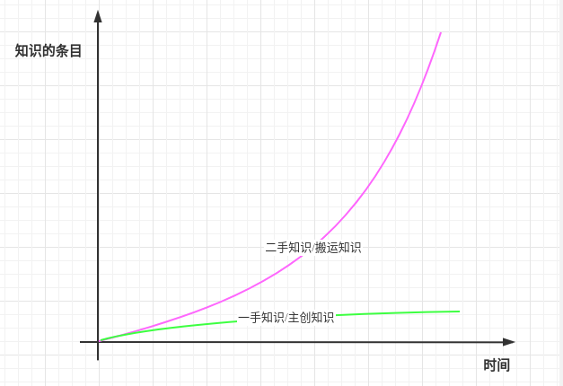

> "如何学习"其实是一个个性化的问题，会因每个人的智商高低，注意力持久力，启蒙期的受教育方式，周围的同辈环境，家庭的教育，从事的职业，兴趣强度等因素而不同。本篇文章是我个人的总结，仅供大家参考。
> 文章主要从两个方面来谈：1）学习习惯；2）学习与工作的关系；

### 一、 学习习惯
###### 1. 学习意愿
1）强烈的学习意愿，会提高学习的效率，注意力和毅力

2）每达成一个目标都会有成就感，这个成就感会推着你向前，形成正反馈

###### 2. 学习源

> 原则：第一手/权威的知识，成体系的知识，这部分知识少而精。网络上充斥着99%的二手知识，大都是知识的搬运工，还没搬全，或窥其一斑不见全貌，不成体系。

1）官方文档/书籍，拒绝不成体系的零散文章

优点是知识成体系，容易构建知识树

2）权威的论文和行业最佳实践方案

读一篇好的论文或行业标准方案，胜过无数二流知识搬运工的隔靴搔痒之作。无论是从时间还是知识细耕度来说都是非常合适的选择。

3）官方社区

优点是知识发布快，权威

4）以图索文

图像包含的信息永远比文字要立体和更有脉络，可以尝试先从谷歌图片或百度图片中搜索关键词。一般会发现很多官方或博客里的图片，比较利于快速理解。

5）付费课程

付费课程减少了知识获取的难度和时间成本，但如果走马观花始终得来浅。还有一点是，能第一时间把知识的主次帮你捋清楚，让你不一开始就陷入到知识细节，而导致无法抓住重点，学习效率变低。

就算你本身一开始就抱着抓主干忽略细节的态度去学习，可以往往一个新手是无法辨别哪些是重点的。这时有个过来人无疑可以减少你很多试错的时间。

###### 3. 初期
> 知识都充满了细节，甚至还有很多奇技淫巧。初期的时候要学会妥协，放弃这些难点，先了解知识的原理和框架。
> 先形成一个知识树的树干，之后要做的事就是给它添枝加叶，把知识细节放到树的相应位置。每放一个新的知识点，就会让整颗树的根在大脑里扎的更深。
> 要分清哪些是需要理解的，哪些是需要练习的。初期要理解技术原理，慢慢练习命令和操作。

关键点：
1）搭建框架

2）忽略难点

3）重复练习

4）及时复习

及时复习包含两点内容：a）第一次学习一个新知识往往会忽视很多细节，需要复习来填补；b）人的记忆符合[艾宾浩斯遗忘曲线](https://baike.baidu.com/item/%E9%81%97%E5%BF%98%E6%9B%B2%E7%BA%BF/7278665?fr=aladdin)，这是一种生理约束，需要把短期记忆转换为长期记忆需要重复；

图片来源：https://www.zhihu.com/question/22866524/answer/1687522416

###### 4. 中期
> 了解知识，使用知识两个阶段往往没有明确的界限。两者相辅相成，在使用中会遇到初期学习时没有注意到的细节和问题，然后再去学习填充细节，会让知识更有深度。工作中更多的使用场景，会让知识更加立体。你也会很享受这种知其然知其所以然的状态。

1）工作使用

*无他，唯手熟尔*

2）博客输出和分享

分享是对你知识树一次修剪过程，你要理正知识间的关系。正如[费曼学习法](https://baike.baidu.com/item/%E8%B4%B9%E6%9B%BC%E5%AD%A6%E4%B9%A0%E6%B3%95)中所说讲故事会反哺讲故事的人。

3）把书上的知识树用符合自己认知的方式组织并形成知识树，这样理解更深且不易忘记。

###### 5. 后期
1）触类旁通类似的知识体系
### 二、 学习与工作的关系
> 从毕业到工作刚好两年，这两年我也一直在寻找工作和学习的平衡点。这两年其实思想的改变以下三个阶段，它是我对工作和学习的思考。

###### 第一阶段：倦于工作——工作第一年
起初我认为学习和工作是分离的，工作是我谋生的手段，学习更多技能才是我职业的基石。在工作的第一年，我加班较少，几乎都会早早的回到出租屋看书。上班时对自己的要求就是按时完成leader的任务就可以了。
然而这样进行了一年左右的时间后发现，成长速度太慢。因为我学习的知识如果在工作中没有用到，学的也很浅、很理论，那么很快就会被遗忘。虽然看了很多书，但是转化率太低。
###### 第二阶段：乐于工作——工作第二年
第二年的时候我改变了这个现状，选择去学习工作中时常会用到的知识，这样虽然学的知识广度减少，但是有了深度。开始对工作投入比第一年更多的精力，这一年加班190多天足以看出。让我自己都感到意外的是，我有时会期待每天上班能去公司工作，在工作中提升自己。
###### 第三阶段：享受工作？
这两天在读“淘宝技术这十年”时，我发现我还是错了。我第二年的工作重心仍然是学习，只不过是“让工作成就自己”的心态。看完这本书感触很深，我发现我不能停在这样一个怪圈里：*为了加薪跳槽而学习 ——>跳槽  ——> 为了加薪跳槽而学习——> 跳槽*。
这样永远也静不下心来作出自己满意的作品，因为精力都被这些欲望耗尽了。希望在工作的第三年开始，我能作出改变，沉下心来，深耕我的项目。

### # 写在后面的零碎话
1. 用来赚钱比停留在看一看的层次重要，只有问题才能知识打磨的更精细
2. 精力有限，提升单位时间内获取的知识深度，不精细的知识会被大脑遗忘
3. 技术都是由小的逻辑单元组成的，触类旁通
4. 知识分层，基础知识，技能知识，业务知识