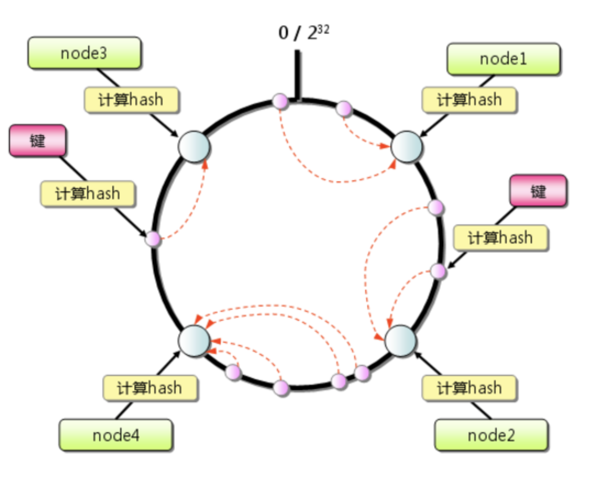
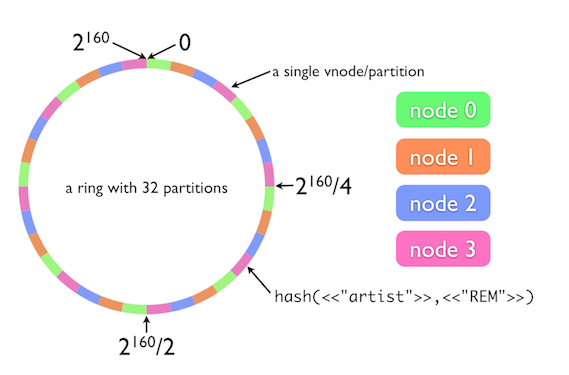
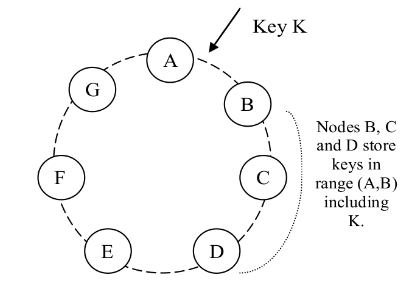
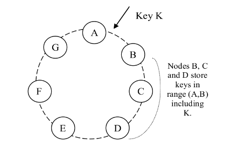

### 一、一致性Hash概念

> 一致性哈希算法在1997年由[麻省理工学院](https://baike.baidu.com/item/麻省理工学院/117999)提出，它是一种分布式缓存协议，用来减轻或解决网络中的热点问题。它是一种分布式散列方案，它通过在抽象圆或散列环上为服务器或对象分配一个位置，从而独立于分布式散列表中的服务器或对象的数量进行操作。这允许服务器和对象在不影响整个系统的情况下进行扩展。

热点问题是指当一个服务器在短时间内接受到远超平时流量的客户端连接请求时，导致服务降级或不可用的现象。而通用的解决方案是通过增加缓存来缓存热点数据，由缓存截流客户的压力。一致性hash就是在这个背景下，对之前的一些中心化的缓存协议的改良，使其可以应对大量的结点导致的复杂度和及降低结点增删带来的影响。

### 二、Amazon的Dynamo实现

#### 1.一致性hash变种 - 虚拟结点

由于一致性hash把结点随机分配到hash ring上，这会导致数据和负载的不均衡。于是Dynamo使用了其算法的变种：每个节点不是映射到hash ring的某个点，而是多个点。

具体实现是增加虚拟节点的概念，这带来了以下好处：

> 1. 当一个节点不可用时（故障或例行维护），这个节点的负载会均匀分散到其他可用节点上
> 2. 当一个节点重新可用时，或新加入一个节点时，这个节点会获得与其他节点大致相同的 负载
> 3. 一个节点负责的虚拟节点的数量可用根据节点容量来决定，这样可用充分利用物理基础设施中的异构性信息

#### 2. 故障策略

> 本篇幅内容摘录了[Dynamo: Amazon's Highly Available Key-Value Store 中文翻译](https://arthurchiao.art/blog/amazon-dynamo-zh/)的内容。

##### 2.1 短期故障： hinted handoff（移交给其他节点处理，附带提示信息）

Dynamo 采用了一种**宽松的仲裁机制**（sloppy quorum）：**所有读和写操作在 preference list 的前 N 个健康节点上执行**；注意这 N 个节点不一定就是前 N 个节点， 因为遇到不健康的节点，会沿着一致性哈希环的顺时针方向顺延。

以上图配置为例，其中 N=3，**如果 A 临时不可用，正常情况下应该到达 A 的写请求就会发送到 D**。这样设计是为了保证期望达到的可用性和持久性。**发送到 D 的副本的元数据中会提示（hint）这个副本本来应该发送给谁**（这里是 A），然后这个数据会被 D 保存到本地的一个独立数据库中，并且有一个**定期任务不断扫描，一旦 A 可用了，就将这个数据发送回 A**，然后 D 就可以从本地数据库中将其删除了，这样系统内的副本数还是保持不变。

NOTE：例子中设置的副本数为3，当 A 异常时会把其副本放到（A+3）的位置 D（独立空间），当 A 恢复时再从 D 移回 A 。

##### 2.2 持久故障：anti-entropy protocol keep replicas synchronized

> 通过Merkle trees来**快速检测副本之间的不一致性，以及最小化转移的数据量**。

一个 Merkle tree 就是一个**哈希树**，其叶子节点是 **key 对应的 value 的哈希值**。 **父节点是其子节点的哈希**。

Merkle tree 的主要优点是：

- 每个分支都可以独立查看（check），节点无需下载整棵树或者整个数据集
- 减少检查副本一致性时所需传输的数据量

#### 3. 增加/移除结点

当一个新节点 `X` 加入到系统后，它会**获得一些随机分散在 ring 上的 token**。对每 个分配给 `X` 的 key range，当前可能已经有一些（小于等于 `N` 个）节点在负责处理了 。因此,将 key range 分配给 `X` 后，这些节点就不需要处理这些 key 对应的请求了，而 要将 keys 转给 `X`。

考虑一个简单的情况：`X` 加入上图中 `A` 和 `B` 之间。这样，`X` 就负责处理落到 `(F, G], (G, A] and (A, X]` 之间的 key。结果，`B`、`C` 和 `D` 节点就不需负责相应 range 了。因此，在收到 `X` 的转移 key 请求之后，**`B`、`C` 和 `D` 会向 X 转移相 应的 key**。当移除一个节点时，key 重新分配的顺序和刚才相反。

#### 参考

1. [一致哈希—wikipedia](https://zh.wikipedia.org/zh-tw/%E4%B8%80%E8%87%B4%E5%93%88%E5%B8%8C)
2. [Dynamo: Amazon's Highly Available Key-Value Store](../../reference/amazon-dynamo-sosp2007.pdf)   [中文翻译](https://arthurchiao.art/blog/amazon-dynamo-zh/)
4. [Consistent Hashing and Random Trees: Distributed Caching Protocols for Relieving Hot Spots on the World Wide Web](../../reference/Consistent_Hashing_and_Random_Trees_Distributed_Ca.pdf)   [中文翻译-未完成](Consistent_Hashing_and_Random_Trees翻译.md)
4. [consistent-hashing blog](https://medium.com/system-design-blog/consistent-hashing-b9134c8a9062)
5. [consistent-hashing blog](https://www.toptal.com/big-data/consistent-hashing)

