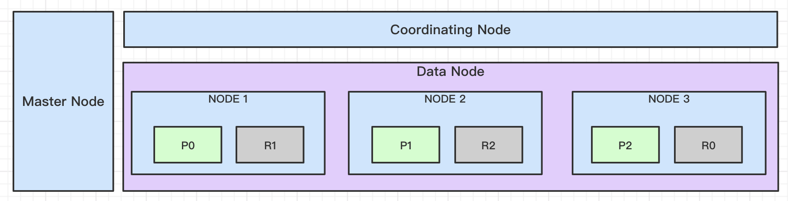

共识协议是分布式网络中各结点对数据达成一致的方法和策略。可参考[分布式网络及共识协议](./1.分布式网络及共识协议.md)

## 一、Zookeeper

ZK定位是分布式的协调框架，使用ZAB协议使ZK集群达到数据共识。ZK适合作一些元数据和配置存储，其吞吐率和容量都不适合分布式存储。[文档](https://zookeeper.apache.org/doc/r3.8.0/zookeeperOver.html)

### 1、ZAB之恢复

ZAB协议恢复，即触发Leader选举，促使集群恢复到一主多从的广播状态。具体有三种场景：

* 集群初次启动
* Follower重启
* Leader重启


### 2、ZAB之广播

写操作统一由leader处理，然后通过2-phase方式原子广播给Follower，这保证了消息完全有序和因果有序。即便是Follower接收到写请求，也会转发给Leader。从图中可看出，ZK是一种primary-backup模式，leader会把命令的结果包装为提议广播给Follower，这保证了消息的幂等性。

ZK的集群结点数一般为3-7个，增加结点会增加读吞吐，但对写吞吐无益，适用于读多写少的场景。


### 3、ZK数据同步策略

提议广播只要收到quorum的ack（包括leader自己在内）就会广播commit。CAP角度来看，其实现了最终一致性，而非强一致性。即如果客户端发起一个写请求，且leader返回成功后，只代表ZK集群的大数结点具备了该数据，此时如果另一个客户端在未及时同步的结点上发送读请求，则无法看到最新数据。但是ZK在使用时，Client大都基于事件监听机制去获取数据，最坏结果表现为数据更新出现延迟通知。

### 4、关于分布式锁

zookeeper实现分布式锁时，有两种类型：

* 非公平锁：通过创建指定名称临时结点避免客户端宕0机，创建成功的客户端获得锁，失败的客户端监听该临时结点（大量客户端被唤醒去争强锁也被称为羊群效应）。
* 公平锁：通过创建有序的临时结点避免客户端宕机，序号最小的临时结点的客户端获得锁，其他客户端监听前一个零时结点，有序排队等待唤醒。

其中，可重入锁的重入的次数可以作为文件内容，随加锁和解锁进行更新；

这其中有个点需要指出，由于zookeeper并不是强一致性，客户端可能无法查到集群中最新写入的数据，但最终会达到一致。这并不影响分布式锁的实现，主要有以下原因：

* 客户端的写入是线性有序的；
* 客户端在不同时间看到的临时结点数量可能不一致，但是他们的顺序是可以保证的；
* 基于以上两点，客户端在create成功后，可以进行多次查询，只要查询到含自己锁的数据集合即可；然后增加前置结点的watcher。

## 二、Redis

### 1、Redis单机模式/主备模式

1）优点

* 容易保证数据强一致性
* 简单易部署，适用于Demo工程

2）缺点

* 有单点问题，结点宕机后严重影响系统可用性，若无备份可造成过数据丢失。

* 单机存储容量和性能上线较低

### 2、Redis主从模式


1）优点

* 可使用读写分离策略，从结点可以分摊读的压力

2）缺点

* 主结点仍只有一个，存储容量和性能上限较低
* 主结点宕机后，需要手动切换从结点为主结点
* 从结点需要一个一个启动，避免主结点同步压力过大

3）主从同步过程

I、当副本连接到主服务器时，它们使用 PSYNC 命令来发送它们的旧主服务器复制 ID 和到目前为止它们处理的偏移量。

这样master 可以只发送所需的增量部分。但是，如果主缓冲区中没有足够的积压，或者如果副本引用不再已知的历史记录（复制 ID），则会发生完全重新同步：在这种情况下，副本将获得数据集的完整副本， 从头开始。

II、Master执行bgsave以生成 RDB 文件。同时它开始缓冲从客户端接收到的所有新的写命令。

III、后台保存完成后，master将数据库文件传输到replica，replica将其保存在磁盘上，然后加载到内存中。

IV、主服务器会将所有缓冲的命令发送到副本。这是作为命令流完成的，并且与 Redis 协议本身的格式相同。


4）关键配置

* min-slaves-to-write
* min-slaves-max-lag

5）主从复制风暴

多级SLAVE，避免所有SLAVE都从主节点复制。

### 3、Redis哨兵模式


1）优点

* 在主从模式的基础上增加独立的哨兵进程，监控集群状态，自动进行主从切换

2）缺点

* 扩容麻烦
* 同主从模式，主结点仍只有一个，存储容量和性能上限较低

### 4、Redis Cluster/Cluster主从模式


1）优点

* 约定16384个槽位，分摊到集群的各个机器
* 分摊槽位的结点是对等的，一个发生故障不会影响其他结点的读写
* 可动态扩容，提升集群的处理请求的能力
* 通过增加主从，还可以增加故障容错能力。

2）哈希槽与哈希环

> Redis Cluster does not use consistent hashing, but a different form of sharding where every key is conceptually part of what we call a **hash slot**.

Redis集群使用哈希槽而非一致性哈希。哈希槽数量为2^14 = 16384，分摊到Redis的集群各个结点。参考[一致性Hash](../12.redis/1.一致性hash.md)。

3）一致性

> Redis Cluster is not able to guarantee **strong consistency**. In practical terms this means that under certain conditions it is possible that Redis Cluster will lose writes that were acknowledged by the system to the client. 

以上摘自官网，Redis不保证强一致性；

* 集群主从模式下，默认是异步同步；此时，主结点宕机，从结点成为新的主结点，可能会丢失部分数据。
* 集群主从迷失下，使用WAIT同步；在发生分区且超时后重新选主，也有可能造成写入旧主结点的数据丢失。

4）共识协议：gossip协议

gossip用于集群中各个结点用来同步集群元数据信息，如当集群状态变更时通过gossip协议把信息同步到整个集群。

5）集群选举机制实现主从自动切换

master结点最少为3个结点，且有qurom个正常时才能选举成功。

[选举步骤如下](https://redis.io/topics/cluster-spec)：

I、感知异常：当副本的master节点处于FAIL状态，master上slot数不为0，副本的与master之间的复制连接断开时间不超过给定的值保证副本数据尽可能新。

II、发起投票：副本增加epoch，并向集群的master节点广播FAILOVER_AUTH_REQUEST发起投票请求。且最多等待NODE_TIMEOUT * 2。

III、响应投票：master在发送响应FAILOVER_AUTH_ACK进行投票。且在NODE_TIMEOUT * 2内只能为同一master的所有副本投一次。副本不会响应投票请求。

IV、结果判定：副本收到大数master投票后晋升为master。如果在NODE_TIMEOUT * 2未获取足够票，则NODE_TIMEOUT * 4后再次尝试。

6）脑裂问题

I、问题描述：集群master选举后，相同slot区会有两个master，如果网络故障期间旧master仍接收请求则会导致数据不一致。

II、解决方案：

https://redis.io/topics/replication#allow-writes-only-with-n-attached-replicas

以下配置的含义为主从延迟小于10秒的slave不小于3.

```properties
min-slaves-to-write 3 # 配置为主从的半数以上
min-slaves-max-lag 10 # 主从同步最大延迟10秒
```

### 5、数据一致性

> https://redis.io/topics/cluster-tutorial
>
> Redis Cluster is not able to guarantee **strong consistency**. In practical terms this means that under certain conditions it is possible that Redis Cluster will lose writes that were acknowledged by the system to the client.

Redis被设计为CP，即分区发生成更偏重于一致性。但是不提供强一致性。

### 6、Redis备份策略

* RDB
    * save
    * bgsave
* AOF
* 混合持久化（RDB + AOF）

### 7、关于分布式锁

redis同样可以实现公平锁和非公平锁，具体lua脚本可参考Redisson代码或官网文档。

### 8、部分故障时是否提供服务

```properties
cluster-require-full-coverage yes # 部分master故障后，不再提供服务
cluster-require-full-coverage no # 部分master故障后，其他master仍能提供服务
```

## 三、Elasticsearch

### 1、ES的存储结构

* 索引在数据结点上的分布


* 整体结构



### 2、ES的共识

1）Zen Discovery

> https://www.elastic.co/guide/en/elasticsearch/reference/7.0/modules-discovery.html
>
> The discovery and cluster formation module is responsible for discovering nodes, electing a master, forming a cluster, and publishing the cluster state each time it changes.

ES使用的集群状态共识使用的Zen Discovery。主要包含以下信息共识：

* 结点发现
* 主结点选举
* 构成集群
* 集群状态更新广播

Zen Discovery算法在7.0有了新的变化，具体参考[链接](https://www.elastic.co/cn/blog/a-new-era-for-cluster-coordination-in-elasticsearch)

2）主副本同步

主副本之间同步的消息是操作，这点而言ES属于state machine replication。同步过程描述可参考[链接](https://www.elastic.co/guide/en/elasticsearch/reference/6.0/docs-replication.html)。


## 四、Kafka

Kafka是一种时间流处理框架，区别于传统的MQ，例如其可以长时间存储消息，允许消息被消费多次。Kafka依赖ZK对Kafka集群状态进行维护，例如主题的分区信息，消费者的offset等信息，即依赖ZK使Kafka对集群状态达成共识。

当然kafka作为消息中间件，也具备了同样的功能：

* 削峰平谷
* 异步提速
* 应用解耦

### 1、kafka的存储结构

了解存储结构前，我们先了解下各个组件的职责：

* Zookeeper：用于Broker的Controller选主，且存储Broker信息（含Topic，Partion）、消费者信息（消费组成员及其offset）、配置信息等。
* Broker
    * 普通Broker：接收读写请求、Topic的Partion副本同步
    * Controller：监听Zookeeper上的信息，集群元数据信息变更时同步给其他普通Broker
* Producer：发送消息到Broker上的指定主题的某个分区上。
* Consumer：建立和Broker的长链接，消费指定主题的分区，并及时更新位移到Zookeeper。一个分区最多只能被一个消费分组内的一个消费者消费。


[图片来源](https://www.ancii.com/asla5750/)


### 2、kafka的共识

1）集群Controller选举

借助Zookeeper进行Controller选举。

2）Topic分区选主

当Topic的Partion所在的Broker故障或发生网络分区时，由Controller负责从ISR中选取其他Broker作为新的主分区。

3）副本数据同步

* HW：High Watermark，高水位线。其值为Topic的Partion对Consumer的可见位移，该位移取自ISR中的所有同步副本的最小值。
* ISR：由Topic的主Partion所在broker维护。约定Topic的某Partion的主从副本间同步的时间小于replica.lag.time.max.ms的从副本 + 主副本的集合。
* ACKS设置
    * acks=0：不需要等broker响应
    * acks=1：等待消息写入Topic的主Partion，然后响应
    * acks=-1/acks=all：等待消息写入Topic的主Partion后，且副本分区（主分区+从分区）写入个数超过`min.insync.replicas`也写入成功，然后响应。注意，默认`min.insync.replicas=1`，效果等同于acks=1。

4）关于一致性

kafka的一致性跟acks设置有关：

* 当设置为0或1时，表现为弱一致性或最终一致性。
* 当设置为-1/all，且`min.insync.replicas`大于1时表现为强一制性

## # 参考

1. [ZAB协议 Paper](https://wenku.baidu.com/view/d6545edaad51f01dc281f133.html)  [译文](https://www.cnblogs.com/j-well/p/7061091.html)
2. [ZK Paper：Wait-free coordination for Internet-scale systems](https://www.usenix.org/legacy/event/atc10/tech/full_papers/Hunt.pdf)  [译文](https://iswade.github.io/translate/zookeeper/)
3. [图文翔实：实例详解ZooKeeper ZAB协议、分布式锁与领导选举](https://dbaplus.cn/news-141-1875-1.html)
4. [理解zookeeper选举机制](https://www.cnblogs.com/shuaiandjun/p/9383655.html)
5. [Redis cluster-tutorial](https://redis.io/topics/cluster-tutorial)
6. [深入剖析Redis系列(二) - Redis哨兵模式与高可用集群](https://juejin.cn/post/6844903663362637832)
7. [一万字详解 Redis Cluster Gossip 协议](https://www.sohu.com/a/452838331_355142)
8. [Consensus Algorithm—— Gossip协议](https://www.jianshu.com/p/de7b026f4997)
9. [redisson官方文档 - Distributed locks and synchronizers](https://github.com/redisson/redisson/wiki/8.-distributed-locks-and-synchronizers)
10. [Elasticsearch 集群协调迎来新时代](https://www.elastic.co/cn/blog/a-new-era-for-cluster-coordination-in-elasticsearch)
11. https://www.elastic.co/guide/en/elasticsearch/reference/7.0/modules-discovery.html
12. https://www.elastic.co/guide/en/elasticsearch/reference/6.0/docs-replication.html
13. [Sequence IDs: Coming Soon to an Elasticsearch Cluster Near You](https://www.elastic.co/cn/blog/elasticsearch-sequence-ids-6-0)
14. [kafka学习笔记：知识点整理](https://www.ancii.com/asla5750/)