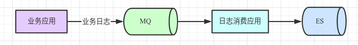

### 一、ES索引分片设置原则

> 存储的数据如果是持续增长的，需要周期建索引进行水平拆分（按小时，按日，按月等），来保证以下的分片原则。

1）副本分片用于保证安全，至少设置为1。副本约多，越影响写入性能。

2）分片总数（主分片 + 副本分片）最好是集群节点数量的倍数，保证可以均匀分配，避免数据倾斜。

3）每个分片大小最好处于10G-65G间。

4）单数据节点上，每GB堆内存不能超过20个分片。

### 二、线上实战

假设我目前有个日志存储的场景如下：

>  ES集群信息：
>
> * ES有9个数据节点，单数据节点规格为16核64G 7000GB
>
> * 含协调节点和主节点

##### 1）确认索引创建周期

从管理维度上考虑，选择“按日”新建索引，格式类似“my_log_yyyy-MM-dd”

##### 2）确认索引的数据量

ø 如果ES中已存在数据，观察ES每日索引的大小，`GET _cat/indices`。

ø 如果还未有数据，则根据每日的日志条数和平均日志大小，评估索引数据量。

Note：根据观察MQ的日流量和ES的索引值，发现ES是MQ的80%大小（具体比例跟索引mapping中字段类型有关，请就地勘测）。

| MQ生产流量 | ES索引大小（不含副本） | 比例  |
| ---------- | ---------------------- | ----- |
| 732.145GB  | 581.9GB                | 79.5% |
| 2.964TB    | 2.25TB                 | 75.9% |
| 3.07TB     | 2.3TB                  | 74.9% |

假设，当前每日索引存储（不含副本）需要800GB。

##### 3）计算索引分片数

* 根据每GB堆内存不超过20个分片，假设当前堆内存设置为31G
  * 单节点最大支持：`31 * 20 = 620`分片
  * 按单分片50G，则磁盘相应大小为`620 * 50G  = 31T`，考虑80%负载，磁盘需要38.75T
  * 以上结论可知当，单分片为50G，磁盘空间小于38.75T时，肯定符合每GB堆内存不超过20个分片

* 按单分片为50GB，则每日索引不含副本共需要`800G/50G = 16`个分片
* 索引副本数设置为1，则每日索引含副本共需要`16 * 2 = 32`个分片
* 由以上得出的分片数，再考虑分片需要为数据节点数量的整数倍（9的倍数），最终设置日索引分片为18，副本为1

##### 4）推算索引保留时间

粗略估算如下：

* 饱和存储：`7000G * 9个数据节点 / (800G * 2) = 39.375天`
* 80%存储：`39.375 * 80% = 31.5天`
* 58%存储：`39.375 *  58.8% = 23.2天`

### 三、磁盘容量评估

> 参考阿里云：https://help.aliyun.com/document_detail/72660.html
>
> - 副本数量：至少1个副本。
> - 索引开销：通常比源数据大10%（`_all`参数等未计算）。
> - 操作系统预留：默认操作系统会保留5%的文件系统供您处理关键流程、系统恢复以及磁盘碎片等。
> - Elasticsearch内部开销：段合并、日志等内部操作，预留20%。
> - 安全阈值：通常至少预留15%的安全阈值。
>
> 根据以上因素得到：最小磁盘总大小 = 源数据大小 * 3.4。计算方式如下。
>
> 磁盘总大小 = 源数据 *（1 + 副本数量）* 索引开销 /（1 - Linux预留空间）/（1 - Elasticsearch开销）/（1 - 安全阈值）
>
> = 源数据 *（1 + 副本数量）* 1.7
>
> = 源数据 * 3.4

### # 参考

1. https://www.elastic.co/guide/en/elasticsearch/reference/current/size-your-shards.html
2. [ES规格容量评估](https://help.aliyun.com/document_detail/72660.html)
3. [ES6.5 堆内存设置](https://www.elastic.co/guide/en/elasticsearch/reference/6.5/heap-size.html)
4. [ES堆内存该设置多大](https://www.jianshu.com/p/f9d4c88367d3)