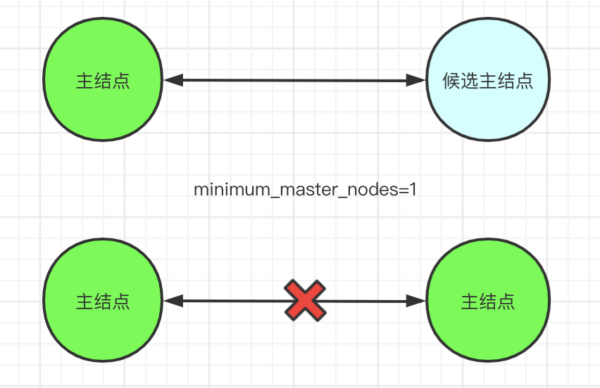
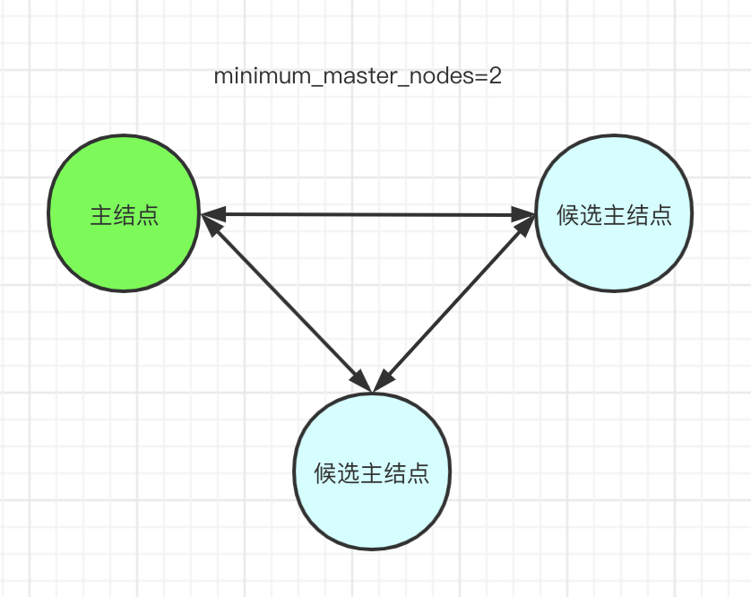
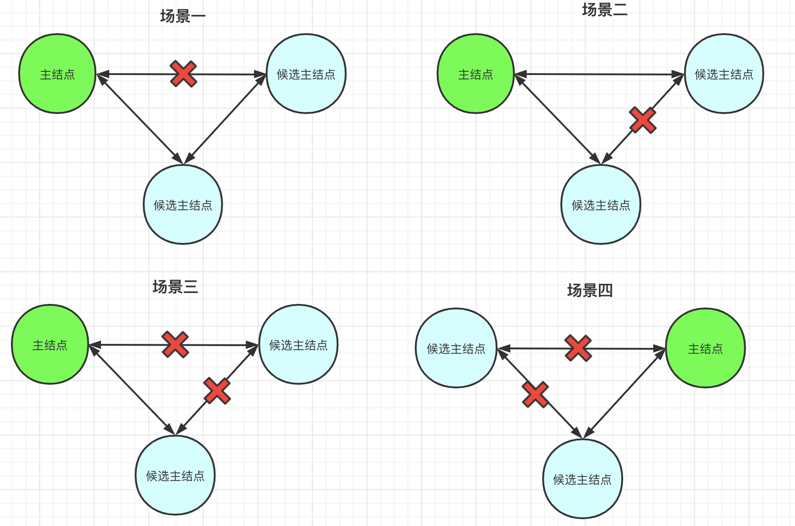
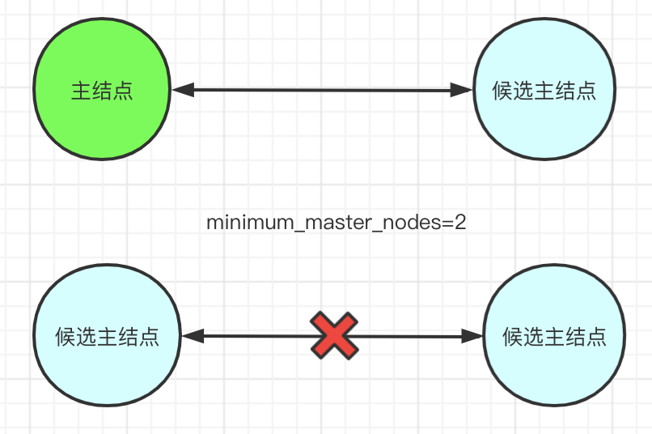

### 一、ES专用主结点

ES的集群规模如果较大时，可以考虑设置专用主结点，设置参数可参考[ES分片和副本](4.ES分片和副本)。配置了参数后的结点被称为*[Master-eligible node](https://www.elastic.co/guide/en/elasticsearch/reference/6.5/modules-node.html#master-node)*，即候选主结点。这些候选主结点之间会通过选举，投票出一个主结点。

### 二、ES脑裂问题

ES的主结点保存了集群的状态，负责索引的创建等重要工作。一个集群只允许有一个主结点，如果大于一个就会出现不一致的情况。而，如果ES的主结点选举的配置错误的话，就可能会出现多个主结点的情况，这种情况成为脑裂。

脑裂发生后不会自动恢复，需要重启发生脑裂的结点才会恢复。但是，重启的主结点在脑裂期间写入的数据和状态就会丢失。

### 三、大数选举及场景分析

#### 1）参数`minimum_master_nodes`及配置原则

`discovery.zen.minimum_master_nodes`（默认为1）设置集群的候选主结点数量必须不小于该值，该值配置为quorum可以避免主结点脑裂而出现多个主结点。

`quorum = (master_eligible_nodes / 2) + 1`

需要注意的是，如果主结点由于网络故障无法发现其他主结点，或者发现的主结点小于quorum，那么他就会由主结点降为候选主结点。这样因网络故障而成为ES集群通讯孤点的主结点降级为候选主结点，也不会再执行主结点职责，避免与此时新选举出来的主结点同时存在而导致脑裂。

#### 2）minimum_master_nodes不符合quorum时，脑裂场景分析

假设当前有两个候选主结点，但是没有配置`discovery.zen.minimum_master_nodes`，即使用默认值1。假如此时发生网络故障，导致两个主结点之间无法通讯，他们各自都会选举自己为主结点1而出现脑裂问题。

#### 3）minimum_master_nodes符合quorum，场景分析

假设当前有三个候选主结点，配置`discovery.zen.minimum_master_nodes=2`，此时如果发生网络故障，则有以下几个场景

从上面四个场景分析，只要三个结点间任意两个结点网络通讯正常（有一条线不中断）就不会发生脑裂。

#### 4）集群的候选结点最少为3个

假设，候选结点为两个，`quorum = 2/2 + 1 = 2`那么一旦两个主结点间网络故障，那么集群中就不会再有主结点了。

### # 参考

1. [discovery-settings.html#minimum_master_nodes](https://www.elastic.co/guide/en/elasticsearch/reference/6.5/discovery-settings.html#minimum_master_nodes)
2. [modules-node.html#split-brain](https://www.elastic.co/guide/en/elasticsearch/reference/6.5/modules-node.html#split-brain)

