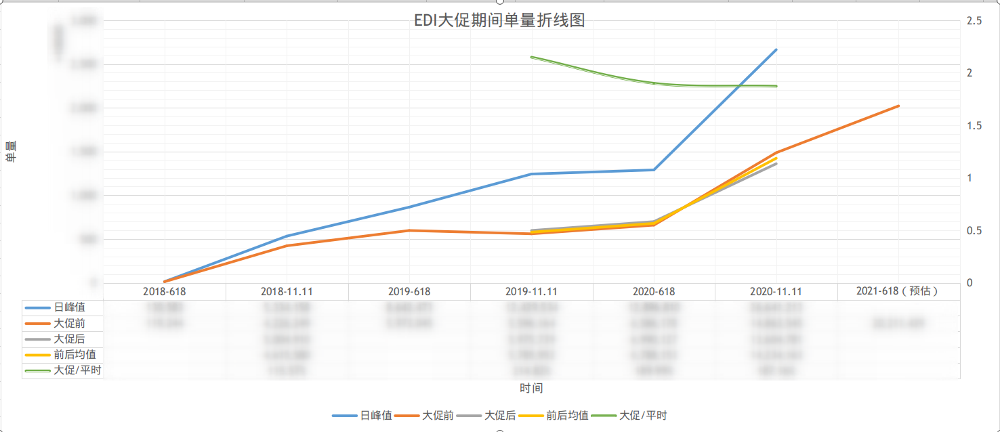
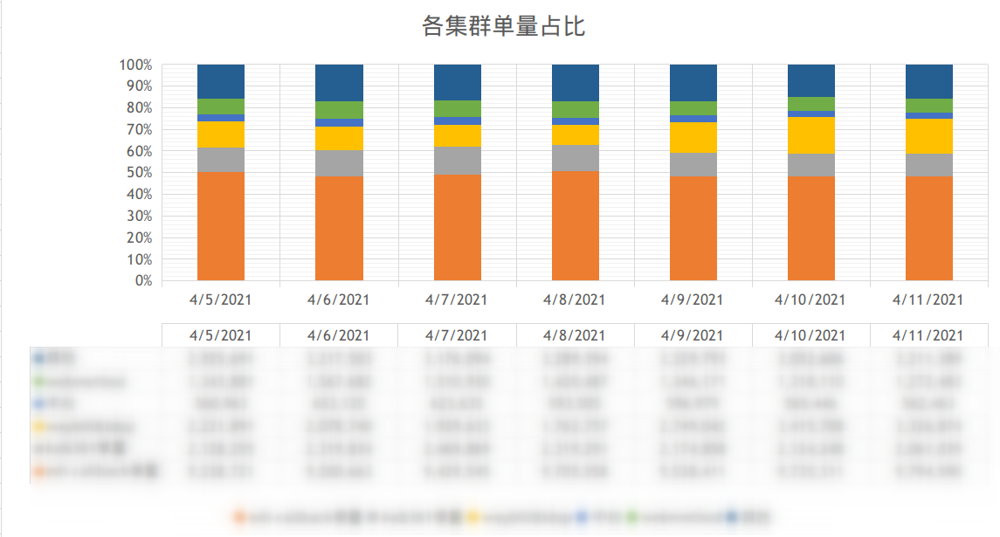
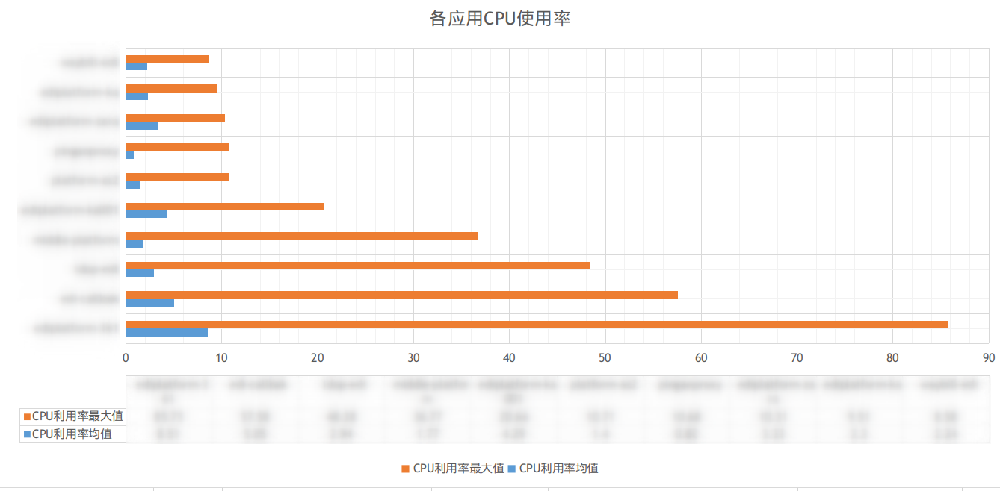

#### 一、背景

今日公司按期开始618备战，其中一项为提应用的扩容需求。往年只是根据单量趋势预估大促单量，然后基于单量进行扩容。

今年受到“使用CPU百分位作容器缩容的参考指标”的影响，决定通过数据及一定的理论来支撑扩容需求。**当然，提出的考量指标及公式可能不适合，也不严谨，但是“有而后优”，先通过这个方案划一个基线，然后再适场景调整。**

#### 二、操作

##### 1. 基于以往数据评估今年618的增长倍率

##### 2. 以集群为维度，观察业务单量比例

##### 3. 以集群为维度，观察CPU使用率

##### 4. 拟定扩容公式

1）假设：

* 根据CPU峰值决定扩容机器数量，可以保证SLA

* 假设随着业务单量增加，CPU的计算量也线型增加

2）定义：

根据以上假设，拟定达到期望使用率扩容公式：

* P期望：期望容器CPU峰值

* P当前：当前容器CPU峰值

* N期望：扩容后，达到期望使用率的容器数量

* N当前：当前容器数量

两种场景：

- 一定单量：P期望 x N期望 = P当前 x N当前

- 考虑增长：P期望 x N期望 = P当前 x N当前 x 大促预估单量倍率

3）当单量倍增时可得出：

**公式一，目标机器个数：**

N期望 = N当前 x P当前 x 大促预估单量倍率 / P期望

**公式二，扩容机器个数：**

N扩容 = N期望-N当前

#### 三、结论

以上的方案可能不够严谨，没有考虑其他瓶颈资源。但是作为一个以方法论支撑行为的一个示例足矣。希望以后的行为皆有章可循，不盲目，有思考。