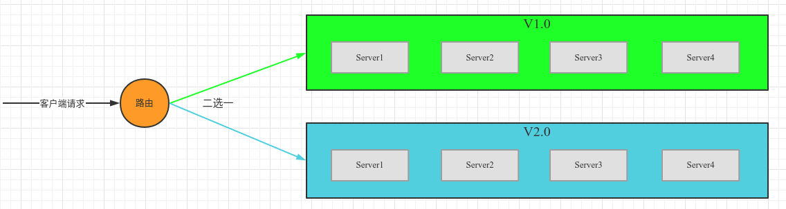
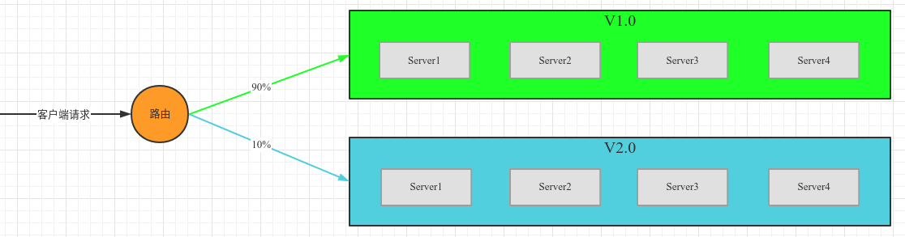
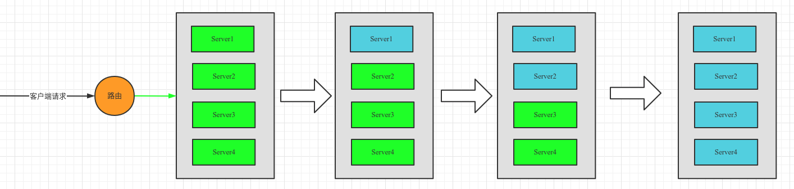

`蓝绿发布`和`灰度发布`都涉及路由的变更，而`滚动发布`则只需要逐次更新实例即可。

#### 一、蓝绿发布

1）蓝绿发布过程中，新老版本不同时工作，非此即彼。

2）部署步骤：

* 当要发布新版本时，部署一套新环境，集群数量和配置都不低于老版本；
* 修改路由，把流量由老集群全部切到新环境的集群上；

#### 二、灰度发布（金丝雀发布）

1）灰度发布过程中，新老版本会同时工作。

2）部署步骤：

* 当要发布新版本时，部署一套新环境，新集群容器数量可随切入的流量，由少量递增至不少于老版本的数量
* 修改路由，把流量灰度递增的切到新集群容器；并适时增加新集群容器数量；

#### 三、滚动发布

1）灰度发布过程中，新老版本会同时工作

2）部署步骤：

* 不需要部署新集群，只需要依次更新集群内实例即可。

